# Challenge

Build Your Own App-to-Alexa Messaging System

Have you tried programming Alexa skills? Tried programming App Inventor? Both can be powerful coding environments alone — but together they allow you to combine conversational AI with other mobile programming components. To get a taste of this combo, try the tutorial below! 

{:.enlargeImage}

# Setup

1. If you have not done so, please complete the following prior to this tutorial to set up all the needed accounts, and Amazon devices if applicable: [App Inventor Setup Tutorial](../images/alexa_hello_world/setup.pdf)

2. Once that's done, you can move onto the tutorial!

Please note: If your instructor gave you access to an anonymous Alexa account then you can skip this section on how to set up an Alexa Developer Account.

# Alexa Messenger Tutorial

## Overview

Up to this point you have only seen App Inventor Alexa tutorials where App Inventor was only used to provide an easy block-based language environment to develop Alexa Skills.  These may have given the wrong impression that Alexa does not really integrate with many of the native mobile app developing features of App Inventor.  This tutorial aims to show how you can develop a mobile app with App Inventor that is fully integrated with Alexa’s conversational AI capabilities.

The app you will develop will be a messenger app where a user can write or speak a message they wish to their mobile device which will then be sent to the cloud and from where another user elsewhere can retrieve the message and hear it through an Alexa device.

{:.enlargeImage}

The messenger app will alternatively have a user ask Alexa to forward a message, which again will then be sent to the cloud and from where a user elsewhere can retrieve it using their mobile app.

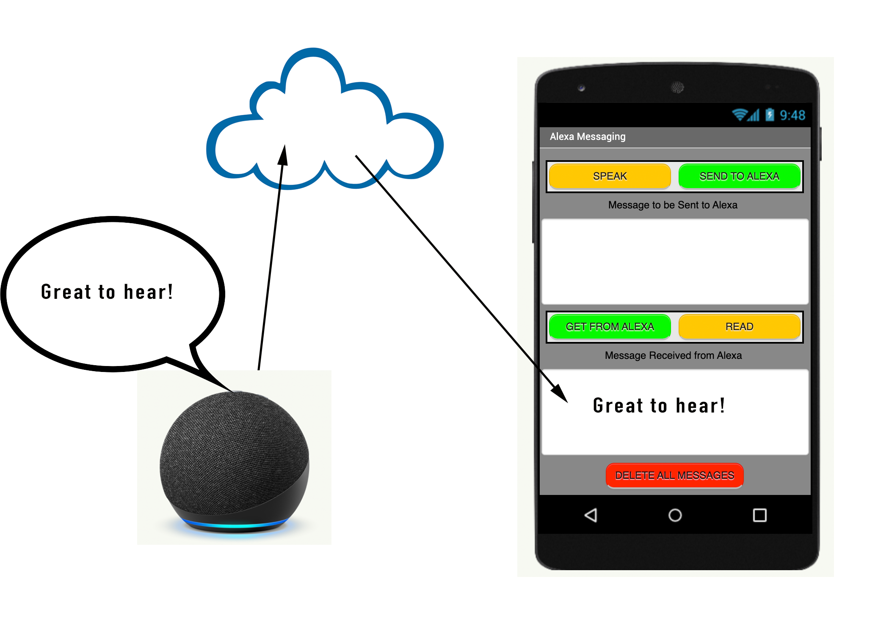{:.enlargeImage}

Through this two-way communication scheme, you will see how it is possible to seamlessly integrate Alexa skills with mobile app capabilities using two parallel development environments provided by MIT App Inventor.

## The Graphical User Interface (GUI)

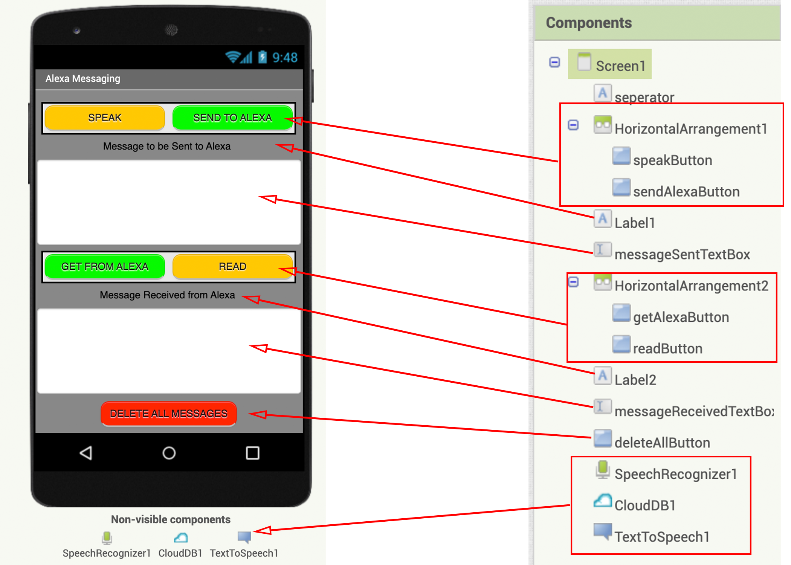{:.enlargeImage}

In App Inventor designer view, you will see that the mobile app’s graphical user interface (GUI) has already been created for you.  Notice the top textbox lets you enter a message to send (either by typing directly into the textbox or by talking into your device via the orange SPEAK button). Then the green SEND TO ALEXA button sends the message to CloudDB.

At the bottom, the green button GET FROM ALEXA  retrieves a pending message from CloudDB and posts it to the bottom textbox.  Use the orange READ button to read the retrieved message out loud.

Also notice the three non-visible components (SpeechRecognizer, CloudDB, TextToSpeech) working in the background. They generate text from speech, transfer the text to the cloud, and read the text out loud.

## Coding the GUI functionality (1)

Click on the Blocks button to go to the Blocks editor.

{:.enlargeImage}

First, code what happens when the user clicks the orange SPEAK button.  Make the  SpeechRecognizer component listen to the user’s speech and turn it into text. Code the block to erase any previous message in the top textbox and replace it with an empty string.

{:.enlargeImage}

When the SpeechRecognizer returns with the text of the user’s speech, paste the text into the top textbox.

{:.enlargeImage}

When the user clicks the green SEND TO ALEXA button, send the text message to CloudDB and store it under the tag “toAlexa”. Also update the textbox with the text “Message sent to Alexa”, confirming that the message is sent.

{:.enlargeImage}

## Coding the GUI functionality (2)

At the bottom when the green GET FROM ALEXA button is clicked then the CloudDB should be invoked to return the contents stored under the tag “fromAlexa”

{:.enlargeImage}

When CloudDB responds with the contents, after checking that the returned item has the correct tag (“fromAlexa”), the contents should be pasted to the textbox at the bottom.

{:.enlargeImage}

When the user clicks the READ button, the contents of the bottom textbox should be read out loud using a TextToSpeech component.

{:.enlargeImage}

## Coding the GUI functionality (3)

Finally, when the user clicks the DELETE ALL MESSAGES button, both textboxes should be cleared and all content on CloudDB (stored under both tags “toAlexa” and “fromAlexa”) should be erased.

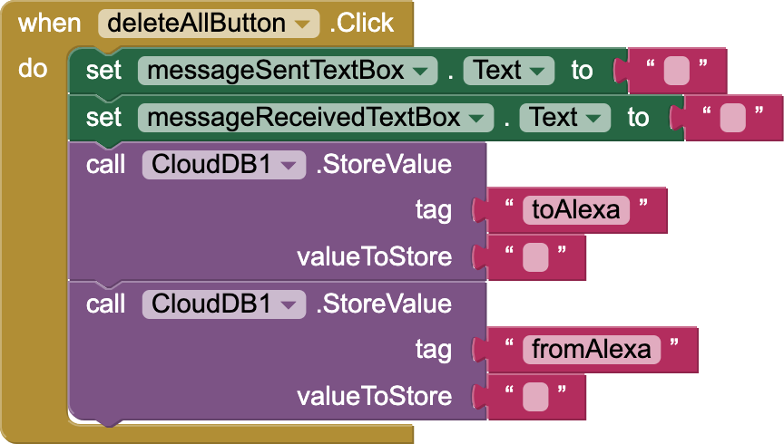{:.enlargeImage}

## Creating the Voice User Interface (VUI) (1)

You just finished coding the mobile app.  Now, create the voice user interface (VUI) in the Alexa development environment so Alexa can retrieve and send messages.

First, create an Alexa skill by going to the Add button in the App Inventor interface and selecting the Skill option.

{:.enlargeImage}

Give an invocation name for the Alexa skill. In this example, call it “message master”. That way, we can tell Alexa something like “Ask message master to get my message”

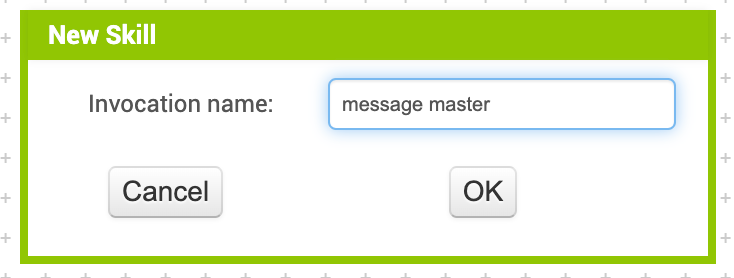{:.enlargeImage}

## Creating the Voice User Interface (VUI) (2)

It is easier to create an interface you can see than one you can only hear. That’s why creating a voice user interface (VUI) may seem less intuitive than creating a graphical user interface (GUI). But similar principles apply.  For a VUI, instead of graphical components, we have spoken elements called ‘intents” and “slots.”   You will soon see how these are used. 

Drag and drop one intent, one slot and then another intent into the Viewer over the Amazon Echo Dot image.

{:.enlargeImage}

This will create IntentA, SlotA and IntentB.  Rename them getMessageIntent, messageSentSlot and sendMessageIntent, respectively as shown below.

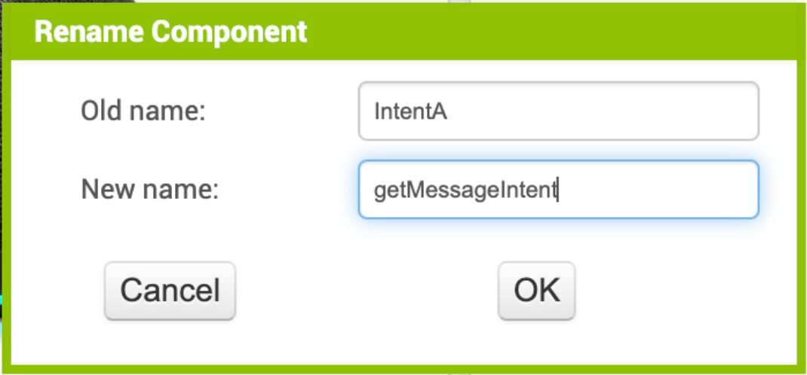{:.enlargeImage}

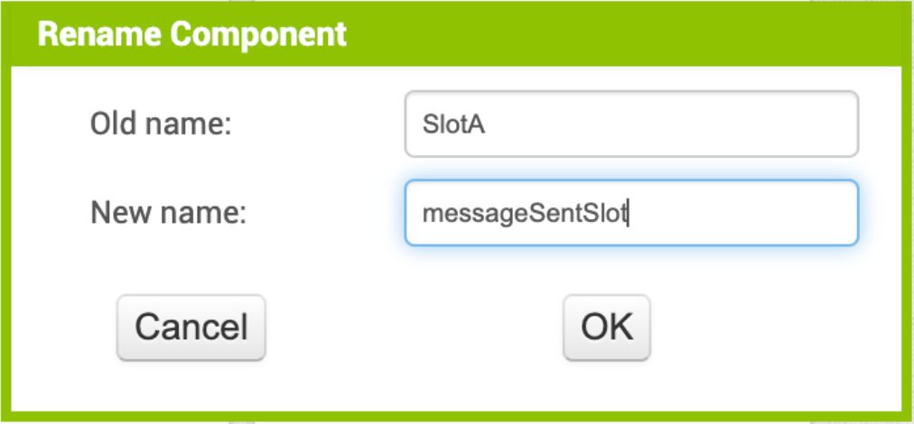{:.enlargeImage}

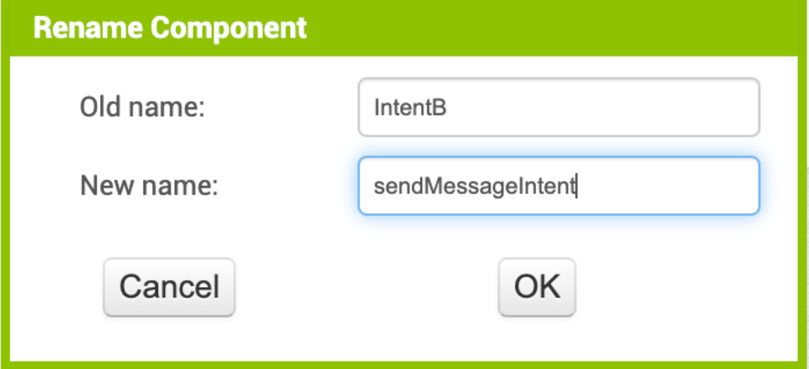{:.enlargeImage}

## Creating the Voice User Interface (VUI) (3)

Access CloudDB at the bottom of the Palette in the Alexa drawer.

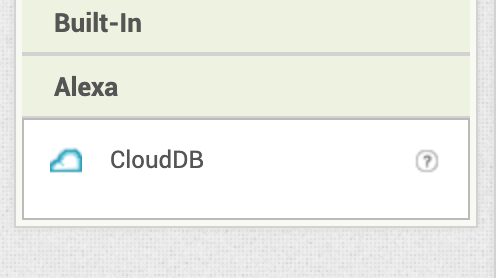{:.enlargeImage}

And drag and drop CloudDB over the Amazon Echo Dot. 

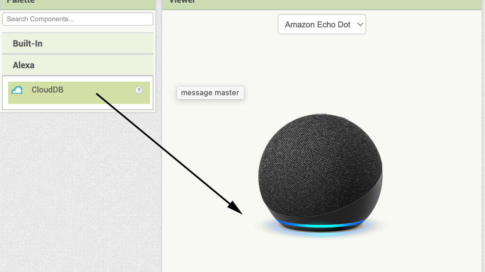{:.enlargeImage}

The non-visible component, CloudDB, will by default have a token identical to the CloudDB you have in  your Screen1 of your mobile app and thus both Alexa and the app will be accessing and communicating via the same CloudDB.

{:.enlargeImage}

(Your token will look different than what you see here)

## Creating the Voice User Interface (VUI) (4)

Your Viewer now should look like this:

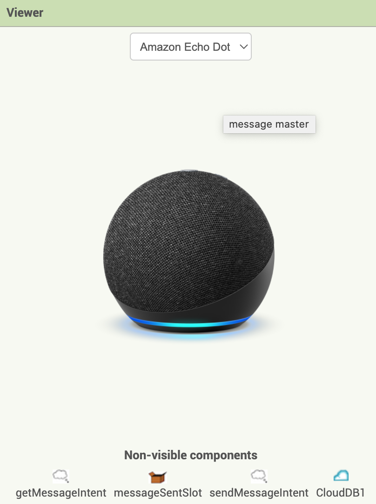{:.enlargeImage}

Your Components should look like this:

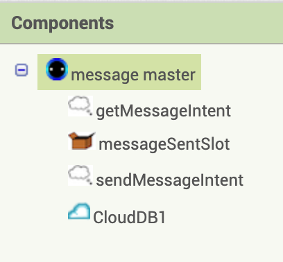{:.enlargeImage}

## Creating the Voice User Interface (VUI) (4)

Define the getMessageIntent by specifying some phrases people would use to mean “retrieve my message.” These phrases are called “utterances” for a VUI. Some possibilities are shown below.  Add a few of your own to this list. 

When Alexa hears these and similar utterances, she will understand that you would like to get your message from the cloud, which was sent by the user of the mobile app.

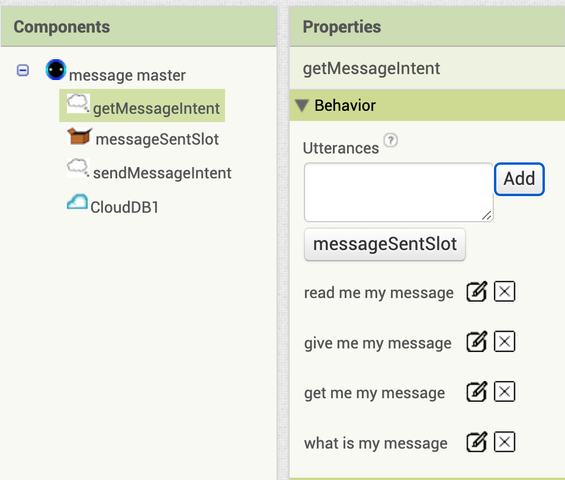{:.enlargeImage}

## Creating the Voice User Interface (VUI) (5)

Now, specify the SlotType for the messageSentSlot.  Choose the option Phrase.  Alexa will capture the message to be sent to the app user (via the cloud) and store it in this slot.

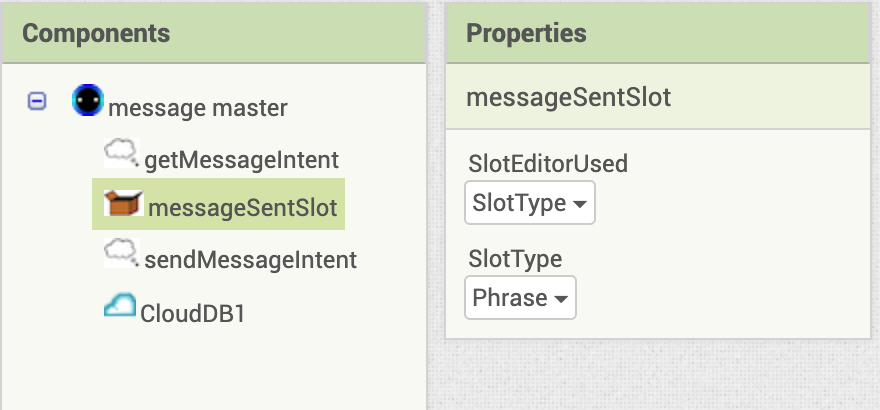{:.enlargeImage}

Define the sendMessageIntent with a few utterances that amount to something like “send the message XXXX”. The XXXX in this phrase will have to be a placeholder for what the message will be. This placeholder is the slot. Create the slot by pressing the messageSentSlot button under the Utterances textbox. Note that App Inventor textualizes this placeholder using curly braces {Slot}.
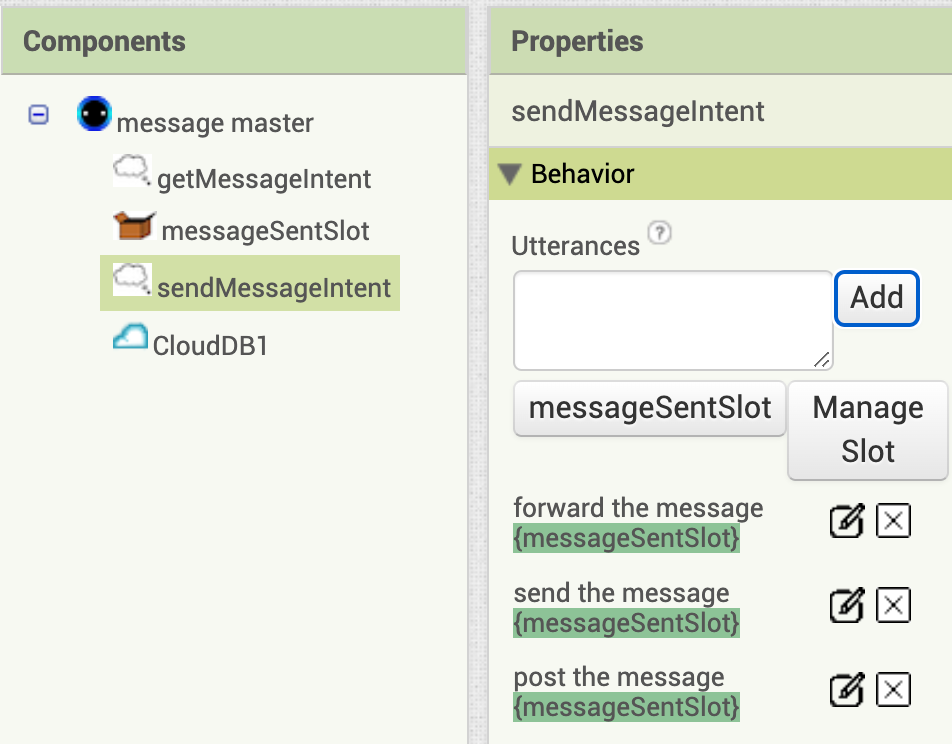{:.enlargeImage}

## Coding the VUI functionality (1)

Go to Blocks editor.
{:.enlargeImage}

From the getMessageIntent block, pick the when getMessageIntent.spoken event handler.

Code the block so that when Alexa hears an utterance like “get me my message” she will say, “Your latest message is:”, pause for a second, then retrieve the content stored in CloudDB by the mobile app user under the tag “toAlexa” and speak this message.  

After that, Alexa will pause for another second and say “End of message” to indicate that the message retrieval has concluded.

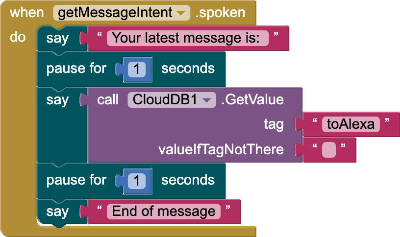{:.enlargeImage}

## Coding the VUI functionality (2)

When the Alexa user wants to send a message to the mobile app user, they will say something like “send the message I miss you, hope all is well”. Alexa will recognize this as sendMessageIntent, capture the message part of the utterance (“I miss you, hope all is well”), and forward the message to the cloud.  

To code this: 
* Go to sendMessageIntent blocks and pick the when sendMessageIntent.spoken event handler.  Alexa will capture the message in the user’s utterance and store it in messageSentSlot.  
* Code Alexa to repeat the message she heard for the purpose of accuracy.  
* Then store the message text to CloudDB under the tag “fromAlexa”.  The mobile app user will use their GET FROM ALEXA green button to retrieve this stored message.

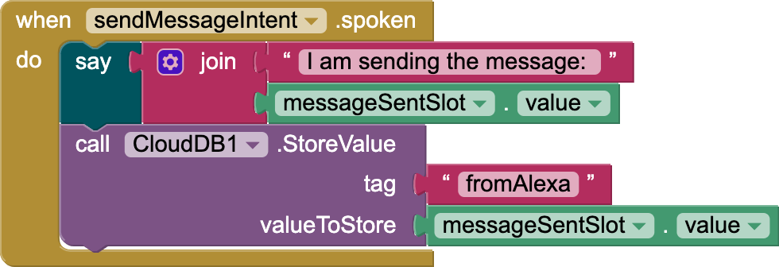{:.enlargeImage}

This is all the code needed to give functionality to the VUI.

## Testing your Alexa Messenger app (1)

Test that your Alexa integrated app is working.  Make sure that:
* The mobile app is able to send and retrieve messages to and from Alexa via CloudDB
* Alexa is able to send and retrieve messages to and from the mobile app via CloudDB

Go to the message master skill interface (unless you are there already.)

{:.enlargeImage}

Under the Testing panel select Send Updates (to Amazon.)  This may take a few minutes.  Be patient.

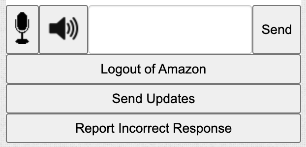{:.enlargeImage}

Go back to Screen1.
{:.enlargeImage}

Connect to AI Companion by scanning the generated QR Code.  Your code will be different than the one you see here.
{:.enlargeImage}
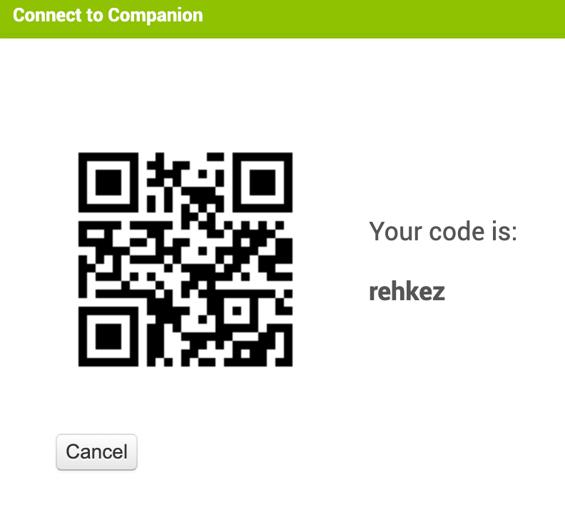{:.enlargeImage}

## Testing your Alexa Messenger app (2)

In your mobile app, create a message to be sent to Alexa either by typing or via the SPEAK button.  When done, press the green SEND TO ALEXA button.

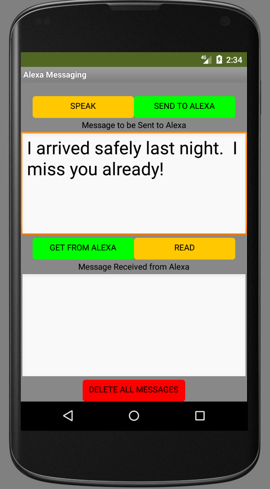{:.enlargeImage}

Now go back to Alexa interface via message master skill.

{:.enlargeImage}

Enter the following in the Testing window “ask message master to get me my message”
You should see Alexa retrieve the message sent by the mobile app.

{:.enlargeImage}

Now try sending a message from Alexa to the mobile app.  Enter “send the message *your message here*”.  Alexa should read you back your message and indicate she is sending the message.

Note that, as in the Testing panel Alexa already knows the context, you do not need to include in your message the words "ask message master to ..." anymore.  If you were using a home Alexa device instead of the Testing panel, you would need to every time say "Alexa, ask message master to ..."  

{:.enlargeImage}

Now check that the mobile app is able to retrieve this message sent by Alexa by pressing the green GET FROM ALEXA button.  You should see the message that was sent.  Use the READ button to listen to it read back to you.  (Note that the voice is your mobile phone's Text-to-Speech voice, not Alexa’s.)

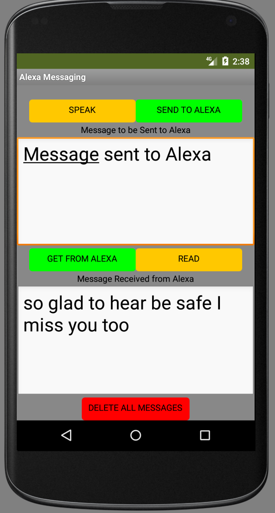{:.enlargeImage}

After a few messages back and forth, you should also test your DELETE ALL MESSAGES red button to make sure you can erase all your messages.

Congratulations, you have just created your first fully integrated Alexa-App Inventor project.

# Expand Your App

Here are some ideas for ways to enhance your app!

* Currently, only the mobile app user can delete all messages by pressing the red DELETE ALL MESSAGES button.  Create a deleteAllMessagesIntent so the Alexa user can also delete all messages as needed.  (For example, when they regret a message they sent!)

* Currently, if there are no new messages waiting for a user in the cloud, no meaningful response like “You have no new messages” is given.  Fix this.

* Currently, only two single messages can be stored in the cloud at a time, one going to Alexa and one coming from Alexa.  Create a messaging system so that multiple messages can be stored and retrieved by each user, and the messages are kept until a user decides to clear them. 

* Try bringing to life your own awesome ideas for perfecting the Alexa Messaging system.

# About Youth Mobile Power
A lot of us spend all day on our phones, hooked on our favorite apps. We keep typing and swiping, even when we know the risks phones can pose to our attention, privacy, and even our safety.  But the computers in our pockets also create untapped opportunities for young people to learn, connect and transform our communities.

That’s why MIT and YR Media teamed up to launch the Youth Mobile Power series. YR teens produce stories highlighting how young people use their phones in surprising and powerful ways. Meanwhile, the team at MIT is continually enhancing MIT App Inventor to make it possible for users like you to create apps like the ones featured in YR’s reporting.

Essentially: Get inspired by the story, get busy making your own app!
 

 The YR + MIT collaboration is supported in part by the National Science Foundation. This material is based upon work supported by the National Science Foundation under Grant No. (1906895, 1906636). Any opinions, findings and conclusions or recommendations expressed in this material are those of the author(s) and do not necessarily reflect the views of the National Science Foundation.

 Check out more apps and interactive news content created by YR <a href="https://yr.media/category/interactive/" target="_blank">here</a>.

