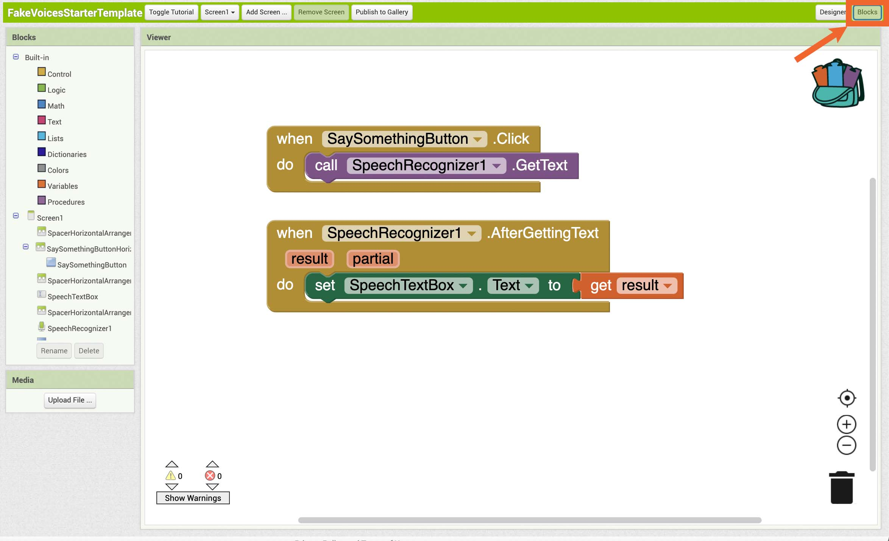
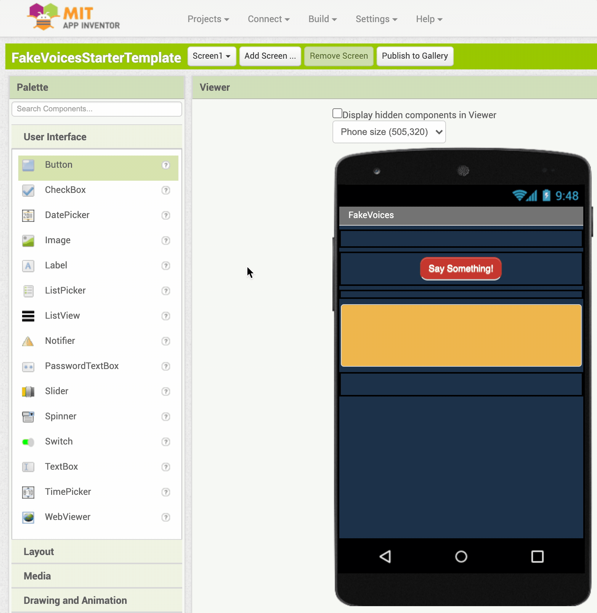
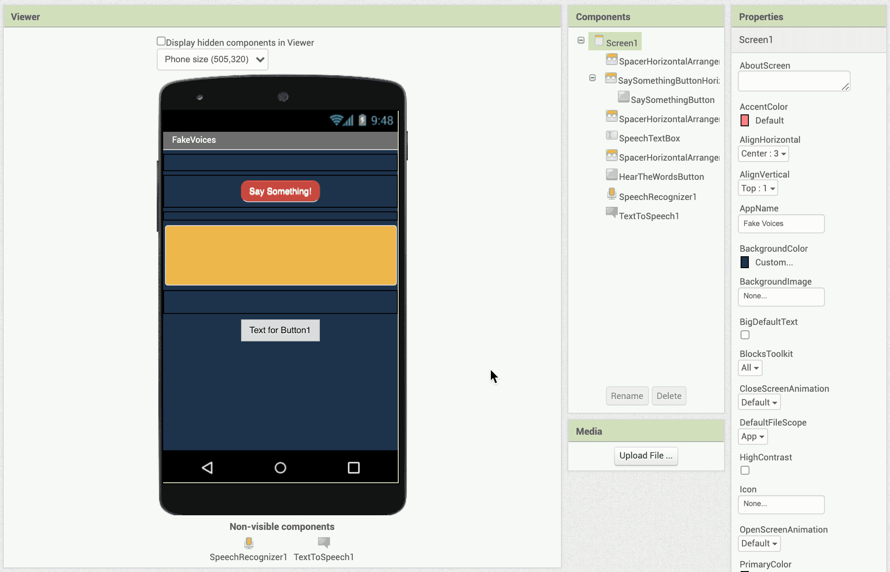
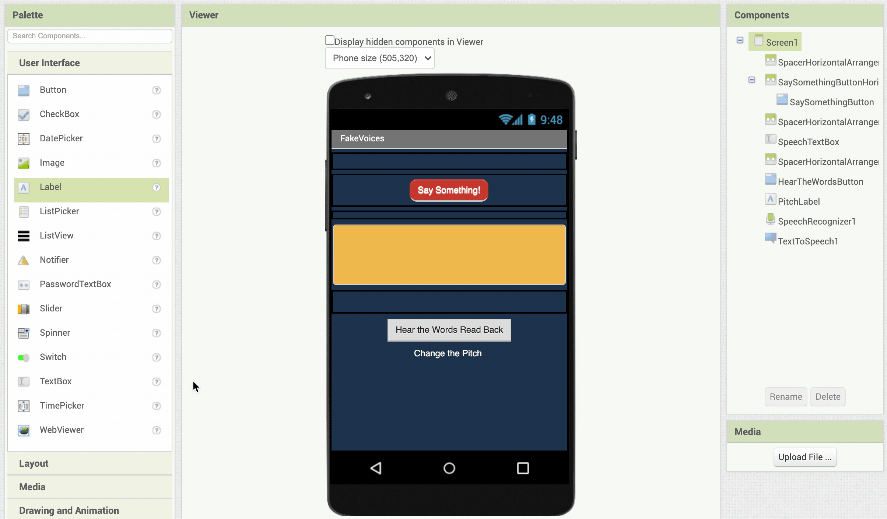
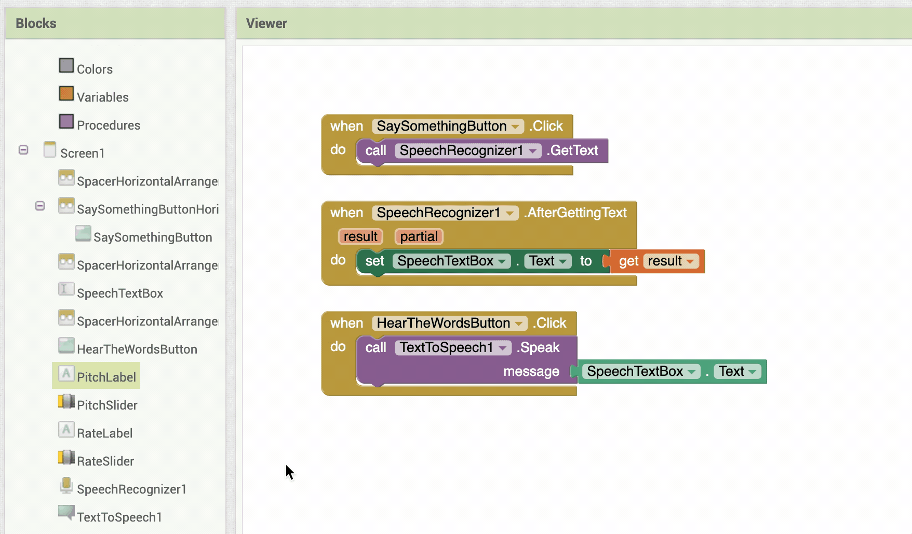

# Challenge

Make Your Own Fake Voice!

“Deepfakes” are videos and sounds created by artificial intelligence. Powerful computers make deepfakes by learning from recordings of human beings, then creating new, fake versions that match humans almost exactly.

{:.enlargeImage}

An app called MyHeritage makes lifelike recreations of anyone. A fake of the historical black hero Fredrick Douglas is shown here.

Sometimes the voices in deepfakes sound a little fake — other times, it is hard to tell. Can anyone trust what they hear ever again?

Create your own strange or spooky voices by coding the Fake Voices app using the steps below. These voices are not true deepfakes because they do not use artificial intelligence, but they are still pretty good!

The tutorial already has some code to get you started. When you are done, try modifying the design and function of your app to perform some useful task in your life. You can also explore fake voices that use artificial intelligence using the links at the end.

If you have never used App Inventor before, check out “Set Up Your Computer” and “Get to Know App Inventor” below for a quick overview.

This tutorial was inspired by the YR Media stories <a href="https://interactive.yr.media/double-take-four-deepfake-scenarios/" target="_blank">Four Deepfake Scenarios</a> and the <a href="https://yr.media/podcasts/fake-ish/" target="_blank"> Fake-Ish Podcast: Getting Real about Imposter Syndrome and Other Ways We Feel Fake</a>.

# Set up Your Computer

# Get to Know App Inventor

## Check out the App Inventor Screens

With App Inventor, anyone can create real apps for phones and tablets for free. There are two main parts of App Inventor: the <strong>Designer</strong> view and the <strong>Blocks</strong> editor.

In the <b>Designer</b> view, add components to your app and lay out how it will look. (You can click on the images below to make them larger.)

{:.enlargeImage}

In the <strong>Blocks</strong> editor, code your app to make it do stuff!

{:.enlargeImage}

Toggle between these screens using the buttons in the top right corner.

{:.enlargeImage}

## Look at the Designer

In the designer view, the <strong>Palette</strong> is where you find all the components. Drag and drop any component from <strong>Palette</strong> into the viewer. (But for this tutorial, stick with the components in the starter file. You will need them later.)

{:.enlargeImage}

The <strong>Viewer</strong> is where you drag components to see how the app will look.

{:.enlargeImage}

<strong>Components</strong> shows all components you will use in the app. You can rename or delete them here too. (But keep the components in this file for now. You will need them to code later!)

{:.enlargeImage}

<strong>Media</strong> shows any uploaded media files, like images or sounds.

{:.enlargeImage}

Finally, <strong>Properties</strong> lets you view or change the properties (like the color or position) of the currently selected component.

{:.enlargeImage}

# The Fake Voices Tutorial (Level: Beginner)

## Introduction

See what the finished Fake Voices app will look like, then follow the steps to make your own! (Click to enlarge.)

{:.enlargeImage}

## Check out the Design

In the <strong>Designer</strong> view, look at the components that are already in the starter template. Don’t forget to look at the non-visible components under the phone!

Try to figure out what each component does. (But keep the component names as they are. You will need to code with them later!)

{:.enlargeImage}

## Finish the Design

For this app, start by adding a button and a few slider bars.

First, add a button. Go to <strong>Palette</strong> and drag in a <strong>Button</strong> component:

{:.enlargeImage}

Name the button. Make sure the button is selected in <strong>Components</strong> and change the button name to “HearTheWordsButton”:

{:.enlargeImage}

Change the button text. Select the button in <strong>Components</strong>, go over to the <strong>Properties</strong> window, and change the button text to “Hear the Words Read Back”:

{:.enlargeImage}

Add a label. Next, go to <strong>Palette</strong> and drag in a <strong>Label</strong> component:

{:.enlargeImage}

Change the label text. Select the label, go to <strong>Properties</strong>, and change the label text to “Change the Pitch”. Don’t forget to change the <i>TextColor</i> to white so that people can see your new label!

{:.enlargeImage}

## Add Some Sliders

Add a slider. Go to <strong>Palette</strong> and drag in a <strong>Slider</strong> component. Make sure the slider is selected in <strong>Components</strong> and change the name to “PitchSlider”:

{:.enlargeImage}

Change the slider properties. Make the PitchSlider slider stretches across the screen by changing its width to “Fill Parent.” To make the slider work with the app's other features, change its <i>MaxValue</i>, <i>MinValue</i>, and <i>ThumbPosition</i> as shown.

{:.enlargeImage}

Add another label and slider. Change the text for this label to “Change the Rate”. Change the name of the slider to “RateSlider”, then change its properties as you did for the PitchSlider above.
(Note: Don’t worry about changing the appearance of these components for now. You can tweak the design once you test the app!

{:.enlargeImage}
{:.enlargeImage}

## Check out the Code
Click on the "Blocks" button in the upper right corner to see where to code your app.

{:.enlargeImage}

Some code is already in the blocks editor to get you started. First, look over each code block so you understand what it does.

{:.enlargeImage}

The first block shows what happens when you click the “Say Something!” button in the app. The button starts the purple block inside — call SpeechRecognizer1.GetText. This code turns spoken words into text.

{:.enlargeImage}

The button <i>calls</i> the SpeechRecognizer code in purple. To <i>call</i> something means to start some useful code that has a special purpose. It’s like calling your sister from across town to come fix your bike tire. (Because she’s really good with bikes!)

The second event block — when SpeechRecognizer1.AfterGettingText — waits for SpeechRecognizer to be done listening and “calls” more useful code.

{:.enlargeImage}

In this case, it puts what you say into a text block called get result. The get result connects to the set SpeechTextBox.Text block to make the app dump all the text into the big yellow text block on the screen. (You can always find result by hovering over the word “result” in orange on the block.)

## Test the Speech Recognition
The SpeechRecognizer code turns what you say into written text. (The new buttons and sliders you made near the bottom will not work until you add more code later.)

Connect your app to your phone using App Inventor Companion.

{:.enlargeImage}

When you press the “Say Something!” button, does it bring up a small screen to capture what you say? Speak into the phone, and the app should automatically type the words into the text box.

Try to fool the SpeechRecognizer software with unusual words or phrases. Does it always get it right?

## Make the App Talk

Add a new block. This time you will use a different event to make the app start speaking. Drag in the button-click event when HearTheWordsButton.click.

{:.enlargeImage}

The when HearTheWordsButton.click block says what happens when you press the “Hear the Words Read Back” button. The button calls whatever code is inside this block.

In this case, you want the phone to read the contents of the text box out loud. When computers read text aloud, it is called “text to speech” or “speech synthesis.”

<hint markdown="block" title="What Is Text to Speech?">
Computers can speak written words, but it is harder than it seems for machines to speak like humans. Sometimes the emphasis is wrong, or the pauses sound unnatural.

Text-to-speech in this app can be adjusted to reproduce accents. The software can speak English with an American, Irish, Australian, or another accent. The software can also speak Spanish with a Mexican, Castilian, or another accent.

Text-to-speech in phones is pretty good, but synthetic speech made by artificial intelligence software sounds even better. In many cases, you cannot easily tell that the AI is not a human being!
</hint>

## Tell the App What to Say

Add text-to-speech. Drag in the call TextToSpeech1.Speak block from the blocks in the TextToSpeech1 component.

{:.enlargeImage}

Link back to the text box. The text-to-speech component still needs to know what to say. To do that, add a link to the text inside the text box. You can find that here:

{:.enlargeImage}

## Test the Fake Voice

Test your app again using App Inventor Companion.

{:.enlargeImage}

This time, press the “Say Something” button to generate some text, and then press the “Hear the Words Read Back” button to have the computer read the words out loud. Does it sound like a human? Pretty close?

Try a second way of entering text in the orange text box: Cut some text from somewhere on your phone or tablet and paste it into the text box.

{:.enlargeImage}

Drawing by @Hafoba.

  

## Mix It up with Sliders
Want to make the computer voice especially creepy? Use the slider buttons to change the pitch and rate of the voice.

Each time the user moves these sliders, the slider bars assign a numerical value for their new position. When the user moves the slider to the left, it assigns a lower number, and to the right, it assigns a higher number.

Set the voice pitch. Add a “setter” block from the TextToSpeech components.

{:.enlargeImage}

See how the little puzzle piece still needs one more piece?

{:.enlargeImage}

The TextToSpeech1 setter block is looking for a value. How will you finish the block and give it value?

<hint markdown="block" title="Give Me a Hint">

Yes, to get the pitch value, drag in the thumb position for the pitch slider.

{:.enlargeImage}

</hint>

Now create another setter for the speech rate. The process is the same as for the pitch, except that now it is the set TextToSpeech1.SpeechRate setter and the thumb position for the <i>rate</i> slider instead.

<hint markdown="block" title="Check My Solution">

{:.enlargeImage}

</hint>

## Test Your Final Code

One more time, test your app using App Inventor Companion. This time, make the app read the text in a creepy monster voice or high birdy voice. What are the strangest combinations of low/high pitch and fast/slow rate you can find?

Congratulations, you are done! You have created an app that recognizes speech and speaks the words with custom pitch and rate. Next, you can <strong>Build</strong> the app in App Inventor to use on any Android phone anywhere. Remember, with great power comes great responsibility! Don’t use your new app to scare or freak anyone out!

{:.enlargeImage}
Boris Karloff in the movie Frankenstein (1931). © Universal Pictures

# Expand Your App
Computers make fake voices in many different ways. The system inside a phone or tablet is a very basic one called <i>text to speech</i>. Do you think the voice from your app would fake anyone out when reading a long passage? What is missing?

Some artificial intelligence systems — such as Siri, Google Voice, or Alexa — sound much more human. They create <i>synthetic speech</i>. These machine learning models are trained by listening to millions of humans speak. Can they really trick the human ear? You decide.

Try the following experiment:

* In your phone or tablet, copy a few sentences of text from a speech or book, such as the famous passage from Martin Luther King, Jr.’s “I Have a Dream” speech, below.

We refuse to believe that the bank of justice is bankrupt. We refuse to believe that there are insufficient funds in the great vaults of opportunity of this nation. So we have come to cash this check, a check that will give us upon demand the riches of freedom and security of justice.

* Paste this passage into the text box in your app and take note of how natural it sounds.
* Next, paste this passage into artificial intelligence systems, such as:
  - <b>Google Cloud Assistant</b>. Go down <a href="https://cloud.google.com/text-to-speech/">the page</a> to the section on the left side named “Demo.” Replace the text provided in the box with any text you want. Experiment with the <i>Language</i> and <i>Voice name</i> settings.
  - <b><a href="https://www.ibm.com/demos/live/tts-demo/self-service/home">IBM Watson Text to Speech</a></b>. Replace the text provided in the box with any text you want. Experiment with the <i>Language</i>, <i>Dialect</i>, and <i>Neutral voice</i> settings.

Which fake voices sound the most human? Which is your favorite?

Here are some ideas for ways to enhance your app. Try them out, or come up with your own ideas!

* Make the user interface simpler to use or more attractive. Let five people try your app and see what they think. Ask people of different ages and different comfort levels with computers. Based on this feedback, what user interface changes do you need to make?
* Show a numerical value for the pitch and speed levels on the screen.
* Speak into the app in another language (the app should automatically detect some languages). How could you set TextToSpeech1 to read the text back in a better sounding accent? For instance, how could you use the set TextToSpeech1.Language block and the language code “ES” to get a better Spanish accent in your app?
* How could you use the app features to create something that performs an important task or service, such as an instant translator for traveling?

What ideas do you have?

# About Youth Mobile Power
A lot of us spend all day on our phones, hooked on our favorite apps. We keep typing and swiping, even when we know the risks phones can pose to our attention, privacy, and even our safety.  But the computers in our pockets also create untapped opportunities for young people to learn, connect and transform our communities.

That’s why MIT and YR Media teamed up to launch the Youth Mobile Power series. YR teens produce stories highlighting how young people use their phones in surprising and powerful ways. Meanwhile, the team at MIT is continually enhancing MIT App Inventor to make it possible for users like you to create apps like the ones featured in YR’s reporting.

Essentially: Get inspired by the story, get busy making your own app!
 

 The YR + MIT collaboration is supported in part by the National Science Foundation. This material is based upon work supported by the National Science Foundation under Grant No. (1906895, 1906636). Any opinions, findings and conclusions or recommendations expressed in this material are those of the author(s) and do not necessarily reflect the views of the National Science Foundation.

 Check out more apps and interactive news content created by YR <a href="https://yr.media/category/interactive/" target="_blank">here</a>.
