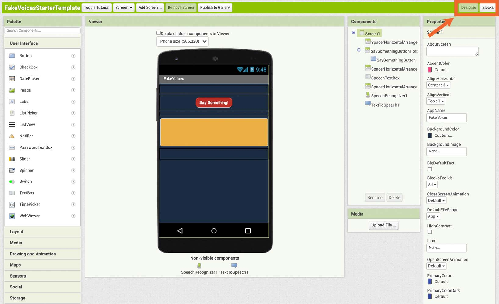
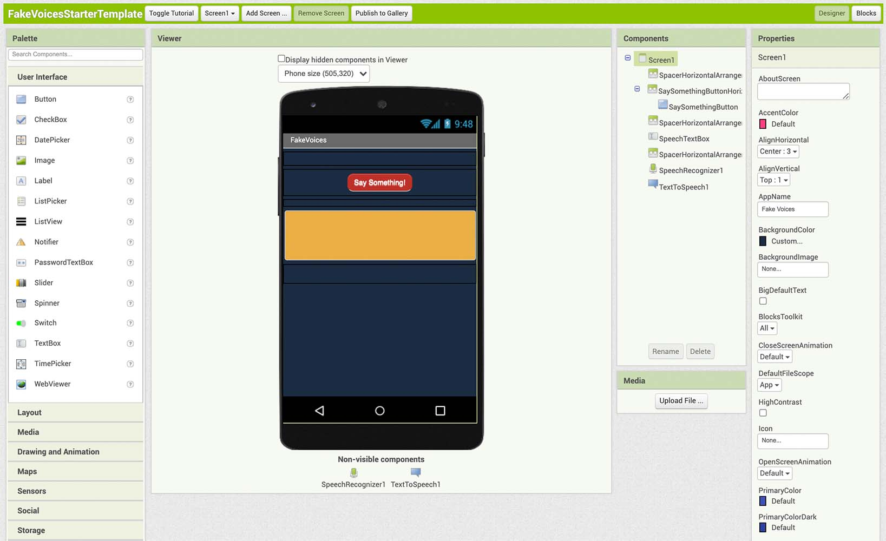
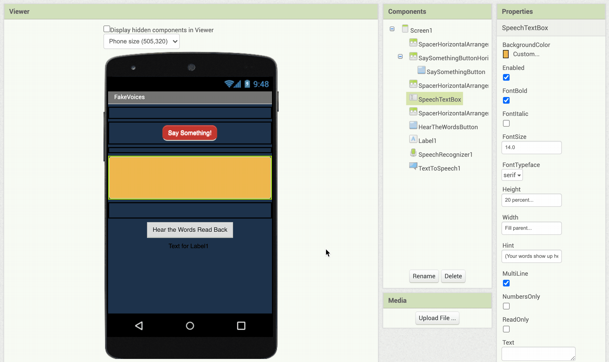
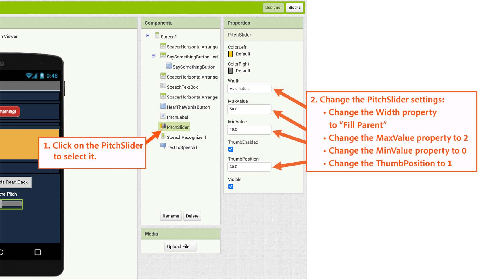
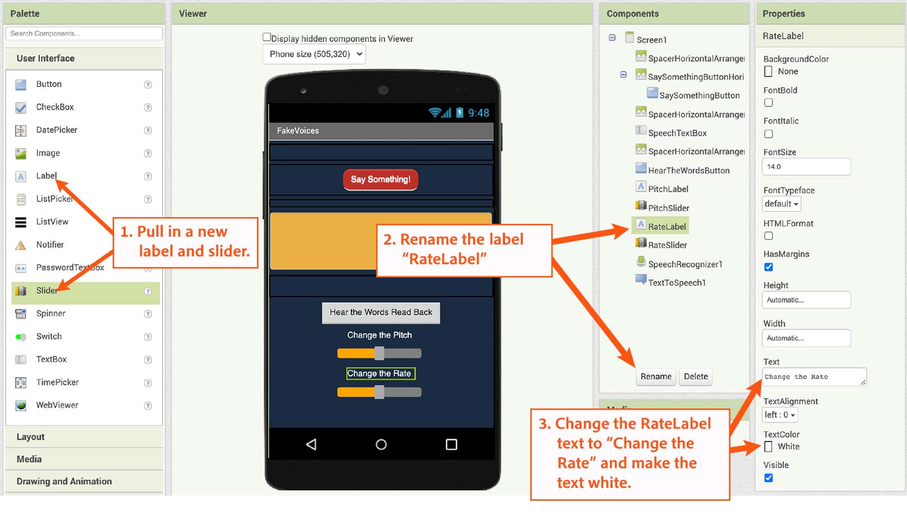
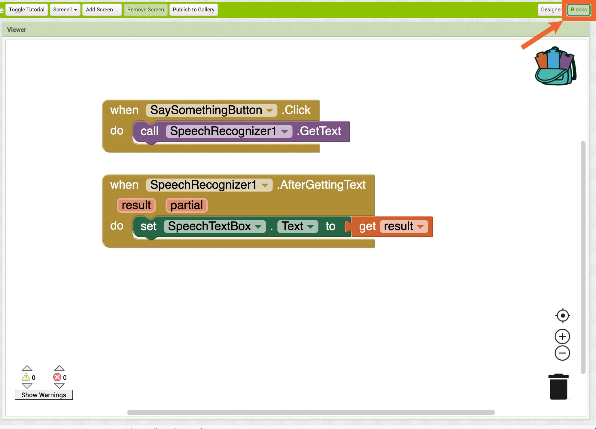
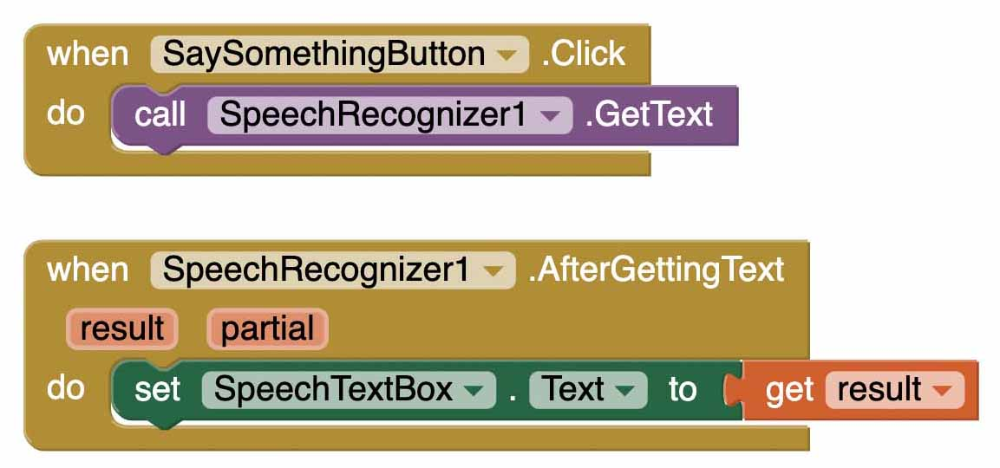
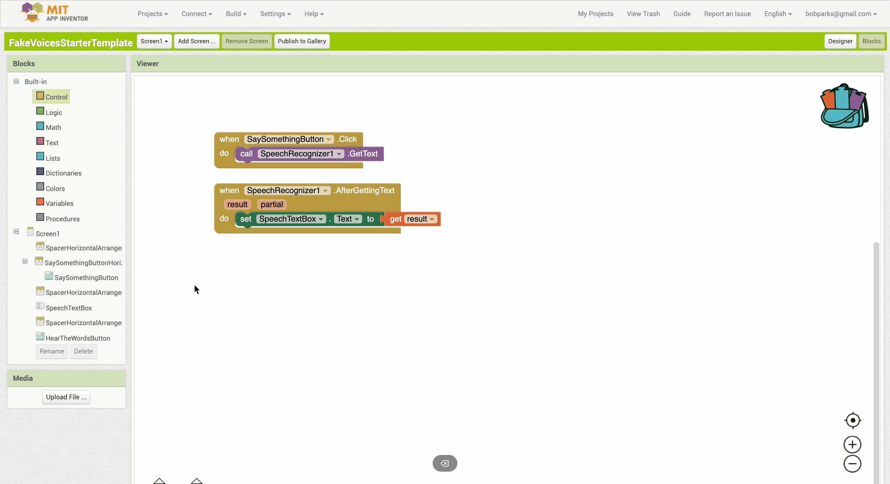

# Challenge

Make Your Own Fake Voice!

“Deepfakes” are videos and sounds created by artificial intelligence. Powerful computers make deepfakes by learning from recordings of human beings, then creating new, fake versions that match the humans almost exactly.

For example, the sound of Jay-Z's voice was created by a computer model in this video:

<video width="90%" controls>
  <source src="../images/Fake_Voices/2B.mp4" type="video/mp4">
  Your browser does not support the video tag.
</video>

This <a href="https://www.youtube.com/watch?v=m7u-y9oqUSw" target="_blank">deepfake video</a> makes it sound like Jay-Z is reading Shakespeare's "To be, or not to be" speech.

Sometimes the voices in deepfakes sound a little fake — other times, it is hard to tell. Can anyone trust what they hear ever again?

Create your own strange or spooky voices by coding the Fake Voices app below. These voices are not true deepfakes because they do not use artificial intelligence, but they are pretty good!

The tutorial already has some code to get you started. When you are done, try modifying the design and function of your app to perform a useful task in your life. You can also explore fake voices that use artificial intelligence using the links at the end.

Use either an iOS or Android phone/tablet to test this app, but a Chromebook will not work as a test device because of the way it handles speech recognition. If you have never used App Inventor before, check out “Set Up Your Computer” and “Get to Know App Inventor” below for a quick overview.

This tutorial was inspired by the YR Media stories <a href="https://interactive.yr.media/double-take-four-deepfake-scenarios/" target="_blank">Four Deepfake Scenarios</a> and the <a href="https://yr.media/podcasts/fake-ish/" target="_blank"> Fake-Ish Podcast: Getting Real about Imposter Syndrome and Other Ways We Feel Fake</a>.

# Set Up Your Computer

# Get to Know App Inventor

## Check out the App Inventor Screens
With App Inventor, anyone can create real apps for phones and tablets for free. There are two main parts: the <strong>Designer</strong> view and the <strong>Blocks</strong> editor.

In the <b>Designer</b> view, you can add components to your app and lay out how it will look. (Click the images below to make them larger.)

{:.enlargeImage}

In the <strong>Blocks</strong> editor, code your app to make it do stuff!

{:.enlargeImage}

Toggle between these screens using the buttons in the top right corner.

{:.enlargeImage}

## Look at the Designer
In the designer view, <strong>Palette</strong> is where you find all the components. Drag and drop any component from <strong>Palette</strong> into the viewer. (But for this tutorial, stick with the components as they are. You will need these components later!)

{:.enlargeImage}

<strong>Viewer</strong> is where you drag components to see how the app will look.

{:.enlargeImage}

<strong>Components</strong> shows all the components you will use in the app. You can rename or delete them here too. (But, again, keep the components as the same for now!)

{:.enlargeImage}

<strong>Media</strong> shows any uploaded media files, like images or sounds.

{:.enlargeImage}

Finally, <strong>Properties</strong> lets you view or change the properties (like the color or position) of the currently selected component.

{:.enlargeImage}

# The Fake Voices Tutorial (Level: Beginner)

## Introduction
See what the finished Fake Voices app will look like, then follow the steps to make your own! (Click to enlarge.)

{:.enlargeImage}

## Check out the Design
In the <strong>Designer</strong> view, look at the components that are already in the starter template. Don’t forget to look at the non-visible components under the phone!

Try to figure out what each component does. (But keep the component names the same. You will need to code with them later!)

{:.enlargeImage}

## Finish the Design
For this app, start by adding a button and a few slider bars.

First, add a button to make the app speak. We will need a button to hear the text read back to us. Go to <strong>Palette</strong> and drag in a <strong>Button</strong> component:

{:.enlargeImage}

You just added a component to the app, but it is not connected to anything until you code later on. (It's like the doorbell at your uncle's house: there might be a button on the front door, but nothing happens when you push it.)

Rename the button. Renaming components helps you identify them when you code later. For instance, the name "Button1" does not tell you what it is.  

Make sure the button is selected in <strong>Components</strong> and change the button name to “HearTheWordsButton”:

{:.enlargeImage}

Change the button text. Select the button in <strong>Components</strong>, go over to the <strong>Properties</strong> window, and change the button text to “Hear the Words Read Back”:

{:.enlargeImage}

## Create a Slider

Add a label for the pitch slider. Next, go to <strong>Palette</strong> and drag in a <strong>Label</strong> component:

{:.enlargeImage}

Change the label name and text. Select the label and rename it "PitchLabel". Then, go to <strong>Properties</strong> and change the label text to “Change the Pitch”. Don’t forget to change the <i>TextColor</i> to white so that people can see your new label!

{:.enlargeImage}

Add a slider to change the pitch. Go to <strong>Palette</strong> and drag in a <strong>Slider</strong> component. Make sure the slider is selected in <strong>Components</strong> and change the name to “PitchSlider”:

{:.enlargeImage}

Change the slider properties. Make the PitchSlider stretch across the screen by changing its width to “Fill Parent” as shown below. To make the slider work with the app's other features, change its <i>MaxValue</i>, <i>MinValue</i>, and <i>ThumbPosition</i> too.

{:.enlargeImage}

## Add Another Slider
Drag in another label and slider to change the rate. Rename the label to "RateLabel" as shown below. Change the name of the slider to “RateSlider”. Change the text for this label to “Change the Rate”. Then, change its properties as shown in the second image, below.

(Note: Don’t worry about changing the appearance of these components for now. You can tweak the design once you test the app!

{:.enlargeImage}
{:.enlargeImage}

## Check out the Code
Click on the "Blocks" button in the upper right corner to see where to code your app.

{:.enlargeImage}

Some code is already in the <strong>Blocks</strong> editor to get you started. First, look over the code to see if you can guess what it does.

{:.enlargeImage}

## Take It Block by Block

{:.enlargeImage}

The brown blocks are called "event handlers" because they fire when something important happens in the app. The first event handler shows what happens when you click the “Say Something!” button in the app. The button starts the purple block inside — call SpeechRecognizer1.GetText and turns your spoken words into text:

{:.enlargeImage}

The button <i>calls</i> the SpeechRecognizer code in purple. To <i>call</i> something means to start some code with a special function. It’s like calling your sister from across town to come fix your bike tire. (Because she’s really good with bikes!)

The second event handler calls set SpeechTextBox.Text to show the text in your app:

{:.enlargeImage}
In this case, SpeechRecogizer stores what you say in the variable result. By connecting the variable to the text box, you make the words show up on the screen. (In the future, you can always find the get result block by hovering over the word *result* in orange as shown below.)

 {:.enlargeImage}

## Test the Speech Recognition
The SpeechRecognizer1 code turns what you say into written text. (The new button and sliders you made will not work until you add more code later.)

Connect the app to your phone using App Inventor Companion.

{:.enlargeImage}

When you press the “Say Something!” button, does it bring up a small screen to capture what you say? Speak into the phone, and the app should automatically type the words into the text box.

Try to fool the SpeechRecognizer software with unusual words or phrases. Does it always get it right?

## Make the App Talk
Add a block of code for your button. Make the app start speaking when someone presses the HearTheWordsButton. Drag in the button-click event handler when HearTheWordsButton.click as shown below:

{:.enlargeImage}

When someone presses the button, this block calls whatever code is inside. In this case, you want the phone to read the contents of the text box out loud. When computers read text, it is called “text-to-speech.”

Add text-to-speech. Drag in the call TextToSpeech1.Speak block from the blocks in the TextToSpeech1 component.

{:.enlargeImage}

<hint markdown="block" title="What Is Text-to-Speech?">
Computers can speak written words, but it is harder than it seems for machines to speak like humans. Sometimes the emphasis is wrong, or the pauses sound unnatural.

Text-to-speech in this app can be adjusted to reproduce accents. The software can speak English with an American, Irish, Australian, or another accent. The software can also speak Spanish with a Latin American, Castilian, or another accent.

Text-to-speech in phones is pretty good, but synthetic speech made by artificial intelligence software sounds even better. In many cases, you cannot easily tell that the AI is not a human being!
</hint>

## Tell the App What to Say
Get the text. The text-to-speech component still needs to know what to say. To do that, get the text from the SpeechTextBox.Text. You can find that here:

{:.enlargeImage}

## Test the Fake Voice
Test your app again using App Inventor Companion.

{:.enlargeImage}

This time, press the “Say Something” button to generate some text, and then press the “Hear the Words Read Back” button to have the computer read the words out loud. Does it sound like a human? Pretty close?

Try a second way of entering text in the orange text box: Cut some text from somewhere on your device and paste it into the text box.

{:.enlargeImage}

Drawing by @Hafoba.

## Use Your Sliders
Want to make the computer voice especially creepy? Hook up the slider buttons to the code to change the pitch and rate of the voice.

Each time the user moves these sliders, the slider bars assign a numerical value for their new position. When the user moves the slider to the left, it assigns a lower number, and to the right, it assigns a higher number.

Set the voice pitch. Add a set TextToSpeech1.Pitch block to the event handler, as shown below. The blocks must go above call TextToSpeech1.Speak so that they change the settings *before* the words are spoken!

{:.enlargeImage}

See how the little puzzle piece still needs one more piece?

{:.enlargeImage}

The TextToSpeech1 setter block is looking for a value. How will you finish the block and give it value?

<hint markdown="block" title="Give Me a Hint">

Yes, to get the pitch value, drag in the thumb position for the pitch slider.

{:.enlargeImage}

</hint>

Create another setter for the speech rate. The process is the same as for the pitch, except this time use set TextToSpeech1.SpeechRate and the thumb position for the <i>rate</i> slider.

<hint markdown="block" title="Check My Solution">

{:.enlargeImage}

</hint>

## Test Your Final Code
One more time, test your app using App Inventor Companion. This time, make the app read the text in a creepy monster voice or high birdy voice. What are the strangest combinations of low/high pitch and fast/slow rate you can find?

Congratulations, you are done! You have created an app that recognizes speech and speaks the words with a custom pitch and rate. Next, you can <a href="http://appinventor.mit.edu/explore/ai2/share" target="_blank">Build</a> the app in App Inventor to share with any Android phone anywhere. Important: With great power comes great responsibility! Don’t use your new app to scare or freak anyone out!

{:.enlargeImage}
Boris Karloff in the movie Frankenstein. © 1931 Universal Pictures

# Expand Your App
Computers make fake voices in many different ways. The system inside a phone or tablet is a very basic one called <i>text to speech</i>. Do you think the voice from your app would fake anyone out when reading a long passage? What is missing?

Some artificial intelligence systems — such as Siri, Google Voice, or Alexa — sound much more human. They create <i>synthetic speech</i>. These machine-learning models are trained by listening to millions of humans speak. Can they really trick the human ear? You decide.

Try the following experiment:

* In your phone or tablet, copy a few sentences of text from a speech or book, such as a passage from Martin Luther King, Jr.’s “I Have a Dream” speech, below.

We refuse to believe that the bank of justice is bankrupt. We refuse to believe that there are insufficient funds in the great vaults of opportunity of this nation. So we have come to cash this check, a check that will give us upon demand the riches of freedom and security of justice.

* Paste this passage into the text box in your app and take note: Does it sound natural?
* Next, paste this passage into one of the following artificial intelligence systems (both are free):
  - <a href="https://cloud.google.com/text-to-speech/#section-2" target="_blank"><b>Google Cloud Assistant</b></a>. Go down the page to the section on the left named “Demo.” Replace the text provided in the box with any text you want. Experiment with the <i>Language</i> and <i>Voice name</i> settings.
  - <b><a href="https://www.ibm.com/demos/live/tts-demo/self-service/home" target="_blank">IBM Watson Text to Speech</a></b>. Replace the text provided in the box with any text you want. Experiment with the <i>Language</i>, <i>Dialect</i>, and <i>Neutral voice</i> settings.

Which fake voices sound the most human? Which is your favorite?

Here are some ways to enhance your app. Try them out, or come up with your own ideas!

* Make the user interface easier or more attractive. Let five people try your app and see what they think. Ask people of different ages and different comfort levels with computers. Based on this feedback, what user interface changes do you need to make?
* Show a numerical value for the pitch and rates on the screen.
* Type or paste into the app text in another language (in some cases, you can even speak to it in Spanish!) How could you set TextToSpeech1 to read the text back in a better accent? For instance, how could you use the set TextToSpeech1.Language block and the language code “ES” to get a better Spanish accent in your app? (If you are using an Android device, make sure the device's text-to-speech is set to the Google Speech Engine in the settings.) How could you allow the user to choose accents from the app's interface?
* Change the text-to-speech voice to a male voice (for a real Frankenstein effect). In iOS, look in the settings for "VoiceOver" under Accessibility. In Android, look for the "Text-to-speech output" setting. (Android makes you choose a language before choosing a specific voice in that language.)
* How could you use the app features to create something that performs an important task or service, such as an instant translator for traveling?

What ideas do you have?

# About Youth Mobile Power
A lot of us spend all day on our phones, hooked on our favorite apps. We keep typing and swiping, even when we know the risks phones can pose to our attention, privacy, and even our safety.  But the computers in our pockets also create untapped opportunities for young people to learn, connect and transform our communities.

That’s why MIT and YR Media teamed up to launch the Youth Mobile Power series. YR teens produce stories highlighting how young people use their phones in surprising and powerful ways. Meanwhile, the team at MIT is continually enhancing MIT App Inventor to make it possible for users like you to create apps like the ones featured in YR’s reporting.

Essentially: Get inspired by the story, get busy making your own app!
 

 The YR + MIT collaboration is supported in part by the National Science Foundation. This material is based upon work supported by the National Science Foundation under Grant No. (1906895, 1906636). Any opinions, findings and conclusions or recommendations expressed in this material are those of the author(s) and do not necessarily reflect the views of the National Science Foundation.

 Check out more apps and interactive news content created by YR <a href="https://yr.media/category/interactive/" target="_blank">here</a>.
