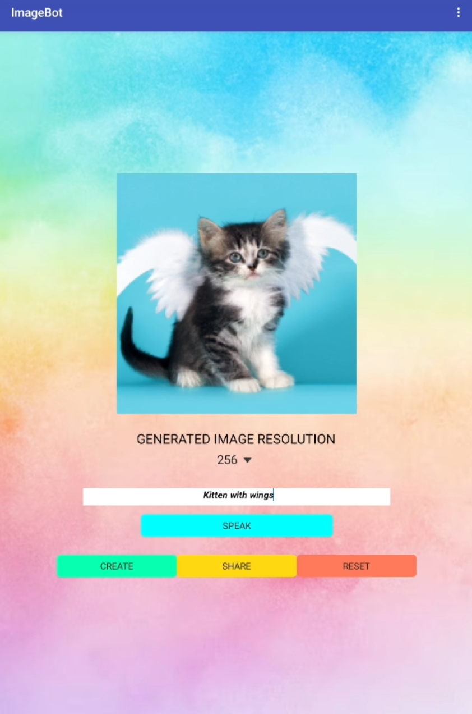
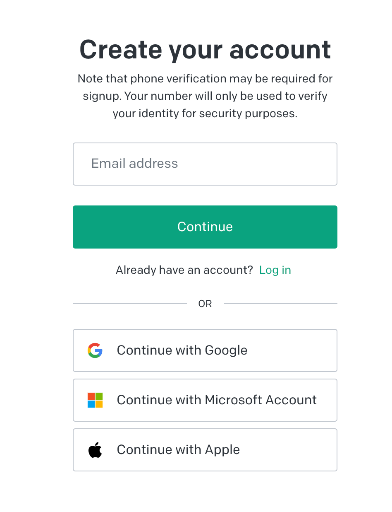
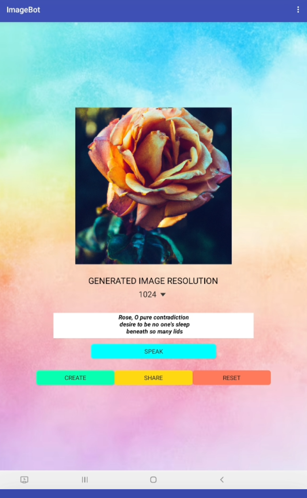
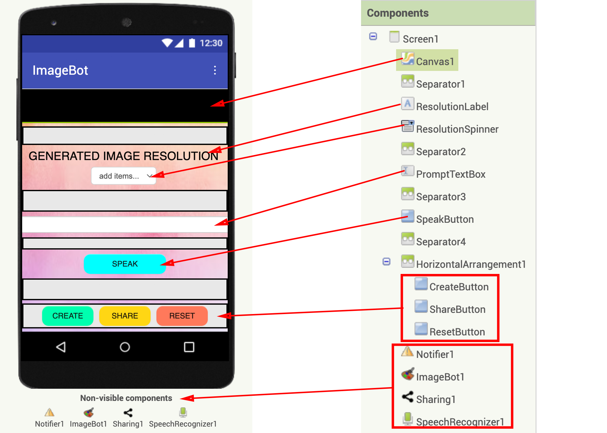
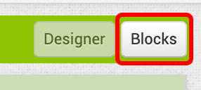
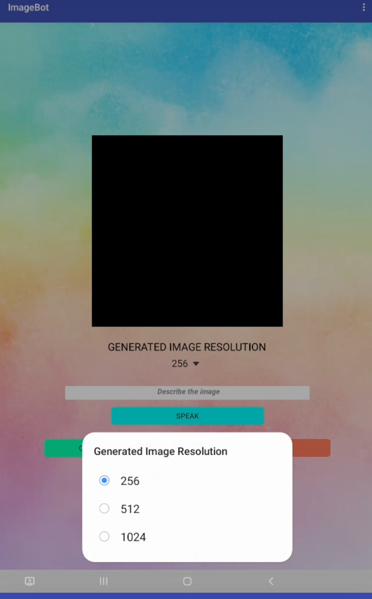

# Challenge

MIT App Inventor ImageBot Tutorial: 
Imagine, Articulate, Generate, and Share

Have you ever wondered how it is possible to create your very own artistic generative AI app that will allow you to create wildly imaginative visualizations from simple prompts?  In this tutorial, you will build a simple app with MIT App Inventor that allows users to connect to OpenAI's DALL-E generative AI program and generate exciting artistic visualizations.

{:.enlargeImage}

# Setup

## Getting your own OpenAI API Key

For this project you will need to get your own OpenAI API key to use MIT App Inventor’s <strong>ImageBot</strong> component.  As of the writing of this tutorial, OpenAI allows users 13 years old and older to create their own OpenAI accounts and generate their own OpenAI API keys. For the first 3 months, you are given a $5 free credit which should get you quite a bit of exploration time. After 3 months, any unused portion of the credit expires. Once your free credit is gone, you will need to become a paying customer with a credit card.  Follow the steps below to create your OpenAI account and get your OpenAI API key.

Follow the steps below to create you OpenAI account and get your OpenAI API key.

1. Go to <a href="https://openai.com/" target="_blank">https://openai.com/ </a>
    
2. Click on the Sign up button on  the upper right

    {:.enlargeImage}
    

3. Create your account by entering your email and choosing a password.  You can also sign up using your Google, Microsoft and Apple accounts.

    {:.enlargeImage}
    

    {:.enlargeImage}
    

4. You will need to verify your e-mail and phone number during the signup process.

5. To get your personal OpenAI API  key go to <a href="https://platform.openai.com/account/api-keys" target="_blank">https://platform.openai.com/account/api-keys </a>
 
6. Click on the  API keys tab and the Create new secret key button.

    {:.enlargeImage}
    

7. Give your key a name if you wish.  This step is optional.

    {:.enlargeImage}
    

8. Copy and save your API key somewhere safe on your computer.  You will need it while doing the project.

## Updating AI2 Companion

If you have not done so, please upgrade your AI2 Companion to version 2.67 or higher.

# ImageBot Tutorial

## Overview

In this tutorial, you will be exploring the <strong>ImageBot</strong> component of App Inventor, building  an app that allows users to create images using OpenAI’s DALL-E. Users choose the image resolution, then speak a prompt that goes to OpenAI. Once OpenAI creates the image in the app, users can re-generate other images with the same prompt until they like the final result. With the click of a button, they can share the image with friends on social media or email it to themselves. Once the process completes, users can reset the interface and start over again.

{:.enlargeImage}

## The Graphical User Interface (GUI)

In this project, most of the User Interface (UI) has been created for you. Study the given components (most should be intuitive). The <strong>Spinner</strong> component may be unfamiliar to you — in this app, it provides a drop-down menu for users to select the desired resolution for the image to be generated.

Drag and drop the following Non-visible components to your app: 
* <strong>Notifier</strong> (from <strong>User Interface</strong> components drawer)
* <strong>ImageBot</strong> (from <strong>Experimental</strong> components drawer)
* <strong>Sharing</strong> (from <strong>Social</strong> components drawer) 
* <strong>SpeechRecognizer</strong> (from <strong>Media</strong> components drawer) 

Your final GUI should look like the one below. (Note: you may need to scroll down to see all your components in the Viewer.)

{:.enlargeImage}

## Adding your OpenAI API Key

To use the DALL-E program, you will need an OpenAI API Key. You generated this in this tutorial’s Setup section (see below). Copy-paste the key you generated to the <em>ApiKey</em> property of your <strong>ImageBot</strong> component. Your key will look different than the partial key shown below.

{:.enlargeImage}

## Coding the GUI functionality (1)

Now you are ready to give functionality to all these components.  Click on the Blocks button to go to the Blocks editor.

{:.enlargeImage}

Start by initializing a global variable <strong><em>imageFileName</em></strong> which you will use to keep track of the image files created.  Initially, this variable should be assigned an empty string.

{:.enlargeImage}

## Coding the GUI functionality (2)

Code an event block that allows users to speak their prompt into the app.  When users press the <strong>SpeakButton</strong>, the <strong>SpeechRecognizer</strong> must capture their utterance and turn it into text.

{:.enlargeImage}

After the <strong>SpeechRecognizer</strong> returns with the text of the user's prompt, then set the <strong>PromptTextBox</strong>’s text to this returned text.

{:.enlargeImage}

## Coding the GUI functionality (3)

Next, users can choose a resolution (256, 512, or 1024) for the image.  The default is 256.

{:.enlargeImage}

After a selection has been made using the <strong>ResolutionSpinner</strong>, the value selected must be set as the <em>Size</em> property of the <strong>ImageBot</strong> component.

{:.enlargeImage}

## Coding the GUI functionality (4)

Now you have all the info needed to generate an image. When users click the <strong>CreateButton</strong>, unless the <strong>PromptTextBox</strong> is empty, have the <strong>Notifier</strong> inform users that the generation process has started via a Progress Dialog message. Then send the entered prompt to OpenAI so that an image based on the description in the prompt can be generated.

{:.enlargeImage}

When OpenAI returns with an image filename, cancel the <strong>Notifier</strong> and set the <strong>Canvas</strong> component’s <em>BackgroundImage</em> property to the image file. Also, set the global variable <strong><em>imageFileName</em></strong> to this filename returned by OpenAI. You will need this available when you code the <strong>when ShareButton.Click</strong> event.

{:.enlargeImage}

Once the image shows up on the Canvas, users can repeat the process until they generate an image they like.

## Coding the GUI functionality (5)

When users finish with image generation, the <strong>ShareButton</strong> allows users to access the social media apps available on their mobile devices and share with their friends. 

To prevent runtime errors (such as when users press the <strong>ShareButton</strong> before generating an image), you will need to make sure that the <strong><em>imageFileName</em></strong> is not an empty string. In the message sent on social media, be sure to include the prompt of the image generated along with the image.

{:.enlargeImage}

## Coding the GUI functionality (6)

Finally, when users are done sharing their image, they may wish to get a clean slate and start the process again by generating a new image with a different prompt. So when users click the <strong>ResetButton</strong>, set the image resolution back to the default 256, clear the <strong>Canvas</strong> background image, clear the global variable <strong><em>imageFileName</em></strong>and clear the <strong>PromptTextBox</strong>.

{:.enlargeImage}

## Testing the App

Now test your app by speaking a prompt, generating an image, sharing it on social media, and resetting the app. Try to break it by testing different possibilities of button presses. If any issues are found, revisit your code and make the necessary revisions.

Congratulations — you have just created a powerful app that can generate and share creative images from user prompts.

# Expand Your App

* Research artistic generative AI programs like DALL-E to catch a glimpse of how they are trained and how they operate.
* Create a version of your app in which users can save their favorite image in an image gallery.
* Create a UI that allows users to draw over generated images and share these.
* Create a program that uses ChatGPT to generate a story from user input and then uses DALL-E to generate the visuals that go with the story.
* Play a game where you separate the prompts from their generated images and see if people can guess which goes with which.
* Organize a visual arts competition (in your class, school, district) to see who can create the best images.
* What awesome ideas do you have?

# About Youth Mobile Power
A lot of us spend all day on our phones, hooked on our favorite apps. We keep typing and swiping, even when we know the risks phones can pose to our attention, privacy, and even our safety.  But the computers in our pockets also create untapped opportunities for young people to learn, connect and transform our communities.

That’s why MIT and YR Media teamed up to launch the Youth Mobile Power series. YR teens produce stories highlighting how young people use their phones in surprising and powerful ways. Meanwhile, the team at MIT is continually enhancing MIT App Inventor to make it possible for users like you to create apps like the ones featured in YR’s reporting.

Essentially: Get inspired by the story, get busy making your own app!
 

 The YR + MIT collaboration is supported in part by the National Science Foundation. This material is based upon work supported by the National Science Foundation under Grant No. (1906895, 1906636). Any opinions, findings and conclusions or recommendations expressed in this material are those of the author(s) and do not necessarily reflect the views of the National Science Foundation.

 Check out more apps and interactive news content created by YR <a href="https://yr.media/category/interactive/" target="_blank">here</a>.

