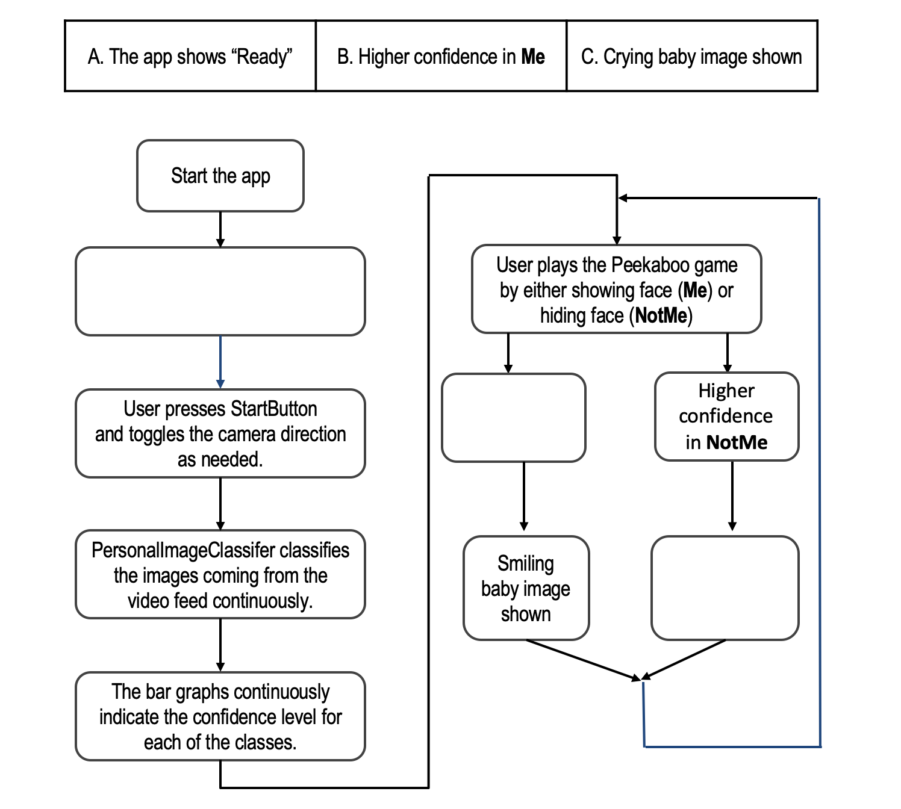
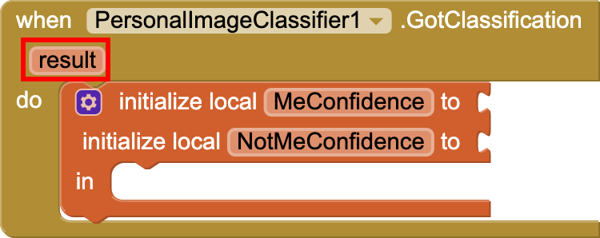
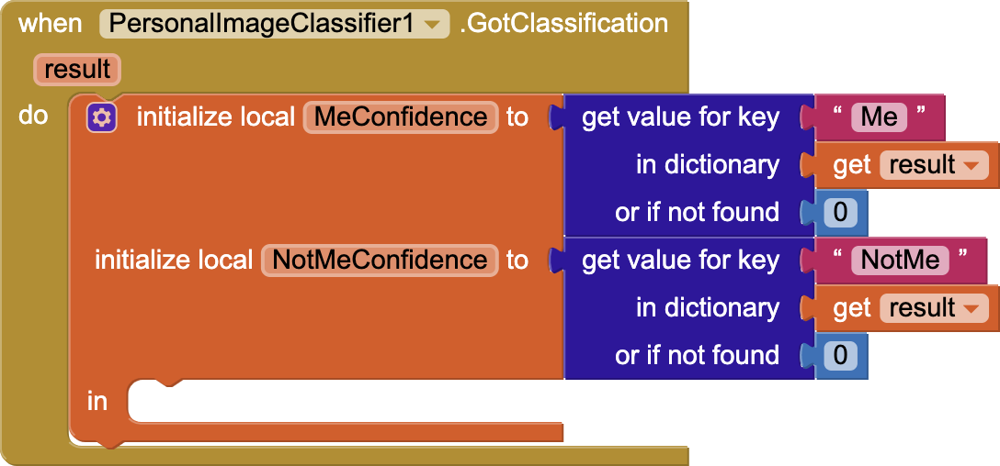
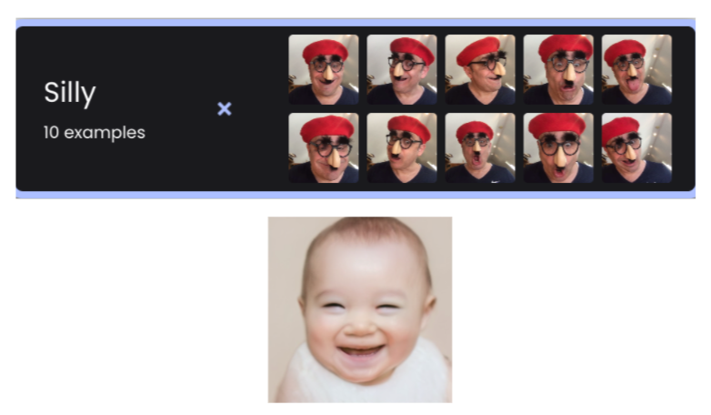

# Challenge

Machine Learning (ML) and Artificial Intelligence (AI) are the big craze today that everyone is talking about.  But what do these words mean?  How can a machine learning something and exhibit intelligence?  In this two part tutorial you will learn about the basics of AI and ML and then using the App Inventor coding environment you will explore Image Classification as an example of Machine Learning and create an app that intelligently responds to your actions.

If you haven’t set up your computer and mobile device for App Inventor, go to the “Setup your Computer” tab to set up your system. Otherwise, go directly to the “PICaboo” tab to start the tutorial.

# Setup your computer

# PICaboo (Level: Intermediate)

## Introduction

In this tutorial, you will make a Peekaboo game app with your very own Personal Image Classification (PIC) model where the baby in the app will smile if your face is shown and will cry if your face is hidden.

{:.enlargeImage}

<hint markdown="block" title="What is the Game of Peekaboo?">
Very young babies do not quite understand yet how to make sense of the visual world around them. One of their challenges is the lack of the sense that objects continue their existence even when they are invisible. This concept is described by the famous child psychologist Jean Piaget as “Object Permanence”. A game that parents often play with their very young babies in the US is called Peekaboo where a parent hides her face (with her hands or with a pillow etc.) and “disappear” to the surprise of the baby and then suddenly show her face saying “Peekaboo, I see you” much to the delight of the baby, who is astonished to see the parent suddenly appear out of “nowhere”. Here is a <a href="https://www.youtube.com/watch?v=Z37Ru-GRtks" target="_blank"> video</a> you can watch for this game. The process through which a machine learns to make sense of visual data is not unlike the way babies learn visual cues. In both cases there needs to be many examples (large sets of training data) and the categories of examples need to be easily distinguishable from one another (visually distinct data classes).

</hint>

 
**Important**: Please note that for this project you cannot use the Emulator to test your app as the Emulator cannot run MIT App Inventor extensions such as the <strong>PersonalImageClassifier</strong> (PIC) extension.  To make sure that your mobile device has the needed hardware capability for PIC, use AI2 Companion on this<a href="../aiaFiles/PICaboo/LookTest.aia" target="_blank"> LookTest.aia </a>test file.  If the status at the top reads "Status: Ready!" then the <strong>PersonalImageClassifier</strong> extension will work. If not, you won't be able to run apps made with this extension. If it works, you can try classifying some objects by pointing the device at an object and pressing the Classify button.

## PICaboo Part 1: Training the model

First you will need to train an image classification model on the App Inventor <a href="https://classifier.appinventor.mit.edu/" target="_blank">Personal Image Classifier</a> page.  To do so follow the instructions on the <a href="../images/PICaboo/PICaboo_Part1.pdf" target="_blank">PICaboo Part 1 pdf document</a>.  At the end of this process do not forget to export the model.mdl file to your computer which you will upload to App Inventor in the next part of the tutorial.

{:.enlargeImage}

## PICaboo Part 2: Designing and Coding the App

A possible Graphical User Interface (GUI) has been created for you in the starter file.  Change the properties of the components as you wish to get the look and feel you want.  However, please do not rename the components, as this tutorial will refer to the given names in the instructions.

{:.enlargeImage}

## Uploading Your Trained Model

Look at the non-visible component <strong>PersonalImageClassifier</strong>. This is the component that will classify your poses based on your trained model.

Upload the model you trained in Part 1 by clicking on the “Model” property and selecting the model you made and downloaded in Part 1 of the tutorial.

{:.enlargeImage}

## Sequence of Events

Follow the sequence of events in the running of the PICaboo. Fill in the missing blocks with the letter corresponding to the correct event.

{:.enlargeImage}

<hint markdown="block" title="Check my solution">
    Left to right boxes: A, B, C.
</hint>
 

## Review Given Code

Now switch to the Blocks Editor to start coding the behaviour for the app.  First look at some of the code blocks that are already included. These blocks set up the <strong>PersonalImageClassifier</strong> when the app first starts.

In case the <strong>PersonalImageClassifier</strong> returns an error, the when PersonalImageClassifier1.Error event block displays the error in the <strong>StatusLabel</strong>.

{:.enlargeImage}

The when PersonalImageClassifer.ClassifierReady block is called when the classifier is ready to start classifying images. <strong>StartButton</strong> and <strong>ToggleCameraButton</strong> are enabled. “Ready” is displayed in the <strong>StatusLabel</strong>. <strong>BarLabel1</strong> and <strong>BarLabel2</strong> are assigned the names of the models labels ("Me" and "NotMe"). These are the classes you trained in the model.

{:.enlargeImage}

When <strong>ToggleCameraButton</strong> is pressed, the direction the camera is facing is switched from Front to Back and vice versa. 

{:.enlargeImage}

<strong>StartButton</strong> is a start/stop toggle button and when it is clicked, if the <strong>PersonalImageClassifier</strong> has been running, its continuous classification process is stopped and otherwise this process is started. Button texts are also changed from "Start" to "Stop" or vice versa accordingly.

{:.enlargeImage}

## Result of Image Classification

Before coding the PICaboo app, let’s see how the result of classification from the component <strong>PersonelImageClassifier</strong> is received and used.

When the classifier produces a classification for what it sees, the when PersonalImageClassifier1.GotClassification event handler block is called. In this tutorial your main task is to complete the code block set for this event handler.

{:.enlargeImage}

The result lists the classifications in the form of dictionary data structure.  A dictionary in Computer Science is a data structure used to store key-value pairs much like a real-world dictionary where words and their definitions are stored. Unlike in the real-world dictionary, the dictionary data structure used in Computer Science can hold arbitrary keys associated with arbitrary values. These arbitrary keys and values can be pretty much anything: letters, words, multi-word strings, numbers, as well as mixed combinations of all these.  Below is an example:

{:.enlargeImage}

In the above example of key-value pairs, “Name” is the key, “Tel” is the value, and the phonebook is the dictionary. 

## Result of Image Classification
The result returned by <strong>PersonelImageClassifier</strong> lists the name (key) of two classes (“Me” and “NotMe”) with their confidence levels (value). This data structure can be represented with code blocks as below. It is important to note that the key-value pairs in result are listed in the order of highest to lowest confidence levels.

{:.enlargeImage}

For example, the result could be composed of the class “Me” with the high confidence level of 0.925 (i.e. 92.5%) and the class “NotMe” with a low confidence level of 0.075 (i.e. 7.5%). These confidence level numbers have been computed by the model you created during the training phase. At this instance the baby in the PICaboo app would be smiling as the baby (i.e. the machine) is confident that he is seeing your face.

{:.enlargeImage}

## Result of Image Classification

In order to find out the value of a particular key from the result, the get value for key block is used. In the example below, if you searched for the key “Me” in the given dictionary, you would get 0.925 which is its associated confidence level (value). If no key was matched, you would get the value “0”.

{:.enlargeImage}

## Got Classification

The when PersonalImageClassifier1.GotClassification event handler block starts by initializing two local variables. Local variables can only be used inside the code block where they are defined:

* MeConfidence: is the confidence level for the “Me” class (showing face).
* NotMeConfidence: is the confidence level for the “NotMe” class (hiding face).

{:.enlargeImage}

You will soon see how these variables will be used.

## Initializations

Initialize the variables MeConfidence and NotMeConfidence to the confidence levels associated with each class, "Me" and "NotMe".  Remember these confidence levels are the values in the dictionary data structure returned in the result by the classifier.

<hint markdown="block" title="Give me a hint">

Initialize the local variables as shown.  If you mouse over the parameter result, you will be able to get the needed block.
Be sure to replace the default "not found" Text block with the “0” from Math blocks.  This makes sure that a confidence level of 0% is assigned in case the classifier has not yet returned a result.

{:.enlargeImage}

<hint markdown="block" title="Check my solution">

{:.enlargeImage}

</hint>

</hint>
 

## Sequence of Events Recap

When the classifier gets its classification…

* Set the <strong>Percentage1</strong> text and <strong>BarGraph1</strong> width % correctly.
* Set the <strong>Percentage2</strong> text and <strong>BarGraph2</strong> width % correctly.
* If the classification with higher confidence is “Me” (i.e. the machine is highly confident that it is seeing your face) then show the happy baby image and hide the sad baby image and make the Screen1 background color in light green.
* Otherwise, show the sad baby image and hide the happy baby image and make the Screen1 background color in light pink.

{:.enlargeImage}

## Setting Percentages and Bar Graphs

First, set the <strong>Percentage1</strong> text to the confidence level of the “Me” class.  As this value is given as a decimal between 0 and 1 you will need to convert it to a percentage (by multiplying with a 100) and add the “%” symbol.  For example if the confidence level was 0.75, this proper percentage would be 75 %.

Secondly, note that <strong> BarGraph1</strong> is a colored label the width of which will graphically represent the confidence level of the “Me” class.  Set its <var>WidthPercent</var> accordingly.  You can duplicate part of earlier code you wrote.

Finally, do a similar thing for <strong>Percentage2</strong> and <strong>BarGraph2</strong>.  Be sure to use the NotMeConfidence local variable for these latter cases.

<hint markdown="block" title="Give me a hint">

{:.enlargeImage}
{:.enlargeImage}

<hint markdown="block" title="Check my solution">

Snap code in as shown.

{:.enlargeImage}

</hint>

</hint>
 

## The Conditional Statement

Now build the if-then-else conditional block set which will test if the class with higher level of confidence is the “Me” class, representing the machine recognizing you showing your face with a higher level of confidence.

<hint markdown="block" title="Give me a hint">

{:.enlargeImage}

<hint markdown="block" title="Check my solution">

{:.enlargeImage}

</hint>

</hint>
 

## Displaying Happy Baby and Sad Baby

Now you will first build the code blocks for the <strong>then</strong> part of the if-then-else block set.   You must

* Set the Screen1 background color to light green.  You are given a light green color block in the template which you can use.
* Show happy baby image.
* Hide sad baby image.
    

Now similarly build code blocks for the <strong>else</strong> part of the  if-then-else block and snap these code blocks to where they belong. You are given a light pink color block in the template which you can use.

<hint markdown="block" title="Give me a hint">

{:.enlargeImage}

<hint markdown="block" title="Check my solution">

{:.enlargeImage}

</hint>

</hint>
 

## Final Code

When you are done your entire code should look something like this:

{:.enlargeImage}

## Test your App

{:.enlargeImage}

It is time to test the Peekaboo game out! Connect to the AI Companion, and see if you can play Peekaboo with the baby? Remember to crack your finger open slightly when covering your face so that you can see what is going on. Does the baby smile when the baby can see your face and cry when you hide your face? What happens to the confidence levels?  What happens when you wave your hand up and down in front of your face repeatedly showing and hiding your face? What happens then to the confidence levels?

Congratulations, you are done!  You have created an AI app that uses Machine Learning to classify images and intelligently respond to your actions.

# Expand Your App

Here are some ideas about how to expand your project. Explore them or come up with your own.

* Retrain your model so that in addition to recognizing you showing your face (“Me”) and you hiding your face (“NotMe”), it recognizes a third facial posture, such as perhaps you making a silly face (“Silly”).  Make sure this last class is visually distinct from the previous two classes (use flashy colors etc.)
    * Save a copy of your original code for the PICaboo app and create a copy to work further on. 
    * Upload the new and expanded model and change the app code so that there are now three bar graphs for the confidence levels of three labels and three images of the baby image to respond to each case (happy baby, sad baby and laughing baby for when you make the “silly” face).
{:.enlargeImage}

* A really ambitious class project is to make an app for a classroom that automatically takes attendance using Personal Image Classifier (PIC).  
    * In the PIC trainer, create a label for each student in the classroom (“Eva”, “Philip”, "Andrea" etc.) and for each label (i.e. student) take 25 images of that student from various angles.  
    {:.enlargeImage}
    * Train the classifier on the images.  This may take a while as there will be so many images to process.  
    * Then test your model to see if it correctly identifies randomly selected students.  
    * If the model is accurate and you build a good app, then all the teacher would have to do, at the start of the class, is to have each student pass by a mobile device running this app and when a student is recognized with a high level of confidence, the student is marked as present.  
    * It may be wise to make a simplified version of this app first for a small class of size, say, 5 so you can understand how the code would change.  
    * In the process you may discover some inherent limitations of the PIC program.  Note these down and let the MIT team know.

* What other amazing ideas do you have?

# About Youth Mobile Power 
A lot of us spend all day on our phones, hooked on our favorite apps. We keep typing and swiping, even when we know the risks phones can pose to our attention, privacy, and even our safety.  But the computers in our pockets also create untapped opportunities for young people to learn, connect and transform our communities.

That’s why MIT and YR Media teamed up to launch the Youth Mobile Power series. YR teens produce stories highlighting how young people use their phones in surprising and powerful ways. Meanwhile, the team at MIT is continually enhancing MIT App Inventor to make it possible for users like you to create apps like the ones featured in YR’s reporting.

Essentially: get inspired by the story, get busy making your own app!
 
 
 The YR + MIT collaboration is supported in part by the National Science Foundation. This material is based upon work supported by the National Science Foundation under Grant No. (1906895, 1906636).   Any opinions, findings and conclusions or recommendations expressed in this material are those of the author(s) and do not necessarily reflect the views of the National Science Foundation.

 Check out more apps and interactive news content created by YR <a href="https://yr.media/category/interactive/" target="_blank">here</a>.