# Challenge

Reinforcement Learning: Tame the Dog

Learning is a mysterious phenomena and the process through which humans and animals learn how to adopt certain behaviors in response to certain stimuli from their environments is not fully understood.  However, it is clear that introducing a <em>feedback cycle</em> into any learning process in the form of <em>rewards</em> and <em>penalties</em> can help speed up and solidify the learning.  In this project you will be introduced to a type of machine learning called <strong>Reinforcement Learning (RL)</strong> where, in the context of "taming a dog", you will learn how to employ rewards and penalties to emulate and reinforce a learning process.

# Setup

<howto id="connect_app"></howto>

# Reinforcement Learning: Tame the Dog (Level: Advanced)

## Introduction I

In this project, we will explore <strong>Reinforcement Learning (RL)</strong> which is one of the main machine learning methods along with Supervised Learning and Unsupervised Learning. We will use the context of “taming a dog” to illustrate the main ideas of RL. In our simulation, we would like to teach a dog which is initially standing,

to sit or shake hands when the user gives the commands “Sit!” or “Shake!”

## Introduction II

The dog initially does not understand any of these commands, so it behaves randomly for a while. However, after each command, the user gives the dog either positive feedback (i.e., a reward — “Good boy!”) or negative feedback (i.e., a penalty — “No Doggy!”).The type of feedback (reward or penalty) allows the dog to create a “memory” of his training (i.e., which actions led to what consequences) where the accumulating rewards and penalties appear in a 2-by-2 matrix called a <strong>Q-Table</strong>. The row headers of this matrix are the <em>commands</em> given by the user: “Sit!” and “Shake!” The column headers of the matrix are the <em>actions</em> taken by the dog: The dog sat, or the dog shook.  (For simplicity, we will call both the commands and the actions SIT and SHAKE)

{:.enlargeImage}

The values in the cells of this matrix are initially all zero. At each turn in the training, the app computes them  with a formula (that we will explain in the last step of the tutorial!): 

{:.enlargeImage}
Where Q(c,a):Q[command,action] and α: Learning Rate

## The User Interface (UI)

To allow you to focus on the new ideas of RL in this project, the User Interface (UI) has been created for you.
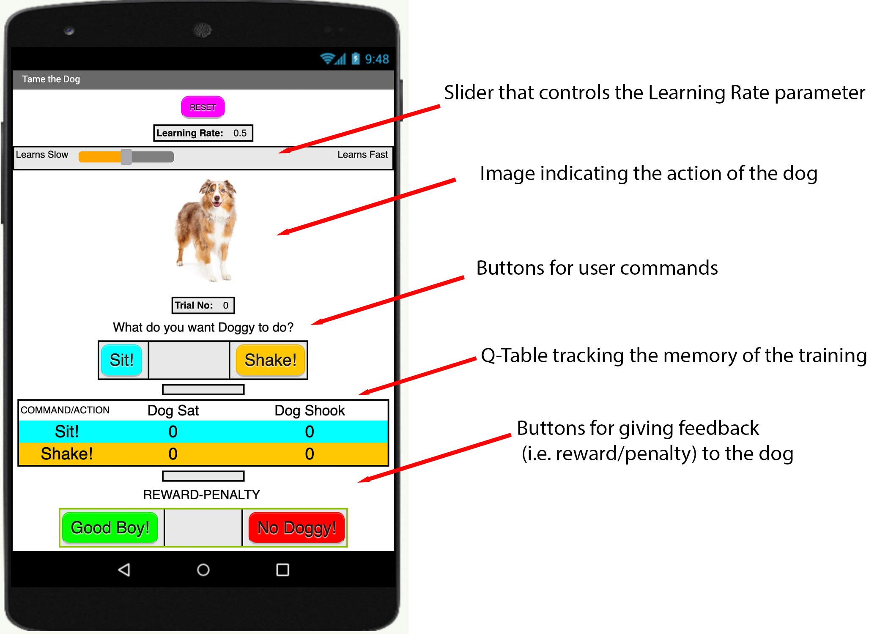{:.enlargeImage}

## Variable Initializations

The coding starts by initializing the variables you will use in the programming.

{:.enlargeImage}

The variables <strong><em>STAND</em></strong>, <strong><em>SIT</em></strong>, and <strong><em>SHAKE</em></strong> correspond to various states of the dog and have numerical values of 0, 1, and 2, respectively (rather than text) to allow numerical use and manipulation.

The variables <strong><em>command</em></strong> and <strong><em>action</em></strong> are both initialized to 0 and will eventually store and keep track of the current command given by the user and the action chosen by the dog and will be assigned values <strong><em>SIT</em></strong> (1) or <strong><em>SHAKE</em></strong> (2).

The variable <strong><em>reward</em></strong> is initialized to 0. It will take the value +1 if the dog receives a reward, and the value -1 if the dog receives a penalty.

The variable <strong><em>counter</em></strong> will keep track of the number of trials in the training process and is initially set to 0.

The variable <strong><em>learningRate</em></strong> will control the learning rate of the dog, a measure of how quickly the dog learns from its experience. For example, when <strong><em>learningRate</em></strong> is 1 (or 100%), the dog will immediately learn from its current reward or penalty about what to do or what not to do. When <strong><em>learningRate</em></strong> is 0 (or 0%) the dog will not be able to learn from its current reward or penalty no matter what. <strong><em>learningRate</em></strong> is initialized to 0.5 (50%), which is halfway between perfect and no learning (probably not a very unrealistic learning rate for a dog!).

<strong><em>Qtable</em></strong> variable keeps track of the 2X2 matrix mentioned above — a record of the memory of the dog's training. (There is no matrix data structure currently in App Inventor, so a list of lists will hold the data. Make sure you understand how the list of lists corresponds to the 2X2 matrix, as you will be manipulating the Q-Table a lot.) 

Initially, all the matrix entries are 0’s as there is no memory of a training:

{:.enlargeImage}

Initialize the variable Qtable as shown below:

{:.enlargeImage}

## Q-Table Procedures I

Study the following Q-Table procedures:

* the first procedure  allows you to access a <em>row</em> of the Q-Table, which is a list of two numbers, 

{:.enlargeImage}

* the second procedure allows access to an <em>individual cell</em> of the Q-Table, which is a number

{:.enlargeImage}

* the third procedure allows you to <em>assign</em> a value to a given cell of the Q-Table. 

{:.enlargeImage}

Notice that the two latter procedures use the first procedure in their definitions.

## Q-Table Procedures II

For example, for the Q-Table shown below
{:.enlargeImage}

which is equivalent to this Q-Table
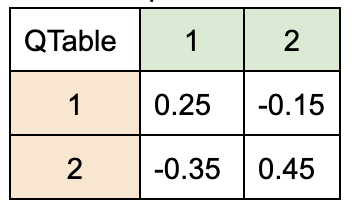{:.enlargeImage}

QTable Row#1 is a list of two numbers:
[0.25, -0.15]

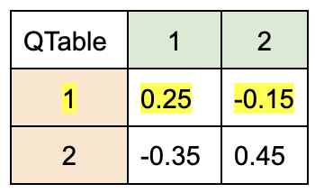{:.enlargeImage}

In code, the procedure block <strong>QTableRow(1)</strong> returns the list containing the numbers 0.25 and -0.15.
{:.enlargeImage}

Similarly, QTable Row#2 is a list of two numbers:
[-0.35, 0.45]

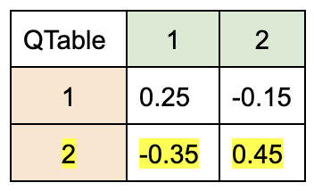{:.enlargeImage}

In code, the procedure block <strong>QTableRow(2)</strong> returns the list containing the numbers -0.35 and 0.45.

{:.enlargeImage}

The following identifies a specific cell of the Q-Table. QTable Row#2 Column#1 is a number: -0.35.

{:.enlargeImage}

In code, the procedure block <strong>QTable(2,1)</strong> returns the number -0.35.

{:.enlargeImage}

What do you think is QTable Row#1 Column#2?

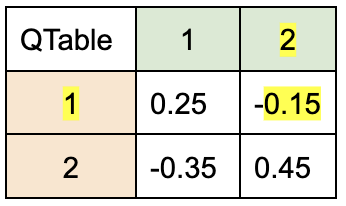{:.enlargeImage}

i.e. What value does this procedure <strong>QTable(1,2)</strong> return?

<hint markdown="block" title="Solution">
 -0.15
</hint>

What does this procedure call <strong>set_QTable(1,2,-0.75)</strong> do?

<hint markdown="block" title="Solution">

The procedure call alters the given Q-Table cell at row 1, column 2 

{:.enlargeImage} 

which becomes the following when -0.15 is replaced by -0.75.

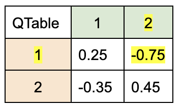{:.enlargeImage}

</hint>

These procedures will make accessing and revising the Q-Table matrix easier than manipulating a list of lists.

## Learning Rate Slider

Study this block. Can you explain what it does when the Learning Rate slider is moved?

{:.enlargeImage}

<hint markdown="block" title="Explanation">
 The variable <strong><em>learningRate</em></strong> is set to the <strong><em>thumbPosition</em></strong> of the slider, and the associated label is updated to report this value in the UI.
</hint>
 

## Reset Button

In this code, see if you can explain what happens when the Reset button is clicked.

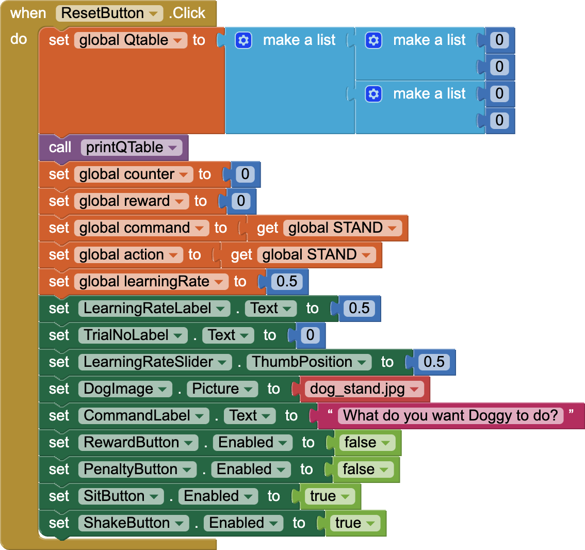{:.enlargeImage}

<hint markdown="block" title="Explanation">

<strong><em>Qtable</em></strong> entries are re-initialized to 0’s, and these values are displayed via the <strong>printQTable</strong> procedure on the UI. The variables <strong><em>counter</em></strong> and <strong><em>reward</em></strong> are set to 0, and the variables <strong><em>command</em></strong> and <strong><em>action</em></strong> are also initialized to <strong><em>STAND</em></strong> (or the number 0). <strong><em>learningRate</em></strong> is re-initialized to 0.5, as is the <strong>LearningRateSlider.ThumbPosition</strong>. The dog’s image is set to the “standing” image. <strong>RewardButton</strong> and <strong>PenaltyButton</strong> are both disabled, and the <strong>SitButton</strong> and <strong>ShakeButton</strong> are enabled. Everything resets to what it was before the training started.
</hint>
 

## Sit Button and Shake Button

Study this code given to explain what happens when the Sit button is clicked. You will shortly see what the procedures <strong>chooseAction</strong> and <strong>showDogAction</strong> do. Notice how the <strong><em>counter</em></strong> variable is updated when this button is clicked.

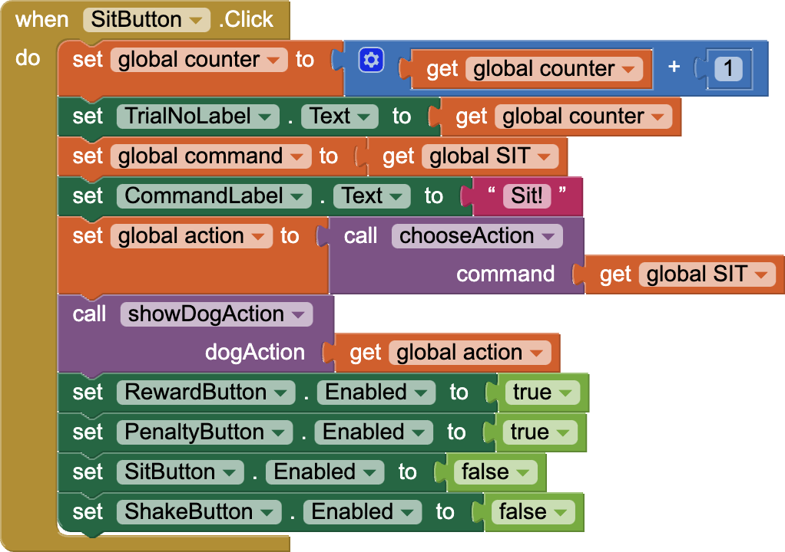{:.enlargeImage}

Next, use the Sit button code given above code as reference code to create the code for the <strong>whenShakeButton.Click</strong> event handler. You can do much with copy/paste (CTRL-C/CTRL-V) and make minor edits.

<hint markdown="block" title="Possible Solution">

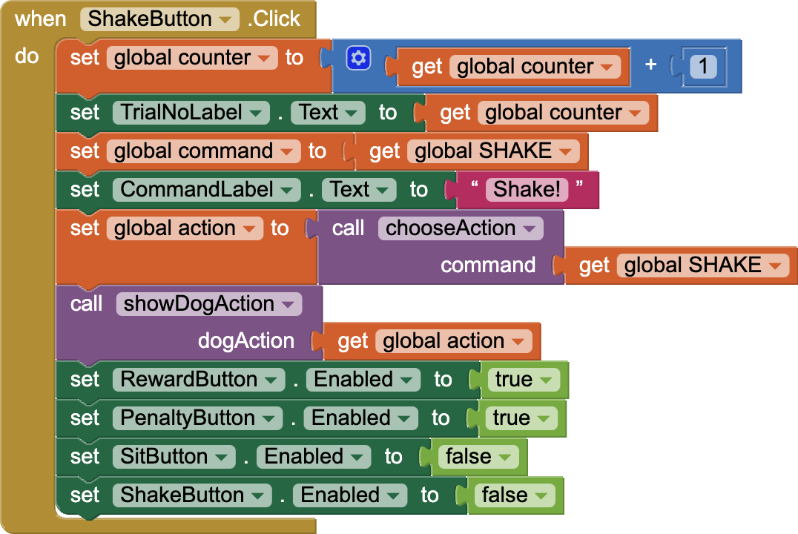{:.enlargeImage}
</hint>
 

## Procedure chooseAction

Now, you will define the <strong>chooseAction</strong> procedure. This procedure will determine how the dog will act based on the user's command. There are many ways to define this procedure. For starters, you can try the following simplistic scheme: for the first 10 trials, assume that the dog is clueless and only <em>randomly</em> sits or shakes hands whatever commands are given. That is, it takes a while for the dog to realize that the commands and the rewards following its actions are somehow related to each other.   After that, the dog wisens up, starts paying attention to the memory of its training, and acts according to the optimal action dictated by its Q-Table. This optimal action will be decided by the procedure <strong>findMaxAction</strong>.

{:.enlargeImage}

<hint markdown="block" title="Possible Solution">

{:.enlargeImage}

<strong>Note</strong>: In the extensions of this project, you can try more advanced approaches to defining this procedure.
</hint>
 
## Procedure findMaxAction

Now define the procedure <strong>findMaxAction</strong>. This procedure uses the Q-Table to decide how to act optimally given a user command. 

* If the dog is given the command “Sit!” then it should look at the first row of the Q-Table and take an action based on the higher Q-value in either cell of the first row.  

* If the dog is given the command “Shake!” then it should look at the second row of the Q-Table and take an action based on the higher Q-value in either cell of the second row. 

For example, say, the Q-Table at that point in the training was this:

{:.enlargeImage} 

and the user gives the command “Sit!”, then you examine the <em>first</em> row of the matrix and see that the value at the first cell is 0.25, which is larger than -0.15, the value in the second cell. So the optimal action for the dog, according to the Q-Table, is to sit.

{:.enlargeImage}

<hint markdown="block" title="Possible Solution">

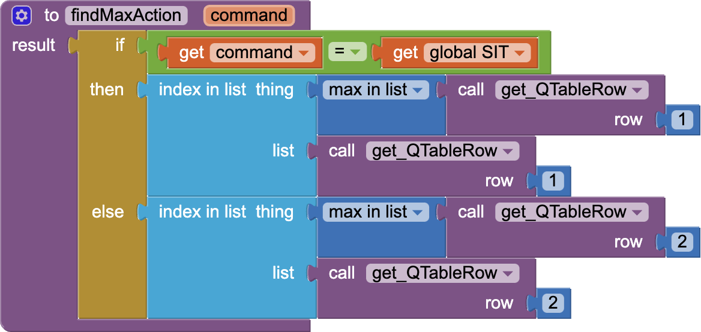{:.enlargeImage}

<strong>Note</strong>: the block <strong>max in list</strong> is in the Math blocks selectable under the menu of <strong>arithmetic mean (average)</strong> block.

Observe that the procedure will return the column index corresponding to the higher Q-value, either 1 (<strong><em>SIT</em></strong>) or 2 (<strong><em>SHAKE</em></strong>). This is why we wanted to define the variables <strong><em>SIT</em></strong> and <strong><em>SHAKE</em></strong> as numbers 1 and 2 rather than as text.

</hint>
 

## Procedure showDogAction

The following procedure determines which image of the dog to display based on the action decided by the dog. Double-check your understanding of it.

{:.enlargeImage}

## Reward Button and Penalty Button

The following code shows what happens when the user gives a command, the dog performs the right action, and the user gives the dog feedback with the Reward button. First, the variable <strong><em>reward</em></strong> is set to +1. (For the Penalty button, the reward value will be -1). Then, based on a computation (covered next!), the app updates the Q-Table and displays the updated Q-Table in the User Interface. The <strong>RewardButton</strong> and the <strong>PenaltyButton</strong> then must be disabled, and the <strong>SitButton</strong> and <strong>ShakeButton</strong> must be enabled so the training process can start again.

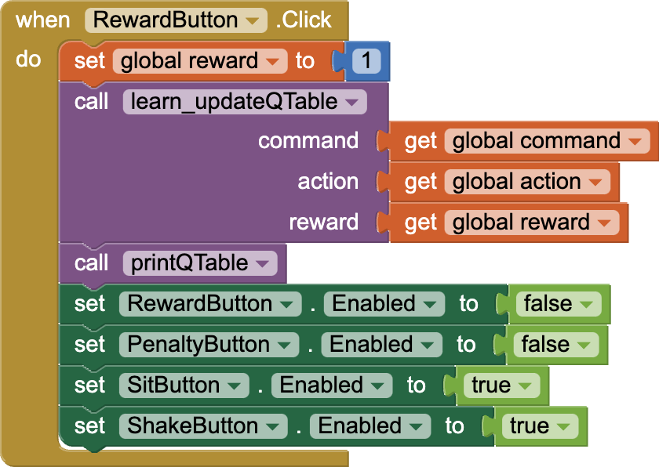{:.enlargeImage}

Now using the <strong>RewardButton</strong> as a reference, code the when <strong>PenaltyButton.Click</strong> event handler. Again, you can use copy/paste for this.

{:.enlargeImage}

<hint markdown="block" title="Possible Solution">

{:.enlargeImage}
</hint>
 

## Procedure printQTable

The following procedure prints/displays the Q-Table's current state by copying the <strong><em>Qtable</em></strong> variable's contents in each row and column to the appropriate labels in the User Interface.

{:.enlargeImage}

## Updating the Q-Table

Now, it is time to understand the critical formula in RL: how to update Q-Table values when the user gives a command (c), the dog performs an action (a) and the user gives the dog feedback (reward: +1 or penalty: -1) based on the action.

Q(c,a) is the Q-Table value for a given user command (c) and dog action (a). (Remember, the commands are in the rows, and the actions are in the columns)The formula below shows how to update the value Q(c,a):

{:.enlargeImage}

Where α: Learning Rate

To understand this formula, study the diagram below:

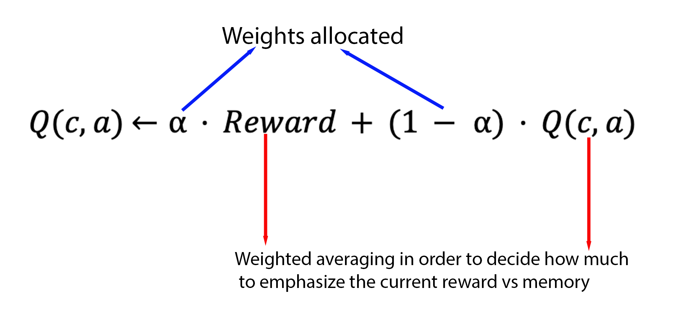{:.enlargeImage}

The new Q-value will be a <em>weighted average</em> of the current Reward (i.e. +1 or -1) and the existing Q-value, which represents the memory of the training so far. The formula decides how much to emphasize the current Reward versus the memory of the training so far using weights  α (the learning rate) and 1-α (the complement of the learning rate).

For example, if the learning rate is 100% (i.e. the dog learns perfectly and immediately) then α = 1 and (1-α) = 0, so the new Q value is exactly equal to the value of the current reward (+1 or -1). In contrast, if the learning rate is 0% (i.e. the dog does not learn anything at all) then α=0 and (1-α)=1, the new Q value is equal to the existing Q value, and nothing changes.

Here is another example:
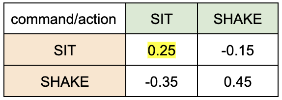{:.enlargeImage}

Assuming the Q-Table above, if the learning rate is 0.7 (70%), the command was “Sit!”, and the dog responded by sitting, then the new Q-value at Q[1,1] is computed by

Q[1,1]  = 0.7X(+1)+(1-0.7)X<strong>0.25</strong>  = 0.7X(+1)+0.3X<strong>0.25</strong> = 0.775

Now code this procedure based on what you learned about how to revise the Q-Table:

{:.enlargeImage}

<hint markdown="block" title="Possible Solution">

{:.enlargeImage}

To make the addition block and <strong>QTable(row,column)</strong> block look more compact, right-click on these blocks and select “External Inputs”. This formatting change will align the parameters vertically rather than horizontally.
</hint>
 

## Test
Now test your app by scanning the QR Code generated via your AI2 Companion.

{:.enlargeImage}

Test everything thoroughly and see if the dog is learning according to its learning rate after the first 10 random responses. Congratulations! You have coded your first AI Reinforcement Learning (RL) project.

# Expand Your App

* First, train the dog correctly. Can you then “untrain” the dog to always perform the wrong actions?

* Can you include a learning graph showing the cumulative percentages of correct actions? You can use the graphing component <strong>Chart1</strong> already placed in the UI by making it visible.

* Incorporate the new parameter called “Memory Responsiveness” which measures how responsive the dog is to the memory of its training. Most animals (and people) take a while before they even start paying attention to the memories of their training. These memories need to reach a high enough threshold of pain and pleasure for them to start understanding what their training is trying to teach and thus how to act appropriately. Revise the procedure <strong>chooseAction</strong> based on this new parameter. For example, you now can let this parameter decide when the dog will stop acting randomly. Initially, we arbitrarily chose this to be the first 10 trials. However, this new parameter should allow you to revise the procedure so it more naturally guides the decision process based on when the Q-Table values start becoming significant. In the UI, make the Horizontal Arrangements 3 and 4 containing this slider visible. Note that if the dog is <em>very responsive</em> to its memory then even <em>very small</em> Q-values (close to 0) will prompt the dog to act according to its training. If the dog is <em>not responsive</em> to its memory then even for <em>large</em> Q values (close to +1 or -1) it will not be relying on the memory of its training. Below is a possible adjustment to the <strong>chooseAction</strong> procedure that considers the dog's memory responsiveness.

{:.enlargeImage}

* How would this project change if there were, not two, but three commands “Sit!”, “Shake!” and “Roll!”? Implement this new version by revising everything from the UI to the code.

* What other awesome ideas do you have?

# About Youth Mobile Power
A lot of us spend all day on our phones, hooked on our favorite apps. We keep typing and swiping, even when we know the risks phones can pose to our attention, privacy, and even our safety.  But the computers in our pockets also create untapped opportunities for young people to learn, connect and transform our communities.

That’s why MIT and YR Media teamed up to launch the Youth Mobile Power series. YR teens produce stories highlighting how young people use their phones in surprising and powerful ways. Meanwhile, the team at MIT is continually enhancing MIT App Inventor to make it possible for users like you to create apps like the ones featured in YR’s reporting.

Essentially: Get inspired by the story, get busy making your own app!
 

 The YR + MIT collaboration is supported in part by the National Science Foundation. This material is based upon work supported by the National Science Foundation under Grant No. (1906895, 1906636). Any opinions, findings and conclusions or recommendations expressed in this material are those of the author(s) and do not necessarily reflect the views of the National Science Foundation.

 Check out more apps and interactive news content created by YR <a href="https://yr.media/category/interactive/" target="_blank">here</a>.

