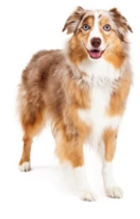
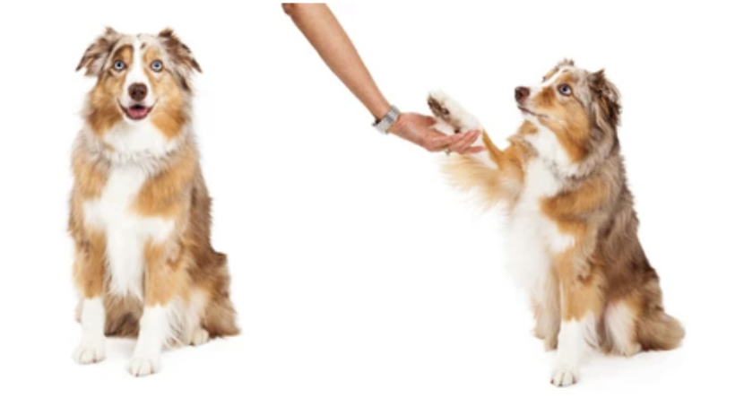
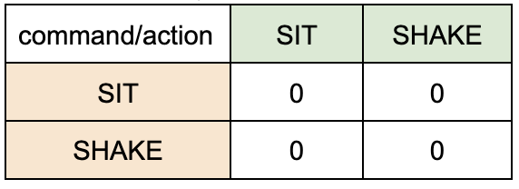
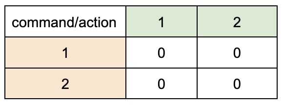

# Challenge

Reinforcement Learning: Tame the Dog

Write a nice Challenge openning paragraph here...

# Setup

## Decide if anything needs to go here

# Reinforcement Learning: Tame the Dog (Level: Advanced)

## Introduction I

In this project, we will explore <strong>Reinforcement Learning (RL)</strong> which is one of the main machine learning methods along with Supervised Learning and Unsupervised Learning. We will use the context of “taming a dog” to illustrate the main ideas of RL. In our simulation, we would like to teach a dog which is initially standing,

{:.enlargeImage}

to sit or shake hands when the user gives the commands “Sit!” or “Shake!”

{:.enlargeImage}

## Introduction II

The dog initially does not understand any of these commands, so it behaves randomly for a while. However, after each command, the user gives the dog either positive feedback (i.e., a reward — “Good boy!”) or negative feedback (i.e., a penalty — “No Doggy!”).The type of feedback (reward or penalty) allows the dog to create a “memory” of his training (i.e., which actions led to what consequences) where the accumulating rewards and penalties appear in a 2-by-2 matrix called a <strong>Q-Table</strong>. The row headers of this matrix are the <em>commands</em> given by the user: “Sit!” and “Shake!” The column headers of the matrix are the <em>actions</em> taken by the dog: The dog sat, or the dog shook.  (For simplicity, we will call both the commands and the actions SIT and SHAKE)

{:.enlargeImage}

The values in the cells of this matrix are initially all zero. At each turn in the training, the app computes them  with a formula (that we will explain in the last step of the tutorial!): 

{:.enlargeImage}
Where Q(c,a):Q[command,action] and α: Learning Rate

## The User Interface (UI)

To allow you to focus on the new ideas of RL in this project, the User Interface (UI) has been created for you.
{:.enlargeImage}

## Variable Initializations

The coding starts by initializing the variables you will use in the programming.

{:.enlargeImage}

The variables <strong><em>STAND</em></strong>, <strong><em>SIT</em></strong>, and <strong><em>SHAKE</em></strong> correspond to various states of the dog and have numerical values of 0, 1, and 2, respectively (rather than text) to allow numerical use and manipulation.

The variables <strong><em>command</em></strong> and <strong><em>action</em></strong> are both initialized to 0 and will eventually store and keep track of the current command given by the user and the action chosen by the dog and will be assigned values <strong><em>SIT</em></strong> (1) or <strong><em>SHAKE>/</em> (2)

The variable <strong><em>reward is initialized to 0. It will take the value +1 if the dog receives a reward, and the value -1 if the dog receives a penalty.

The variable <strong><em>counter will keep track of the number of trials in the training process and is initially set to 0.

The variable <strong><em>learningRate</em></strong> will control the learning rate of the dog, a measure of how quickly the dog learns from its experience. For example, when <strong><em>learningRate</em></strong> is 1 (or 100%), the dog will immediately learn from its current reward or penalty about what to do or what not to do. When <strong><em>learningRate</em></strong> is 0 (or 0%) the dog will not be able to learn from its current reward or penalty no matter what. <strong><em>learningRate</em></strong> is initialized to 0.5 (50%), which is halfway between perfect and no learning (probably not a very unrealistic learning rate for a dog!).

<strong><em>Qtable<.</em></strong> variable keeps track of the 2X2 matrix mentioned above — a record of the memory of the dog's training. (There is no matrix data structure currently in App Inventor, so a list of lists will hold the data. Make sure you understand how the list of lists corresponds to the 2X2 matrix, as you will be manipulating the Q-Table a lot.) 

Initially, all the matrix entries are 0’s as there is no memory of a training:

{:.enlargeImage}

Initialize the variable Qtable as shown below:

[Initialzie Q-Table](../images/RL_tamethedog/InitializeQtable.png){:.enlargeImage}

## Q-Table Procedures

# Expand Your App

* 

* 

* What other awesome ideas do you have?

# About Youth Mobile Power
A lot of us spend all day on our phones, hooked on our favorite apps. We keep typing and swiping, even when we know the risks phones can pose to our attention, privacy, and even our safety.  But the computers in our pockets also create untapped opportunities for young people to learn, connect and transform our communities.

That’s why MIT and YR Media teamed up to launch the Youth Mobile Power series. YR teens produce stories highlighting how young people use their phones in surprising and powerful ways. Meanwhile, the team at MIT is continually enhancing MIT App Inventor to make it possible for users like you to create apps like the ones featured in YR’s reporting.

Essentially: Get inspired by the story, get busy making your own app!
 

 The YR + MIT collaboration is supported in part by the National Science Foundation. This material is based upon work supported by the National Science Foundation under Grant No. (1906895, 1906636). Any opinions, findings and conclusions or recommendations expressed in this material are those of the author(s) and do not necessarily reflect the views of the National Science Foundation.

 Check out more apps and interactive news content created by YR <a href="https://yr.media/category/interactive/" target="_blank">here</a>.

