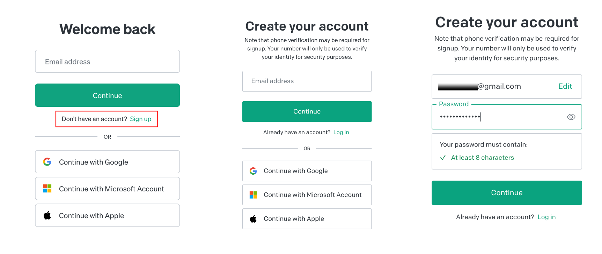
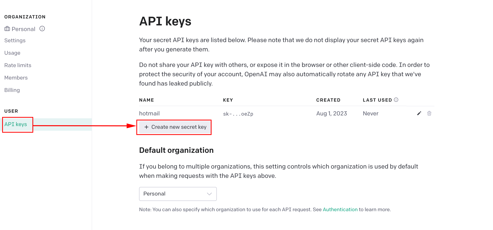
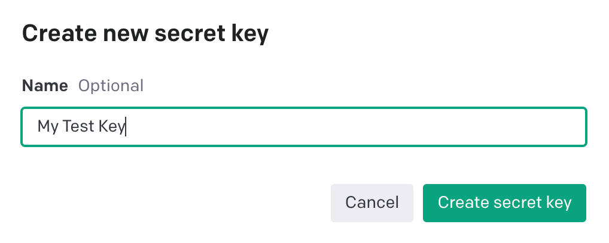
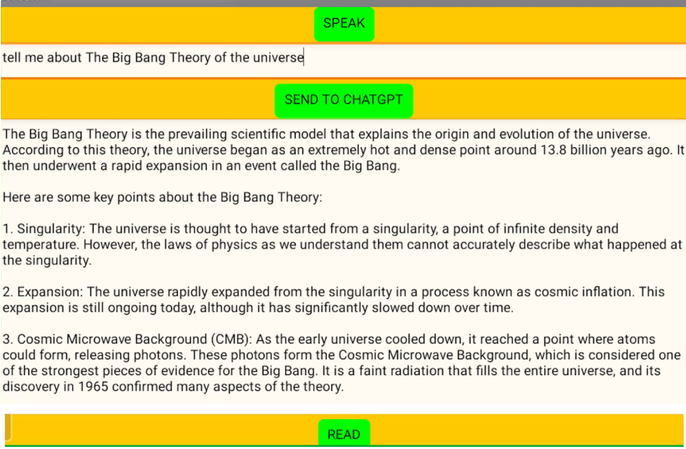
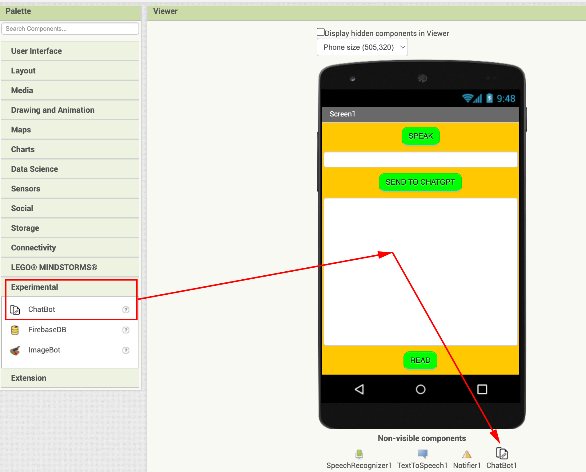
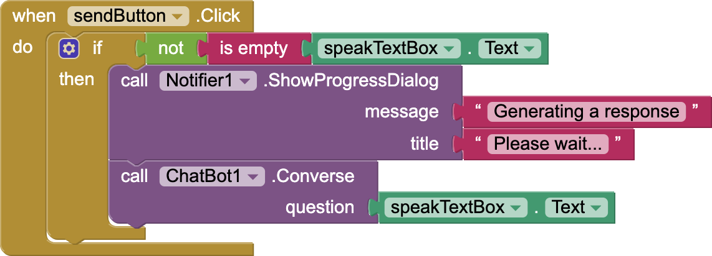
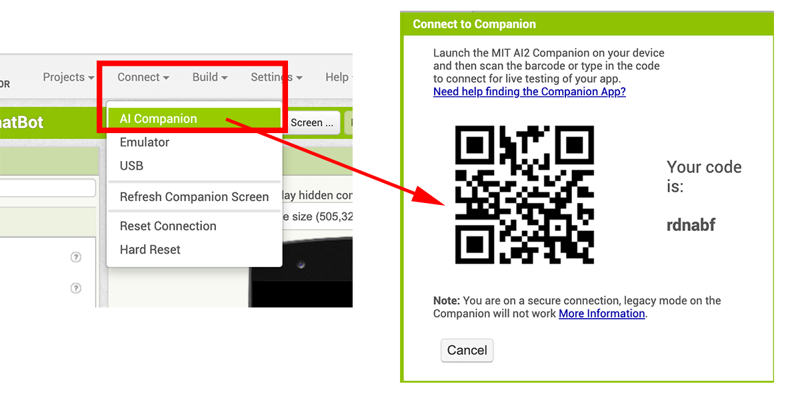

# Challenge

MIT App Inventor simple ChatGPT Tutorial: 
Capturing the world’s wisdom at your fingertips

Have you ever wondered how it is possible to create your very own ChatGPT app that will allow you, wherever you are, to tap into a world of useful information?  In this tutorial, you will build a simple app with MIT App Inventor that allows users to connect to ChatGPT, ask questions, and have a conversation.

<!---->
# Setup

## Getting your own OpenAI API Key

For this project you will need to get your own OpenAI API key to use MIT App Inventor’s <strong>ChatBot</strong> component.  As of the writing of this tutorial, OpenAI allows users 13 years old and older to create their own OpenAI accounts and generate their own OpenAI API keys. For the first 3 months, you are given a $5 free credit which should get you quite a bit of exploration time. After 3 months, any unused portion of the credit expires. Once your free credit is gone, you will need to become a paying customer with a credit card.  Follow the steps below to create your OpenAI account and get your OpenAI API key.

Follow the steps below to create you OpenAI account and get your OpenAI API key.

1. Go to <a href="https://openai.com/" target="_blank">https://openai.com/ </a>
    
2. Click on the <strong>Login</strong> button on  the upper right, then click <strong>Sign up</strong> option.

    {:.enlargeImage}
    

3. Create your account by entering your email and choosing a password.  You can also sign up using your Google, Microsoft and Apple accounts.

    {:.enlargeImage}
    

4. You will need to verify your e-mail and phone number during the signup process.

5. To get your personal OpenAI API  key go to <a href="https://platform.openai.com/account/api-keys" target="_blank">https://platform.openai.com/account/api-keys </a>
 
6. Click on the  API keys tab and the Create new secret key button.

    {:.enlargeImage}
    

7. Give your key a name if you wish.  This step is optional.

    {:.enlargeImage}
    

8. Copy and save your API key somewhere safe on your computer.  You will need it while doing the project.

9. During the ChatBot project, when you add your <strong>ChatBot</strong> component, you will need to copy-paste your OpenAI API key in the <strong>ChatBot</strong> property <em>ApiKey</em>.

{:.enlargeImage}

## Updating AI2 Companion

If you have not done so, please upgrade your AI2 Companion to version 2.67 or higher.

# Simple ChatGPT Tutorial

## Overview

In this tutorial, you will build a simple app with MIT App Inventor that allows users to connect to ChatGPT, ask questions, and have a conversation.

{:.enlargeImage}

## The Graphical User Interface (GUI)

In this project you are given a GUI that is almost completed.

{:.enlargeImage}

What do you think is the function of each component? Hopefully many of the components will be self-explanatory.

Now from the <strong>Experimental</strong> drawer drag and drop a <strong>ChatBot</strong> component.

{:.enlargeImage}

## Adding your OpenAI API Key

Now you are ready to copy paste your OpenAI API key you generated during the Setup phase into the <strong>ChatBot</strong> property <em>ApiKey</em>. Your key will be different than what you partially see below.  If you do not generate and use your own OpenAI API Key, the number of queries you can send to ChatGPT will be limited.

{:.enlargeImage}

## Getting Users’ Prompt Input

Now click on the Blocks button to start the coding to give functionality to your components.

{:.enlargeImage}

Start by coding the <strong>speakButton</strong>.

When <strong>speakButton</strong> is clicked:
* Clear the two textboxes from any earlier content
* Call the <strong>SpeechRecognizer</strong> to get the text of the speech

{:.enlargeImage}

When the <strong>SpeechRecognizer</strong> returns with the text of the speech, paste this text to the <strong>speakTextBox</strong>.

{:.enlargeImage}

## Communicating with ChatGPT

When the <strong>sendButton</strong> is clicked, have the <strong>ChatBot</strong> send the text to OpenAI for a response.

{:.enlargeImage}

When the <strong>ChatBot</strong> gets a response from OpenAI, paste this to <strong>responseTextBox</strong>.

{:.enlargeImage}

## Reading the Response to the User

When the <strong>readButton</strong> is clicked, have the <strong>TextToSpeech</strong> read the text in the <strong>responseTextBox</strong> to the user.
{:.enlargeImage}

## Testing the app

Now test your app by scanning the QR Code generated via your AI2 Companion.  
{:.enlargeImage}

Give ChatGPT an interesting role and ask it some questions.  For example:

<em>You are a Shakespearean actor who answers every question in limerick.   Explain why the chicken crossed the road.</em>

Please note that unless you use your own OpenAI API key, the number of queries you can make to ChatGPT is limited.

Congratulations! You just created a powerful app that will allow you to chat with ChatGPT at the touch of a button and access a reservoir of knowledge and wisdom. 

<strong>Disclaimer</strong>: Always use common sense when evaluating ChatGPT’s responses and be aware that, like any computer system, ChatGPT may fail.

# Expand Your App

* If you have not done so already, get your own OpenAI API key so the number of  conversations you can have with ChatGPT is not limited.

*  Do some research on and/or ask ChatGPT how Large Language Models (LLM) like it are trained and how they operate.

* Allow the user to specify a System Role for ChatGPT in the UI.  For example “You are a kindergarten teacher who explains everything in a way understandable by 4-5 year olds.”

* Keep an ongoing record of the entire history of the chat.

* How can you use the ChatGPT app to act as a non-directive therapist and guide you in your mental-health-related questions?  You may also enjoy revisiting the classical (pre- Machine Learning) AI project <a  href="http://appinventor.mit.edu/explore/resources/ai/therapist-bot" target="_blank">Therapist Bot</a> based on the <a  href="https://en.wikipedia.org/wiki/ELIZA" target="_blank">Eliza</a>  project from the 1960’s.

* How can you use the app to collaborate with you in creating some bars for a rap song or lines of poetry?

* Can ChatGPT give you information about current events? Are there topics ChatGPT is <em>not</em> programmed to chat about? Are there times when ChatGPT clearly gives you false information? What examples can you find that point to the limitations of ChatGPT? Explore other limitations and failings of ChatGPT.

* ChatBot component allows you to access chatbot API’s other than the default ChatGPT API via the <em>Provider</em> property.  An example would be Google's PaLM. Explore these other options.

* Explore the new <strong>ImageBot</strong> component which uses generative AI of DALL-E to create fascinating visuals.

* What other cool ideas do you have?

# About Youth Mobile Power
A lot of us spend all day on our phones, hooked on our favorite apps. We keep typing and swiping, even when we know the risks phones can pose to our attention, privacy, and even our safety.  But the computers in our pockets also create untapped opportunities for young people to learn, connect and transform our communities.

That’s why MIT and YR Media teamed up to launch the Youth Mobile Power series. YR teens produce stories highlighting how young people use their phones in surprising and powerful ways. Meanwhile, the team at MIT is continually enhancing MIT App Inventor to make it possible for users like you to create apps like the ones featured in YR’s reporting.

Essentially: Get inspired by the story, get busy making your own app!
 

 The YR + MIT collaboration is supported in part by the National Science Foundation. This material is based upon work supported by the National Science Foundation under Grant No. (1906895, 1906636). Any opinions, findings and conclusions or recommendations expressed in this material are those of the author(s) and do not necessarily reflect the views of the National Science Foundation.

 Check out more apps and interactive news content created by YR <a href="https://yr.media/category/interactive/" target="_blank">here</a>.

