# Challenge

Our amazing friends at YR Media has published an intriguing interactive story on AI titled <a href="https://yr.media/tech/can-you-teach-ai-to-dance/" target="_blank">Can You Teach AI to Dance?</a> which got us thinking whether something as organic and complex as a dance can be quantified, measured and mathematically studied with the help of AI.  In this project you are challenged to create an AI based app that can track the movements of a dancer and recognize some basic dance moves.

If you haven’t set up your computer and mobile device for App Inventor, go to the “Setup your Computer” tab to set up your system. Otherwise, go directly to the “Awesome Dancing with AI” tab to start the tutorial.

# Setup your computer

# Awesome Dancing with AI (Level: Intermediate)

## Introduction
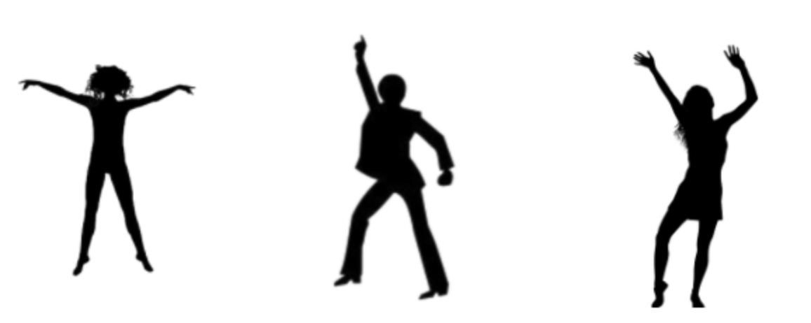
Do you like dancing?   Are you good at it?  Would you like to improve?   Is there an algorithm to describe, identify or measure an amazing dance? Can dance moves be quantified and measured?  Can AI be used to help you improve your dancing skills?  In this project you will learn how to use the new AI technology PoseNet to track key points of your body to create a skeletal model and develop some basic methods to quantify, measure and identify some dance moves.

<a href="https://github.com/tensorflow/tfjs-models/blob/master/posenet/demos/camera.gif" target="_blank">Image Credit</a>

 
**Important**: Please note that for this project you cannot use the Emulator to test your app as the Emulator cannot run MIT App Inventor extensions such as the PoseNet Extension.  To make sure that your mobile device has the needed hardware capability for PoseNet, use AI2 Companion on <a href="../aiaFiles/aiDance/Posenet_TestProject.aia" target="_blank">this .aia </a>test file.

## Graphical User Interface (GUI)

A possible GUI has been created for you in the starter file.  Please change the properties of the components as you wish to get the look and feel you want.  However, please do not rename the components, as this tutorial will refer to the given names in the instructions.

{:.enlargeImage}

The <strong>SwapCameraButton</strong> toggles the camera view from Front to Back as the user wishes.  <strong>CanvasLiveButton</strong>  toggles the Canvas background from a solid black color to a live camera view.  <strong>ResetButton</strong> sets the Dance Score back to zero.  The <strong>WebViewer</strong> component is where the camera view will be cast and the <strong>Canvas</strong> component is where the skeletal model of the body will be created either against a black background or a live camera view background.

Note that at the very bottom of the Components panel is the <strong>PosenetExtension</strong> which is the AI technology that we will be using to track key points of a body and which will help you to build a skeletal version of the body.

## PoseNet key points

The key points of the body tracked by PoseNet are: eyes, ears, nose, shoulders, elbows, wrists, hips, knees and ankles.  

{:.enlargeImage}

Whenever PoseNet is able to track a body key point, it will return a list of two elements representing the x and y-coordinates of the key point.  When PoseNet is unable to track a body key point, it will return an empty list.

## Preliminary GUI code
You are also given some preliminary code for the GUI.  Study these to make sure that you have a general idea what they do.

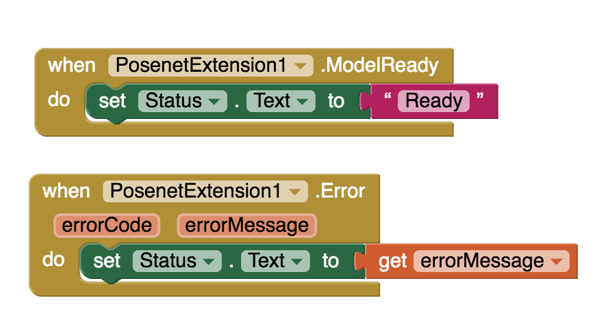{:.enlargeImage}
These two blocks are used to communicate the status of PoseNet as either "Ready" or in case of error, display the error message.

{:.enlargeImage}
The <strong>ResetButton</strong> resets the Dance Score to zero each time it is clicked.

{:.enlargeImage}
The <strong>SwapCameraButton</strong> toggles the camera view from its default "Front" view to "Back" and vice versa.

{:.enlargeImage}
The <strong>CanvasLiveButton</strong> adjusts the value of a Boolean variable which will be used to display the PoseNet constructed skeleton either on a live background or on a solid black background.

## Helper functions (1)
You are also given some helper functions. 

<strong><em>getX</em></strong> and <strong><em>getY</em></strong> functions extract the x and y-coordinates of a given point. A point is simply a list of two elements that PoseNet returns representing the x and y-coordinates of the given point's location.

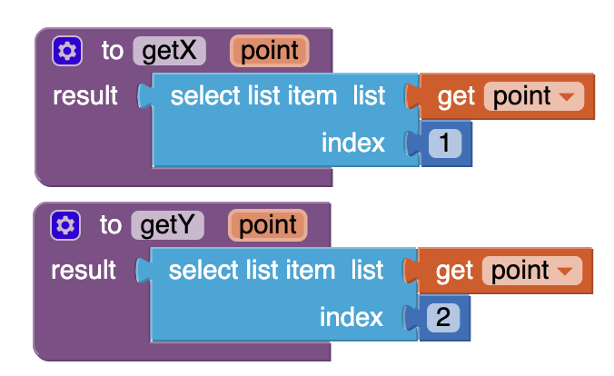{:.enlargeImage}

## Helper functions (2)
<strong><em>defined</em></strong> is a Boolean function that returns true if the given point is a list of two elements (representing the x and y-coordinates of the point's location) and false otherwise.  If PoseNet is unable to detect any of the body key points, it will return an empty list for each of the missing key points.

{:.enlargeImage}

<strong><em>allDefined</em></strong> is a Boolean function that checks whether <em>all</em> the points in a given list of points are defined.  If <em>all</em> the points are defined, it returns true and otherwise, if <em>any</em> of the points is not defined, it returns false.  We will use this helper function to collectively check if certain key points of the body are properly tracked and returned by the PoseNet extension.  If the posture of the body is such that perhaps due to poor lighting, messy background, baggy clothes etc. any key point of the body is not trackable by PoseNet, an empty list will be returned to indicate the failure to detect this key point.  Note that the logical function <strong>and</strong> is used to check that all points are defined.

{:.enlargeImage}

## Helper functions (3)
<strong><em>distance</em></strong> is a function that computes the Euclidean distance between two points on the Canvas when the two points are defined.   It uses the Pythagorean formula:

{:.enlargeImage}

which you may recall from high school Algebra.  If any of the points are not defined, then the distance is set to an arbitrarily large value implying infinite distance between undefined points.

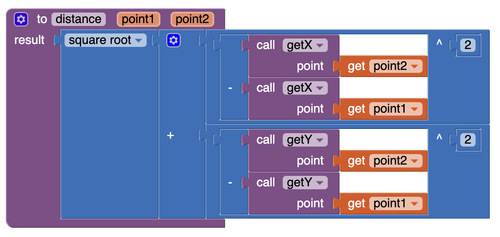{:.enlargeImage}

## Helper functions (4)
<strong><em>drawPoint</em></strong> procedure draws a small circle of 4 pixel radius on the Canvas at the location of a given defined point.  This procedure will help us draw the key points of the body such as the joints.  We use the 4 pixel radius to make the point visible to the eye.

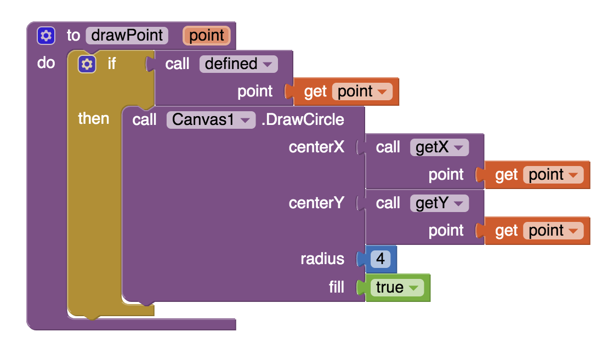{:.enlargeImage}

<strong><em>drawLine</em></strong> procedure draws a line segment on the Canvas between two defined points.  We will use this procedure to draw the bones of the skeletal representation of the body.

{:.enlargeImage}

## Pose Update
When PoseNet extension detects that the body it is tracking has changed its position, it triggers the following <strong>PosenetExtension1.PoseUpdated</strong> event.  This event handler’s code has also been created for you even though the code for each of the procedures that are invoked (<strong><em>drawKeyPoints, drawBody, drawHead</em></strong> etc.) are all empty and will soon be created by you.  Please note that the if then statement in this event handler makes sure that if the user clicked the <strong>CanvasLiveButton</strong>, the camera live feed is broadcast on the Canvas which by default has a solid black background color.

{:.enlargeImage}

## Constructing the Skeleton
Now you will write some of these procedures.

<strong><em>drawKeyPoints</em></strong> procedure will draw a red circle depicting each key point of the body returned by PoseNet:
* set the Canvas <em>PaintColor</em>  to red color (or something else distinctive)
* for each point returned by PoseNet in the <strong>PosenetExtension1.KeyPoints</strong> list,  draw a point using the helper procedure <strong><em>drawPoint</em></strong> described earlier.

<hint markdown="block" title="Give me a hint">

{:.enlargeImage}

<hint markdown="block" title="Check my solution">

{:.enlargeImage}

</hint>

</hint>

 Try this on your own but if you get stuck you can click the Hint button.

<strong><em>drawBody</em></strong> procedure will draw the skeleton of the body, by drawing yellow lines to depict bones between the appropriate key points: 
* set the canvas <em>PaintColor</em>  to yellow color (or something else distinctive different than the one used for key points)
* for each bone in the <strong>PosenetExtension1.Skeleton</strong> list, draw a line between the endpoints of the bone, using the helper procedure <strong><em>drawLine</em></strong> described earlier.

<hint markdown="block" title="Give me a hint">

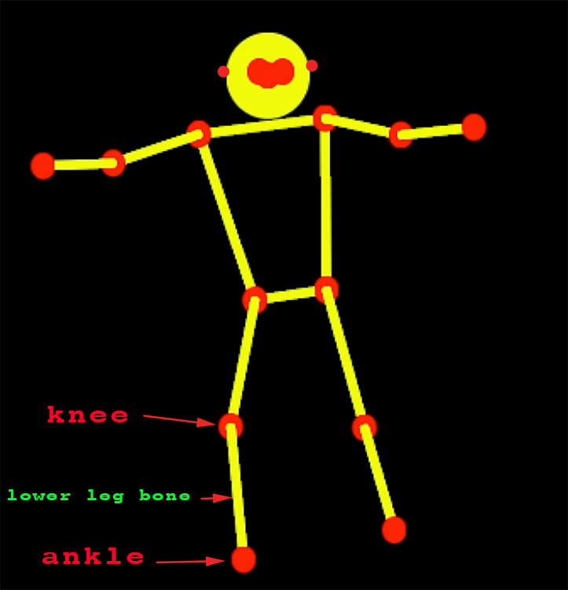{:.enlargeImage}

<strong>PosenetExtension1.Skeleton</strong> returns a list of "bones" where each "bone" is a list of two key points that are its endpoints.  For example a lower leg bone in the skeleton would be a list consisting of an ankle key point and a knee key point.

{:.enlargeImage}

<hint markdown="block" title="Check my solution">

{:.enlargeImage}

</hint>

</hint>

 Try this on your own but if you get stuck you can click the Hint button.

## Optional: Drawing a circular head
If you would like to have a <em>circular</em> head above the skeletal shoulders then complete the <strong><em>drawHead</em></strong> procedure.  Otherwise there will only be some key points above the shoulder designating the ears, eyes and the nose without the circular head, just like shown in the animation on the first page of the tutorial.

<strong><em>drawHead</em></strong> procedure:
* set Canvas paint color to green (or some other distinctive color)
* check that <strong>LeftEar</strong> and <strong>RightEar</strong> key points are defined.
* draw a circle with the midpoint between the two ears as its center using the midpoint formula from Algebra:
{:.enlargeImage}
 * and make sure that the circle goes through both ears by selecting the radius of the circle to be half the distance between the two ears.

<hint markdown="block" title="Give me a hint">

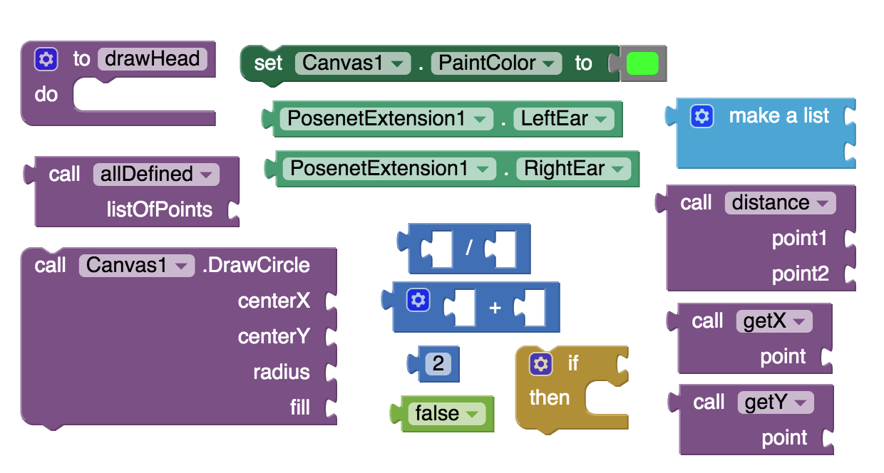{:.enlargeImage}

<hint markdown="block" title="Check my solution">

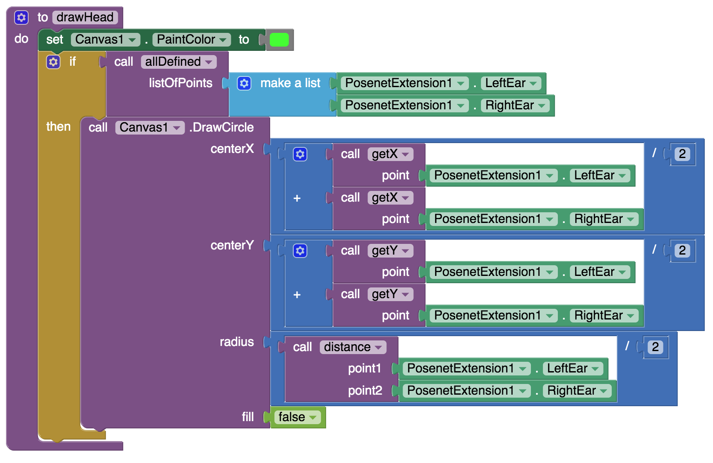{:.enlargeImage}

Note: When the computation becomes too large horizontally, you can use the "External Inputs" menu option (via a right-click) to shrink the space needed for your operations.  To go back to the default option, use "Inline Inputs" as shown.

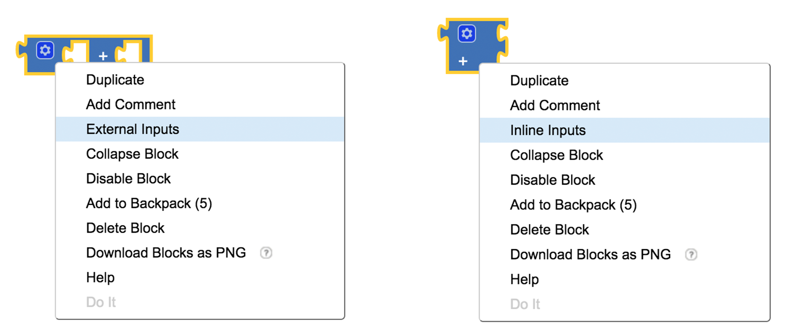{:.enlargeImage}

</hint>

</hint>

Try this on your own but if you get stuck you can click the Hint button.

## Test your App
Now you will use the AI Companion to check that your app works well. Please note that an Emulator cannot be used in the testing as it does not support MIT App Inventor Extensions like PoseNet.

Check that your app can track a body (yours or someone else's) and have the skeleton correctly constructed joining the key points of the body. For best results with PoseNet, make sure that the body is well lit and is in front of a background of a solid single color.  Baggy clothes may also interfere with the tracking of the body key points.  

If you are using a mobile phone (instead of a tablet) your screen might be too small to display everything at once.  In this case, as the <em>"Scrollable"</em> property of the Screen is checked by default in this project, you can adjust the screen by scrolling to show what you wish.  You can also choose to make the <strong>HorizontalArrangement1</strong> (where the shadow dancers images are) invisible.  If you are still short of screen space you can also choose to make <strong>WebViewer1</strong> invisible by unchecking its <em>Visible</em> property.  If you do so, beware that the <strong>Canvas1</strong> dimensions (250X300) must still exactly match the dimensions of the <strong>WebViewer1</strong>.

## Detecting Dance Moves

Some simple dance moves that we will explore are:

<strong>Hands in the Air Move</strong>

<strong>Knee Up Move I, II</strong>

<strong>Travolta Move I, II</strong>

If you are too young to remember John Travolta's famous <em>Saturday Night Fever</em> dance move, click the button.
<hint markdown="block" title="Show me Travolta @ SNF">

<a href="https://en.wikipedia.org/wiki/Saturday_Night_Fever" target="_blank">Image Credit: Wikipedia</a>
</hint>

 
<strong>T-Pose Move</strong>

Now you will write some code to detect some of these dance moves.  As these dance moves are detected, the Dance Score of the dancer being tracked will automatically be incremented.

## Hands in the Air Move

procedure <strong><em>checkForHandsintheAirMove</em></strong>:
* first check that the following key points returned by PoseNet are defined: right and left wrists and right and left ears.  
* one way to define the “Hands in the Air” move is to make sure that both wrist points are above their respective ear points.  To do this you just need to compare the y-coordinate of the right wrist to the y-coordinate of the right ear and do a similar thing for the left wrist and left ear.  Please note that the x and y axes on the Canvas are positioned as shown below with the origin at the top left corner of the Canvas.  So having the right wrist above the right ear will mean that the y-coordinate of the right wrist will be less than the y-coordinate of the right ear.  Similar is true for the left wrist and left ear. 

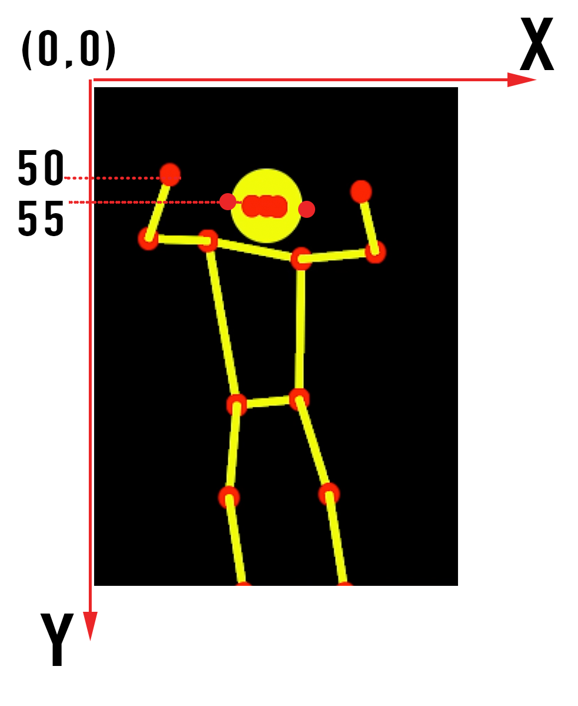{:.enlargeImage}

 * if both wrists are above their respective ears then increment the Dance Score.

<hint markdown="block" title="Give me a hint">

{:.enlargeImage}

<hint markdown="block" title="Check my solution">

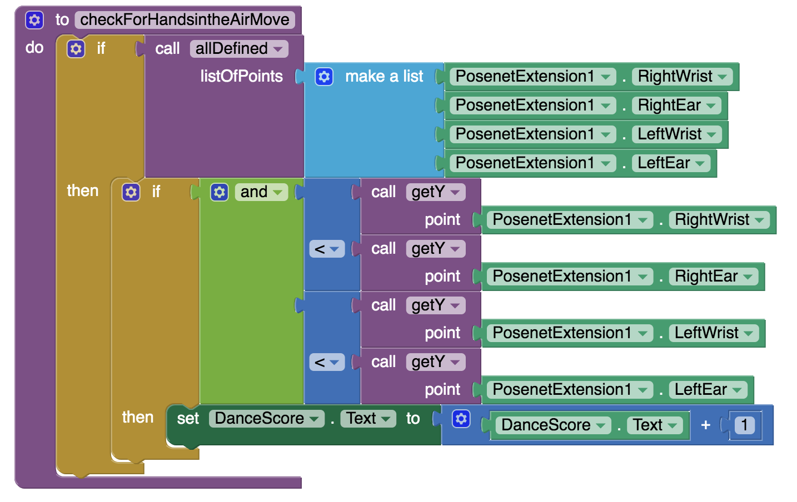{:.enlargeImage}

</hint>

</hint>

Try this on your own but if you get stuck you can click the Hint button.

## Knee Up Move 

procedure <strong><em>checkForKneeUpMove</em></strong>:

* first check that either of the following pairs of key points returned by PoseNet are defined: right knee and right hip or left knee and left hip.  
* one way to define the “Knee Up” move  is to make sure that either the right knee point is above the right hip point, or, the left  knee point is above the left  hip point.  To do this you just need to compare the y-coordinate of the right knee to the y-coordinate of the right hip and do a similar thing for the left knee and the left hip. 
* if either knee is above its respective hip then increment the Dance Score

<hint markdown="block" title="Give me a hint">

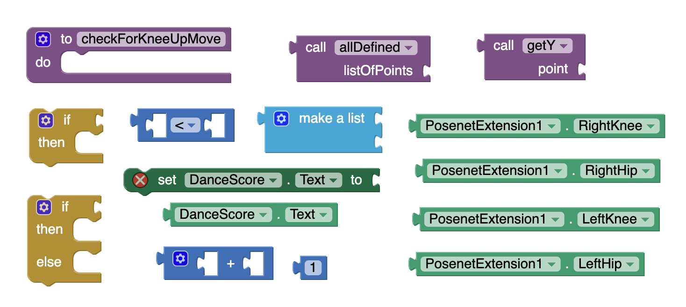{:.enlargeImage}

<hint markdown="block" title="Check my solution">

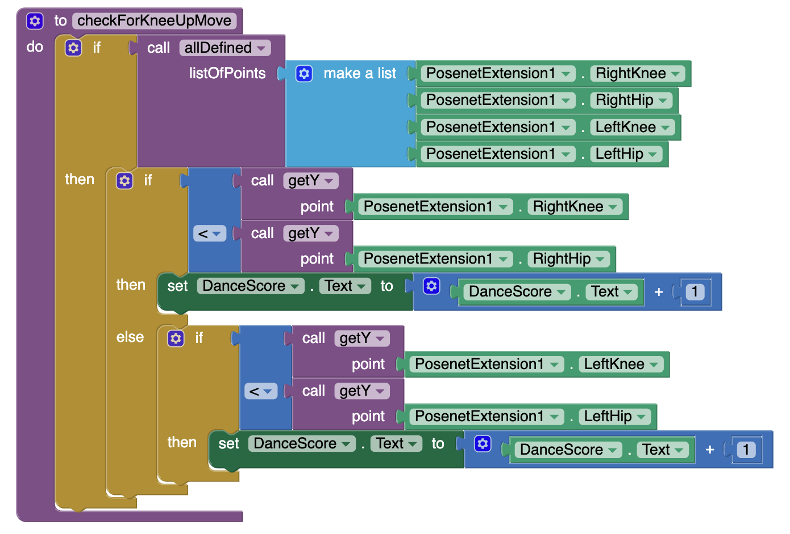{:.enlargeImage}

</hint>

</hint>

Try this on your own but if you get stuck you can click the Hint button.

## Travolta Move

Now why don't you try to define the Travolta moves and define the procedure <strong><em>checkForTravoltaMove</em></strong> yourself?

<hint markdown="block" title="Give me a hint">

One way to define the Travolta move is either the right wrist is above the right ear and the left wrist is below the left shoulder OR the left wrist is above the left ear and the right wrist is below the right shoulder.

<hint markdown="block" title="Check my solution">

Are you sure you are ready to see a solution? 

<hint markdown="block" title="Check my solution">

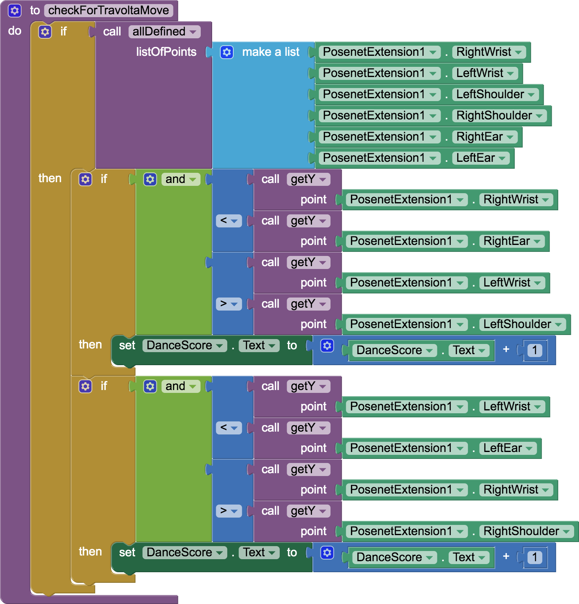{:.enlargeImage}

</hint>

</hint>

</hint>

Try this on your own but if you get stuck you can click the Hint button.

## T-Pose Move

If you want a good challenge, try to define the T-Pose move where the dancer stretches left and right hands horizontally to form the shape of the letter “T”.

<hint markdown="block" title="Give me a hint">

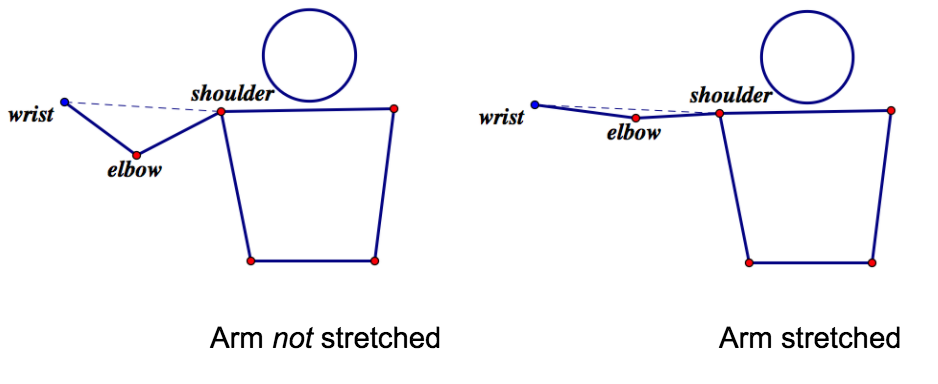{:.enlargeImage}

A stretched arm means that the distance between the right wrist and the right shoulder should be very close to the sum of the distances from the right wrist to the right elbow to the right shoulder. And similarly on the left side.

<hint markdown="block" title="Check my solution">

Are you sure you are ready to see a solution? 

<hint markdown="block" title="Check my solution">

{:.enlargeImage}

</hint>

</hint>

</hint>

Try this on your own but if you get stuck you can click the Hint button.

## Test your App
Check your app thoroughly that if you (or someone else you are tracking with PoseNet) do any one of the dance moves, the move is correctly detected and the Dance Score goes up.   As mentioned before, for best results with PoseNet, make sure that the body is well lit and is in front of a background of a solid single color.  Baggy clothes may also interfere with the tracking of the body key points.

Test your app on some YouTube dance videos like this <a href="https://www.youtube.com/watch?v=xfDVrv54Lfc" target="_blank">Latin dance video</a> (where the dancer is against a clear background) to see how your app is able to track the dancer.

Congratulations you have now built your first AI based app that can track the movements of a person and recognize some basic dance moves.

# Expand Your App
* Currently if you maintain a certain dance move, the Dance Ccore keeps going up.  Add some smart code to make sure that a given dance move is rewarded only once until a new dance move is observed.

* Create a penalty system that subtracts from the Dance Score for poorly executed basic dance moves (for example, if the dancer makes almost a T-Pose move but not quite due to non-horizontal stretching of the arms, forming a pose like the letter Y instead of the letter T, etc.)
 
* Imagine a Yoga version of this app where different Yoga postures are detected and correct postures are rewarded.

* What other more hip dance moves can you think of that can be described and quantified in terms of the key points of the body?  Implement these ideas in your app.

* What other amazing ideas do you have?

# About Youth Mobile Power 
A lot of us spend all day on our phones, hooked on our favorite apps. We keep typing and swiping, even when we know the risks phones can pose to our attention, privacy, and even our safety.  But the computers in our pockets also create untapped opportunities for young people to learn, connect and transform our communities.

That’s why MIT and YR Media teamed up to launch the Youth Mobile Power series. YR teens produce stories highlighting how young people use their phones in surprising and powerful ways. Meanwhile, the team at MIT is continually enhancing MIT App Inventor to make it possible for users like you to create apps like the ones featured in YR’s reporting.

Essentially: get inspired by the story, get busy making your own app!
 
 
 The YR + MIT collaboration is supported in part by the National Science Foundation. This material is based upon work supported by the National Science Foundation under Grant No. (1906895, 1906636).   Any opinions, findings and conclusions or recommendations expressed in this material are those of the author(s) and do not necessarily reflect the views of the National Science Foundation.

 Check out more apps and interactive news content created by YR <a href="https://yr.media/category/interactive/" target="_blank">here</a>.