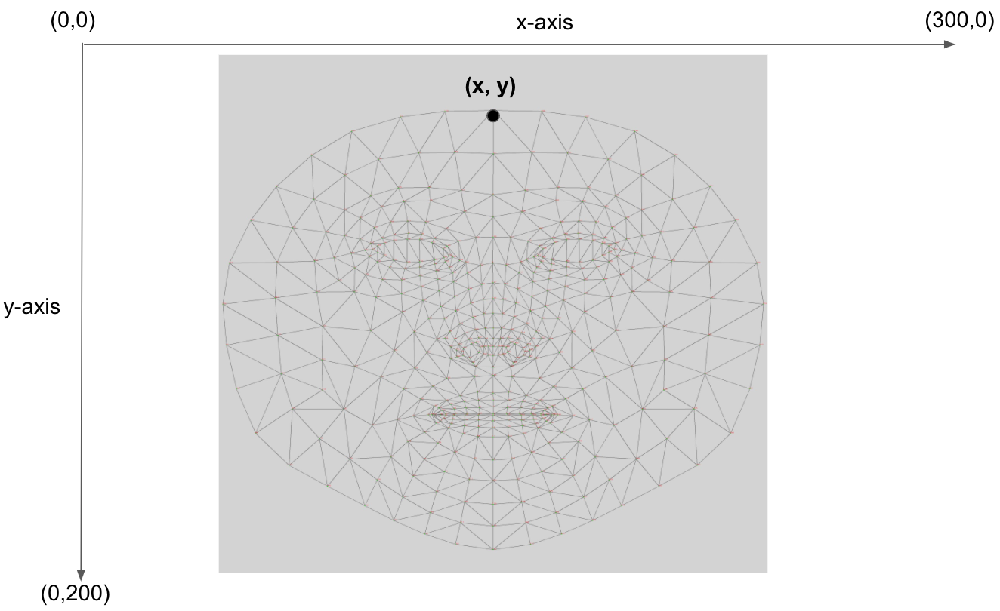
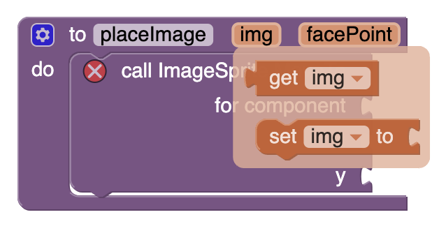
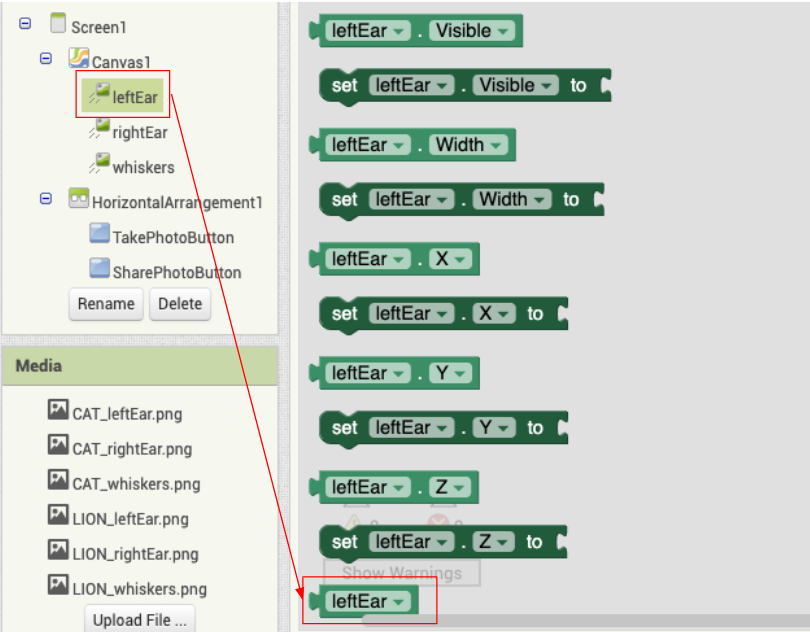
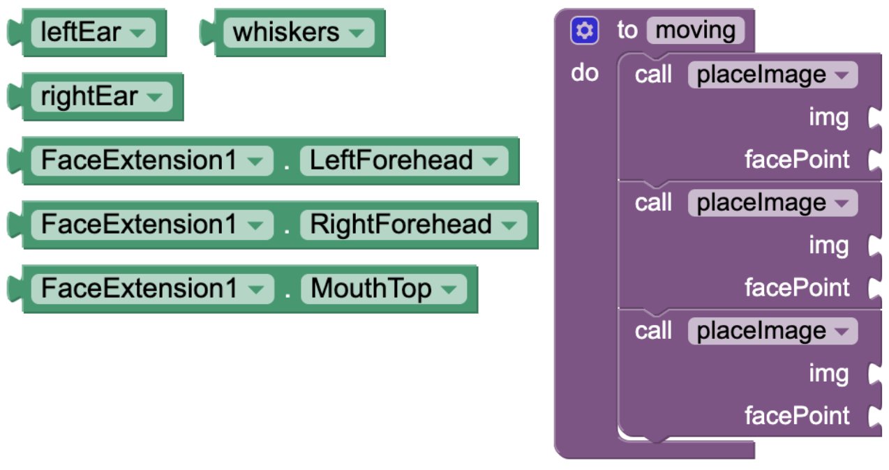
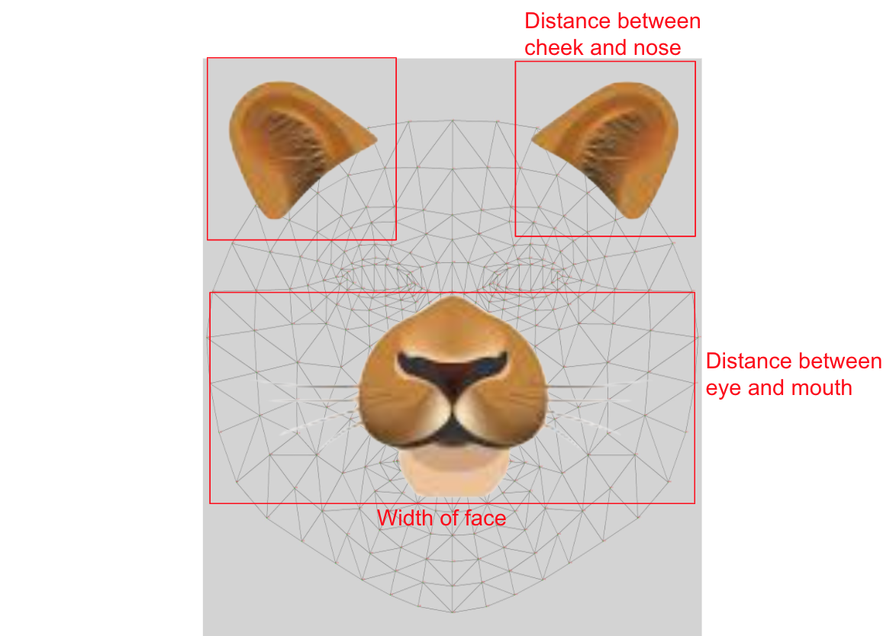
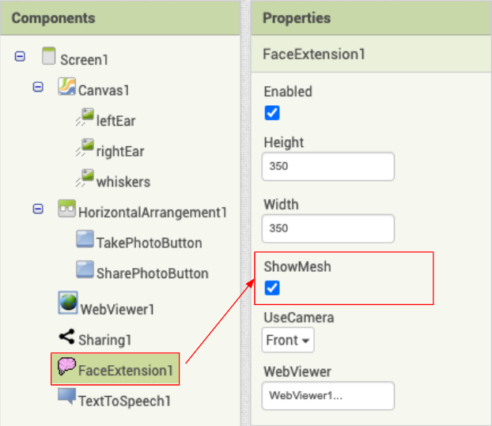
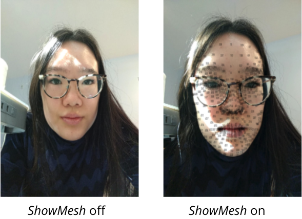
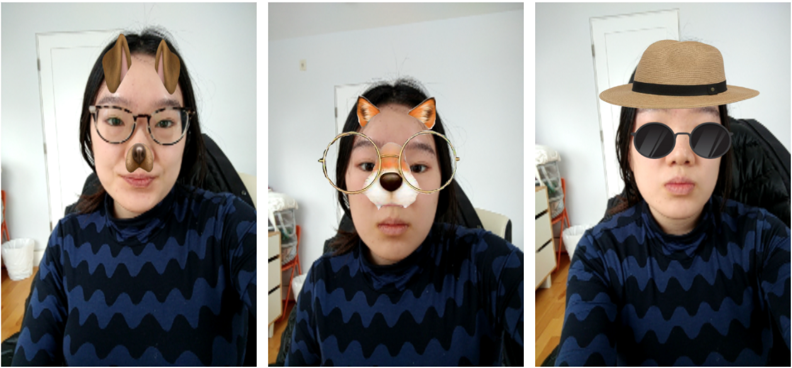
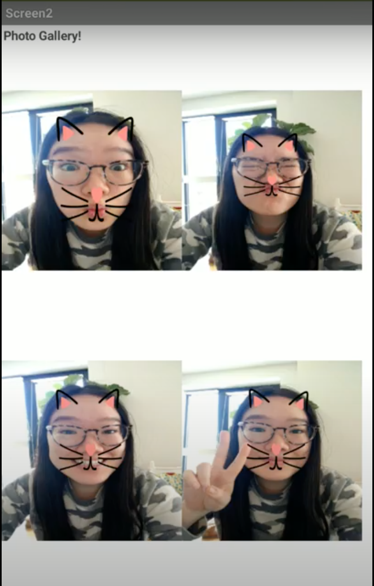

# Challenge

Our friends at YR Media have <a href="https://interactive.yr.media/erase-your-face/" target="_blank"> this excellent article </a> about facial recognition. In this tutorial, we will be using a similar but different technology - facial landmark detection. You are challenged to create an AI-based filter camera. You have two options: the cute cat seen in the GIF below, or a fierce lion.

If you haven’t set up your computer and mobile device for App Inventor, go to the “Setup your Computer” tab to set up your system. Otherwise, go directly to the “Facemesh Filter Camera” tab to start the tutorial.

# Setup your computer

# Facemesh Filter Camera (Level: Intermediate)

## Introduction

Have you taken photos with facial filters? Instagram and Snapchat facial filters have taken the internet by storm, but do you know how these filters work? Would you like to make your own facial filters?

{:.enlargeImage}

In this project you will learn how to use a new AI technology called Facemesh; it is a model trained by Google and available to the public. 
<hint markdown="block" title="What is a model?"> 

A model is the mathematical representation of how a computer thinks. It can be considered the computer's “brain”. For example, when you see a face, your brain will quickly make a decision about where the eyes are. Similarly, the Facemesh model takes in a photo of a face and makes a decision about where the eyes are. A human brain’s decision-making process is in the field of cognitive science; a computer’s decision-making process is in the field of Artificial Intelligence.

Models are quite complicated and involve a lot of math. The level of math you need to understand the processes is at the university level, but do not worry! You do not need to fully understand the entire process to be able to benefit from it in this project!
</hint>
 
Feel free to click on any images in the tutorial for a magnified view.

## Facemesh Model

The Facemesh model takes in the image of your face and gives you the specific location of many different facial features, such as the X and Y coordinates of your nose, forehead, or mouth. Using such information, you can create facial filters; these are essentially images that follow specific points on your face.

To access the Facemesh model, you will use the <strong>FaceExtension</strong>, which is an App Inventor tool that acts as a bridge to empower you to use the model in your own mobile app.
{:.enlargeImage}
The end result of this project will be your own filter camera! You can use this app to take creative photos and share them with your friends. 

 
**Important**: Please note that for this project you cannot use the Emulator to test your app as the Emulator cannot run MIT App Inventor extensions such as the <strong>FaceExtension</strong>.  To make sure that your mobile device has the needed hardware capability for Facemesh, use AI2 Companion on <a href="../aiaFiles/facemesh/Facemesh_TestProject.aia" target="_blank">this .aia </a>test file.

## Graphical User Interface (GUI)

A possible GUI has been created for you in the starter file. Please do not rename the components, as this tutorial will refer to the given names in the instructions.

{:.enlargeImage}

The <strong>TakePhotoButton</strong>  allows the user to take a photo; it's connected to a <strong>TextToSpeech</strong> component that informs the user when the photo has been taken. The <strong>SharePhotoButton</strong> allows the user to share the most recently taken photo using any photo-sharing app installed on the device.

The <strong>FaceExtension</strong> is the AI technology to track key points of a face and will give you the information needed to create the facial filter. It requires a web browser to run, so we link it the <strong>WebViewer</strong> component. The <strong>Webviewer’s</strong> visibility is turned off because we use the <strong>Canvas</strong> as our viewer. The <strong>Canvas</strong> component will show the live camera view background as well as the cat/lion facial filter. 

The dimensions of the <strong>WebViewer</strong> component, the <strong>Canvas</strong> component, and the <strong>FaceExtension</strong> must match in order to facilitate face tracking. If you change the default values of the height and width for any one of the three components, make sure that you change it identically for all three of them.

Finally, the <strong>Sharing</strong> component is a social component that allows you to share the photo file via another app on the phone such as Email and Messenger.

## Facemesh Key Points
The key points of the face tracked by Facemesh are: 
* forehead
* chin
* left cheek
* left eye bottom
* left eye inner corner
* left eye top
* left eyebrow
* left forehead
* left nose
* mouth top
* mouth bottom
* nose bottom
* right cheek
* right eye bottom
* right eye inner corner
* right eye top
* right eyebrow
* right forehead
* right nose. 

{:.enlargeImage}

## Facepoint Format

Each key point is returned as a list of two elements representing the x and y-coordinates. 

For example, the key point “forehead” will be a list of 2 elements: 

<strong>[forehead x-coord, forehead y-coord]</strong> 

 

{:.enlargeImage}

When Facemesh is unable to track the entirety of a face, it will return an empty list so the filter will not work; make sure the face is within the camera frame!

## Choose a cat or a lion
Let's get right into our project! Right now, the canvas looks like it’s empty. This is because we haven’t set the <em>Picture</em> property for our <strong>leftEar</strong>, <strong>rightEar</strong>, and <strong>whiskers</strong> yet. 

First, decide if you would like to have a cat or a lion filter. Once you’ve decided, check out the Media, which has images for either option. 

Now, click on “whiskers" in the components bar. You’ll notice that whiskers' properties will show up. If you’ve chosen a lion, set <em>Picture</em> for <strong>whiskers</strong> as LION_whiskers.png. If you’ve chosen a cat, you would want to set <em>Picture</em> for <strong>whiskers</strong> as CAT_whiskers.png. 

{:.enlargeImage}

## Choose a cat or lion (2)
For example, if you’ve set <em>Picture</em> for <strong>whiskers</strong> as LION_whiskers.png, you should see the following change in the designer.

{:.enlargeImage}

Repeat this process for the <strong>leftEar</strong> and <strong>rightEar</strong> images, selecting images for the animal of your choice. 

Lion:
* Set the <em>Picture</em> property for <strong>leftEar</strong> as LION_leftEar.png, and the <em>Picture</em> property for <strong>rightEar</strong> as LION_rightEar.png. 

Cat:
* Set the <em>Picture</em> property for <strong>leftEar</strong> as CAT_leftEar.png, and the <em>Picture</em> property for <strong>rightEar</strong> as CAT_rightEar.png.

## Choose a cat or lion (3)
Once you’ve finished setting <em>Picture</em> for all three of the <strong>leftEar</strong>, <strong>rightEar</strong>, and <strong>whiskers</strong>, your canvas should look something like one of the two following images.

{:.enlargeImage}

## Preliminary GUI Code
You are also given some code that makes the buttons work as expected. Check out the code blocks so you can have a general idea what they do.

{:.enlargeImage}

Here we have two variables: <var>photoCount</var> simply counts how many photos have been taken, and <var>mostRecentPhoto</var> stores the file name of the most recently taken photo. 

{:.enlargeImage}

When you click the <strong>TakePhotoButton</strong>, the <var>mostRecentPhoto</var> file name is updated to be the current image, and the <var>photoCount</var> increases by 1. The first photo you take will be called ‘characterCamera1.jpg’ and the second photo will be called ‘characterCamera2.jpg’, etc. These files are all saved to your device. Depending on your device, you can find the photos wherever files are saved. For example, on a Google Pixel, the photos are saved to the “Files” app. 

The reason we keep track of <var>photoCount</var> and increment by 1 is so that each picture file has a unique name. If we didn’t increment by 1, each photo you take would be writing to the same file over and over again. The reason we keep track of <var>mostRecentPhoto</var> is so that we can share this photo using the <strong>SharePhotoButton</strong>. 

The <strong>TextToSpeech</strong> means that a robot will say "Photo Captured!" out loud when the photo is taken.

{:.enlargeImage}

When you click the <strong>SharePhotoButton</strong>, you can share the most recent photo! You’ll be able to share it using any app installed on your device that shares images, such as Google Drive, Dropbox, etc.

## Helper function
Now we need to write some code to place the three ImageSprites (leftEar, rightEar, and whiskers) on the corresponding points on the face.

Your first coding task is to fill in this helper function called placeImage. 

{:.enlargeImage}

placeImage procedure places the center of img, the <strong>ImageSprite</strong>, on the facePoint, the key point tracked by Facemesh. 

Click "Next Step" for guidance on how to fill in this procedure and move the three images (<strong>leftEar</strong>, <strong>rightEar</strong>, and <strong>whiskers</strong>) to match points on the face. 

## Placing the ears and whiskers

By calling ImageSprite.MoveTo (x, y), we move the ImageSprite’s <strong>top-left corner</strong> to (x, y). 

However, if we want the <strong>center</strong> of img to be placed on the facePoint (xf, yf), we have to do some simple math to get the coordinates of its top-left corner, which we will call (xc, yc).

Note that in this x-y coordinate system of the <strong>Canvas</strong>, (0, 0) is the top left corner. The difference from the normal Cartesian coordinate system is that y increases downwards.

{:.enlargeImage}

In the scenario above, you want to place the left ear centered on the left forehead facePoint (xf, yf) returned by Facemesh.
* To get the adjusted horizontal placement
	* <strong>xc = xf - 0.5 * image width</strong>
* To get the adjusted vertical placement
	* <strong>yc = yf - 0.5 * image height</strong>

When we call ImageSprite.MoveTo (xc, yc), the image is centered on (xf, yf), which are the coordinates of the facePoint.
 
## Fill in the procedure

In the placeImage procedure, your task is to
* Fill in the x argument of the ImageSprite.MoveTo block to be <strong>xf - 0.5 * image width</strong>. This is the result of subtracting half of the ImageSprite’s width from the facePoint’s x-coordinate.
 
 
* Fill in the y argument of the ImageSprite.MoveTo block to be <strong>yf - 0.5 * image height</strong>. This is the result of subtracting half of the ImageSprite’s height from the facePoint’s y-coordinate.

Don’t worry if this is a handful right now. Click on the questions below for more help on how to complete the procedure.
<hint markdown="block" title="How do I get the height/width of img?">
To get the height/width of the image, you use the following blocks..
{:.enlargeImage}
{:.enlargeImage}
To access these ImageSprite blocks shown above, click “Any component” in the Blocks menu. This will open the drop-down menu to show the following. Then click “Any ImageSprite” and you’ll find the blocks there.
{:.enlargeImage}
</hint>
<hint markdown="block" title="How do I get the number 0.5?">
Click on the “Math” option in the Blocks, and you’ll find the number 0. You can drag this number onto the Viewer and double click on the 0 to erase the old value and insert your new value.
{:.enlargeImage}
</hint>
<hint markdown="block" title="How do I get facePoint and img?">
Hover your mouse over “img” for about a second in the placeImage procedure, and the following will pop up. You can then drag “get img”.
{:.enlargeImage}
Hover your mouse over “facePoint” for about a second in the placeImage procedure, and the following will pop up. You can then drag “get facePoint”.
{:.enlargeImage}
</hint>
<hint markdown="block" title="How do I get the x, y coords of facePoint?">
As mentioned earlier, each <strong>facePoint</strong> is a list of 2 items. The x-coordinate is at index 1 and the y-coordinate is at index 2.
* To get xf, use the following block that gets the item at index 1 from the facePoint list.
{:.enlargeImage}
* To get yf, use the following block that gets the item at index 2 from the facePoint list.
{:.enlargeImage}
</hint>

If you are stuck, feel free to see which blocks are needed 
<hint markdown="block" title="Show Hint">
{:.enlargeImage} 
<hint markdown="block" title="Check my solution">
{:.enlargeImage}
</hint>
</hint> 
 

## Face Updated
When the <strong>FaceExtension</strong> detects a face, it triggers the following FaceExtension1.FaceUpdated event. This event handler’s code has also been created for you. The code for the resizing procedure is given to you, but the code for the moving procedure is incomplete and will soon be created by you.
{:.enlargeImage}

## Moving
The way a basic filter works has two parts.
1. moving: when the face moves, the images move along with the face.
2. resizing: when the face becomes bigger or smaller, the images are resized accordingly.

Let's cover the first procedure, moving: 
 

To complete the block, you should
* Call placeImage to move <strong>leftEar</strong> to the left-side of the forehead (FaceExtension.LeftForehead). 
 
 
* Call placeImage to move <strong>rightEar</strong> to the right-side of the forehead (FaceExtension.RightForehead). 
 
 
* Call placeImage to move <strong>whiskers</strong> to the top of the mouth (FaceExtension.MouthTop). 

Remember, placeImage takes in two arguments: 
1. the <strong>ImageSprite</strong> object
2. a face key point detected by <strong>FaceExtension</strong>. 

<hint markdown="block" title="How do I get an ImageSprite?">
{:.enlargeImage}
In the Blocks, find Canvas1, and you'll see the three ImageSprites leftEar, rightEar, and whiskers underneath.
 
 
If you want to get leftEar, click on leftEar and a drawer of options will show up on the right. Scroll to the bottom to find the leftEar object. You can drag it into the viewer and use it as an argument for placeImage.
 
 
Follow similar steps to get rightEar and whiskers.
</hint>

If you are stuck, feel free to see which blocks are needed
<hint markdown="block" title="Show hint">
{:.enlargeImage} 

<hint markdown="block" title="Check my solution">
{:.enlargeImage}
</hint>
</hint>
 

## Resizing
Let’s explain the second procedure which is given to you: resizing.
 
 
{:.enlargeImage}

* When we define the width or height of the image, we're defining the width or height of the image <em>bounding box</em> (highlighted in red). 
* All widths and heights are arbitrarily chosen to fit what we might expect; you can change them as you like. 

{:.enlargeImage} 

Whiskers:
* Width is set to the width of the face.
* Height is the distance between the eye and the mouth.

Ears:
* Width is set to the distance between the cheek and the nose.
* These have square-shaped bounding boxes, so we can set the width and height to be the same

## Test your App
Now you will use the AI Companion to check that your app works. Please note that an Emulator cannot be used in the testing as it does not support MIT App Inventor Extensions like FaceExtension.

Check that your app can track a face and have the ears and whiskers correctly positioned on the face. For best results with FaceExtension, make sure that the face is well lit and directly facing the camera.

## Take a photo and send it to your friend!
Now, you can make a pose with your new cat or lion makeover, and click the “Take Photo” button. Next, click the “Share Most Recent Image” to share the photo with your friends! 

In the demo below, a user takes a photo, clicks “Share the Most Recent Image”, and uses Google Hangouts to share the photo with her friend. The apps available will vary depending on what you have installed on your device.

Good job! You’ve completed this character camera app! You’ve built an AI-based app that can track the movements of a face.

# Expand your app

## FaceExtension ShowMesh
{:.enlargeImage}

In the Designer, if you click on the <strong>FaceExtension1</strong> component, its properties will appear on the right. You can play with some of these properties.

Try checking <em>ShowMesh</em> to turn it on. This will show you a live map of all the points Facemesh identifies on your face.

{:.enlargeImage}

## Using FaceExtension AllPoints
There are 486 points available for you to use via FaceExtension.AllPoints

Scroll down to the very bottom of <a href="https://github.com/tensorflow/tfjs-models/tree/master/facemesh" target="_blank">this Facemesh webpage</a> to see a Facemesh map of all the points you can access. You can click on it to zoom in.

For example, if you want a specific point on your lip, find the number on the map. In this case, the number is 14 so the facePoint can be accessed via this block:
{:.enlargeImage}
Now you can use this block as the facePoint argument for placeImage.

## FaceExtension UseCamera
{:.enlargeImage}

By default, <em>UseCamera</em> is set to "Front" to take selfies. Try to switch it to "Back" so you can take photos of your friends. You can also add a button that toggles between cameras. Note that if you change <em>UseCamera</em> in the blocks, you must set it to text (either "Back" or "Front").

{:.enlargeImage}
{:.enlargeImage}

Note: A camera component is unnecessary in this app because the <strong>FaceExtension </strong> component accesses your device's camera for you.

## Choose your own character!
You can 
1. get your own images online or check out this <a href="https://github.com/mit-cml/yrtoolkit/tree/master/yr/images/facemesh/imageLibrary
" target="_blank">image library</a>
2. go to the website <a href="https://remove.bg/" target="_blank">remove.bg</a> to get rid of the background
3. make your own <strong>ImageSprites</strong>. 
4. update height and width sizing as you see fit
5. place images on the corresponding face points as you see fit

Go wild and let the creative juices flow! 

Here are some ideas to get you started:
{:.enlargeImage} 

## Allow filter switching
You can add two or more buttons to switch between different filters. 

You would need to add some code to change the <em>Picture</em> property of the <strong>ImageSprites</strong> when the button is clicked. Here's an example of some code for the buttons.

{:.enlargeImage}
{:.enlargeImage}

## Create a Photo Gallery
Wouldn't it be nice to see all the photos you've taken in a gallery?

You can add a second Screen, save the names of the photos taken so far, and display them as a gallery. You may need to use TinyDB to save the photos. Here's an idea of what your simple gallery might look like.

{:.enlargeImage}

## Adding Interactivity
Using various points, you can identify movement in the face by tracking the difference between two facePoints.

Here is a demo of an app where the emoji matches your facial expression. 

 
To get this extra interactivity in your app, you need to:
* Have two <strong>Imagesprites</strong>, one for mouth open and one for mouth closed
* Track the difference between the y-coordinates of your lips
* Change the <em>Visible</em> property of the different emoji <strong>Imagesprites</strong> accordingly.

# About Youth Mobile Power 
A lot of us spend all day on our phones, hooked on our favorite apps. We keep typing and swiping, even when we know the risks phones can pose to our attention, privacy, and even our safety.  But the computers in our pockets also create untapped opportunities for young people to learn, connect and transform our communities.

That’s why MIT and YR Media teamed up to launch the Youth Mobile Power series. YR teens produce stories highlighting how young people use their phones in surprising and powerful ways. Meanwhile, the team at MIT is continually enhancing MIT App Inventor to make it possible for users like you to create apps like the ones featured in YR’s reporting.

Essentially: get inspired by the story, get busy making your own app!
 
 
 The YR + MIT collaboration is supported in part by the National Science Foundation. This material is based upon work supported by the National Science Foundation under Grant No. (1906895, 1906636).   Any opinions, findings and conclusions or recommendations expressed in this material are those of the author(s) and do not necessarily reflect the views of the National Science Foundation.

 Check out more apps and interactive news content created by YR <a href="https://yr.media/category/interactive/" target="_blank">here</a>.
