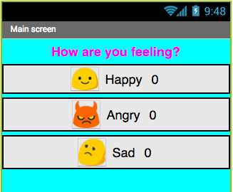
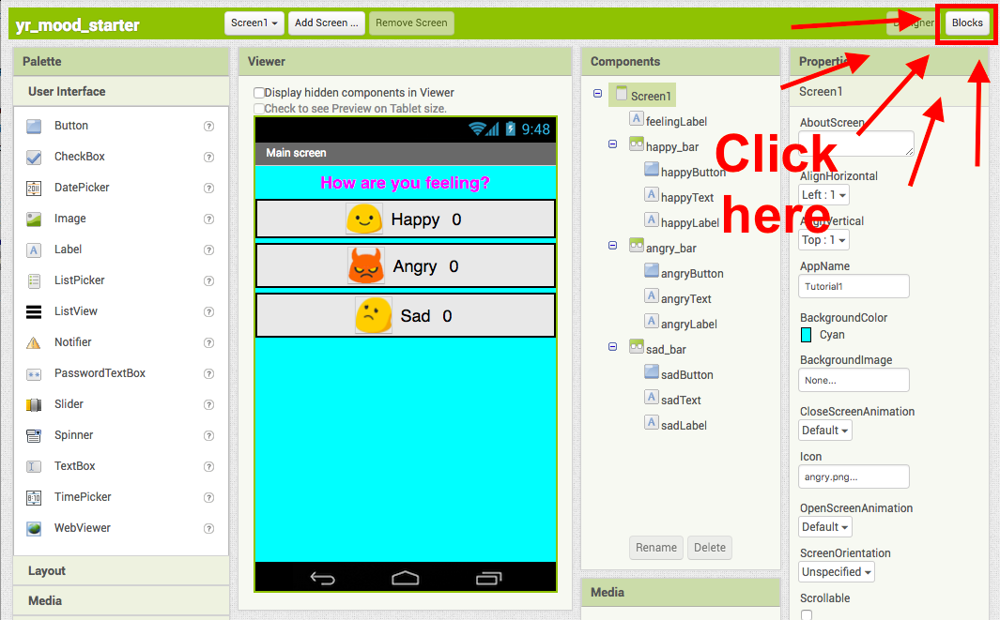
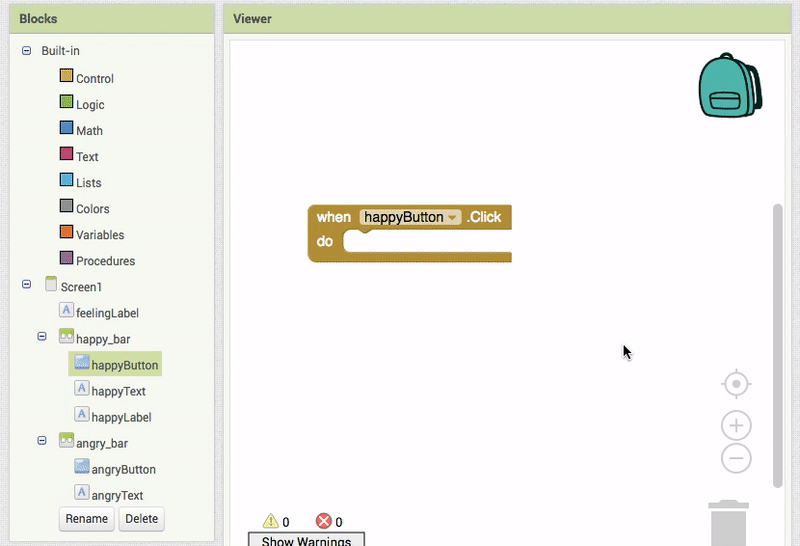
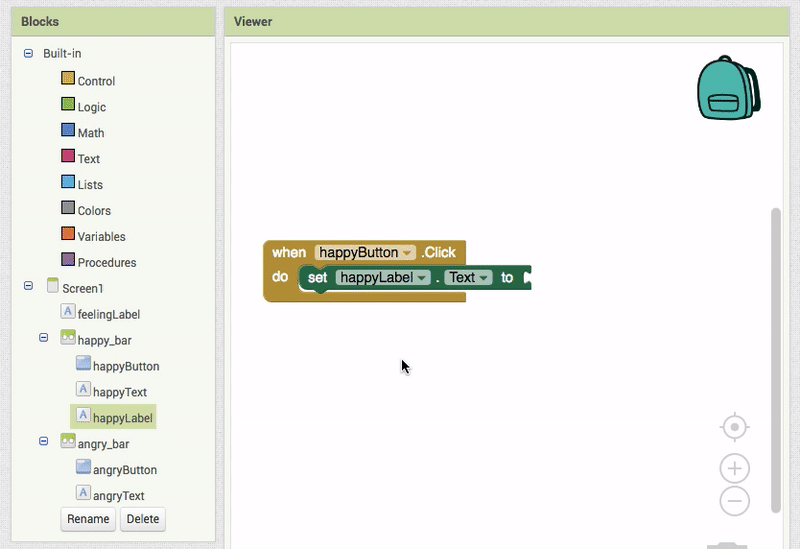
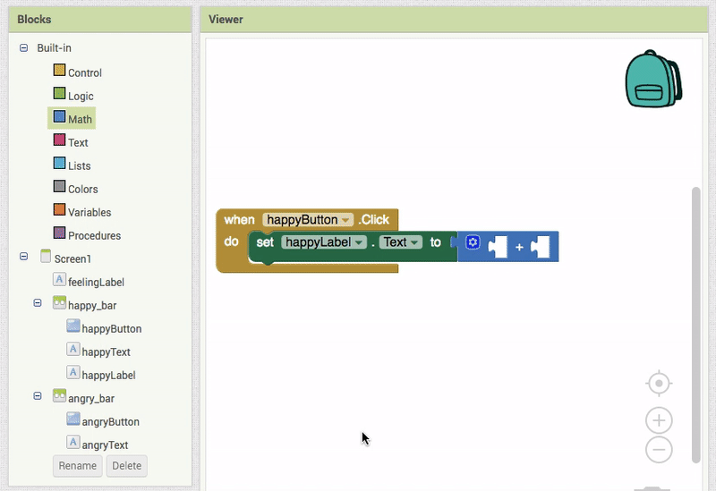
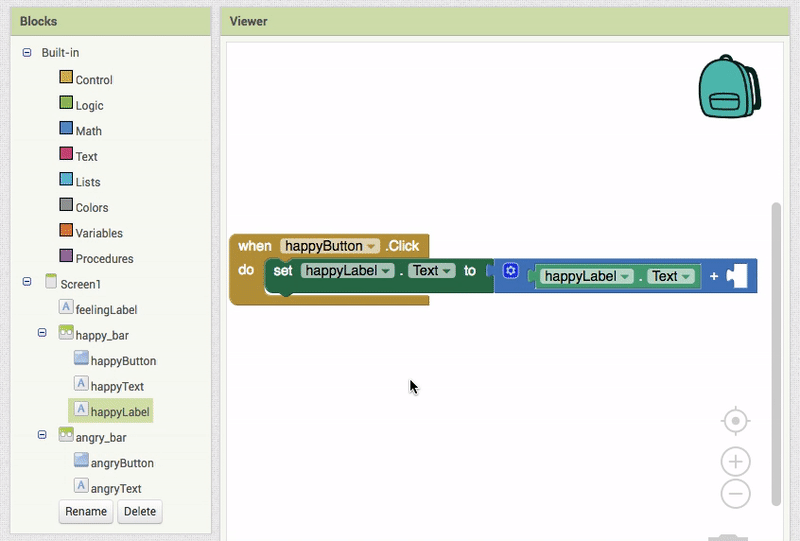
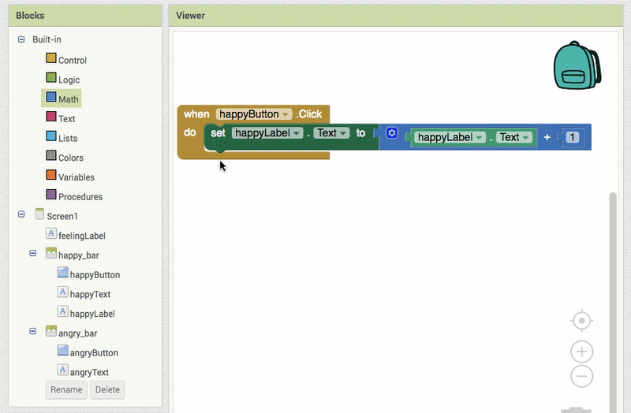
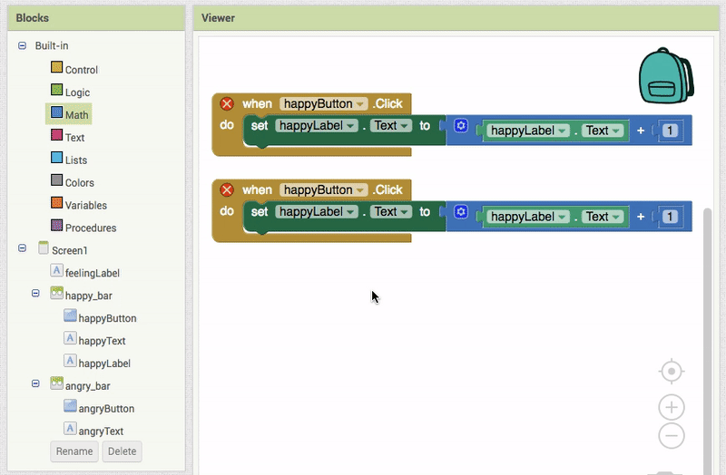
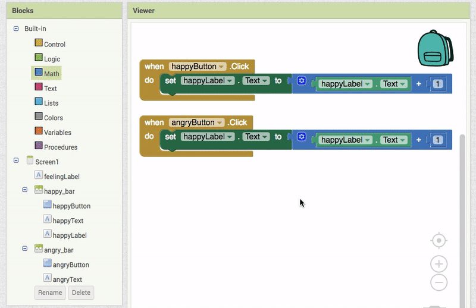
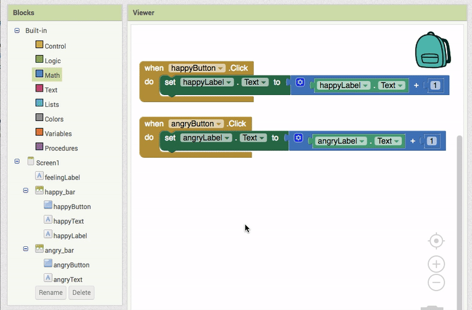

# The Challenge

Last year, NPR's Morning Edition ran [a story](https://youthradio.org/journalism/only-smiling-on-the-outside-teens-hide-depression/) about an app called Mood Ring, created by our friends at YR  Media, using App Inventor. Mood Ring invites teens to track how they’re feeling using emojis, and to reach out to trusted others for support. It's “a playful way to address something serious,” in the words of a teen who made it.

Now it’s your turn to work with App Inventor to design and build your own version of an app that uses emojis to promote positive emotional health. We can’t wait to see what you come up with!

To hear more from YR Media about mobile apps and mental health, check out their latest story on [artificially intelligent therapy bots](https://youthradio.org/journalism/tech/could-your-next-therapist-be-your-phone/). It's part of their series, Youth Mobile Power.

# Connect Your App

# Mood Counter Tutorial (Level: Beginner)

## 1. Introduction

Let's make an app

{:.enlargeImage}

Try clicking the different emojis. What happens?

Let's change the app so that when you tap the angry emoji, it increases the anger count.

## 2. Add click handler

Click on the Blocks button on the right side top bar.

{:.enlargeImage}

## 3. Add set happyLabel.text

Click on the  happyLabel drawer, then drag the set happyLabel.Text to block to the when happyButton.Click block.

{:.enlargeImage}

## 4. Add __ + __

Click on the  Math drawer. Click and drag the __ + __ block and add it to the set happyLabel.Text to block.

{:.enlargeImage}

## 5. Add happyLabel.Text

Click on the  happyLabel drawer. Click and drag the happyLabel.Text block and add it to the first socket of the __ + __ block. 

{:.enlargeImage}

## 6. Add 1

Click on the  Math drawer. Click and drag the 0 block and add it to the second socket in the __ + __ block. Change the "0" to a "1".

{:.enlargeImage}

## 7. Duplicate blocks

Try clicking the different emojis. What happens now?

Let's now make the angry emoji work too. Right click (or ctrl/control click) on the when happyButton.Click block, then click Duplicate.

{:.enlargeImage}

## 8. Change "happyButton" to "angryButton"

Click on the "happyButton" drop down on the  when happyButton.Click block and choose "angryButton"

{:.enlargeImage}

## 9. Repeat for happyLabel

Change the dropdown of set happyLabel.Text to to set angryLabel.Text to. And change happyLabel.Text to angryLabel.Text

{:.enlargeImage}

## 10. Repeat for sadButton

Repeat steps 7, 8, and 9 for the sadButton.

{:.enlargeImage}

## 11. Test it out!

Try it out on your  device. Tap on the different emojis. Do the numbers increment when you tap on the buttons?

Change up this basic tutorial by adding more features using the ideas in the next section.

# Expand your app

**Show an inspiring quote based on how the user feels.**

Set the [label component's text](javascript:goToHowToTutorial(0)) to a random message after the user chooses their mood.

**Play a song or display an image to cheer up a friend.**

Use the [player component](javascript:goToHowToTutorial(1)) to play a song after the user selects an emotion or the [image component](javascript:goToHowToTutorial(2)) to show a picture.
Personalize the app with the user's name.

**Personalize the app with the user’s name.**

Use the [text input component](javascript:goToHowToTutorial(3)) to get the user’s name and display it in the app.

**Text a friend when the user is feeling sad.**

Use the [texting component](javascript:goToHowToTutorial(4)) to send a message when the sad button is clicked.

**Let users review how they felt in the past.**

You can use the [file component](javascript:goToHowToTutorial(5)) to store what happens each time the user hits the button.
