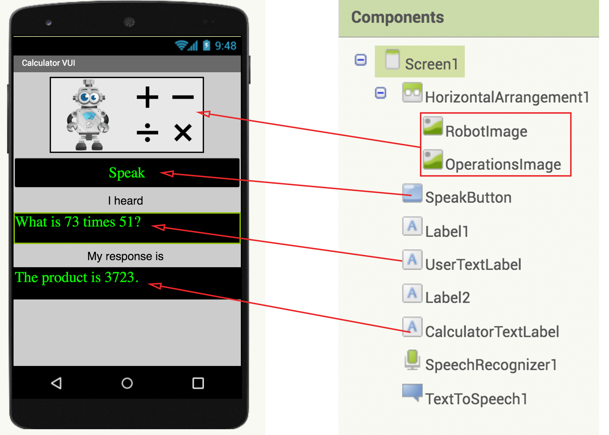
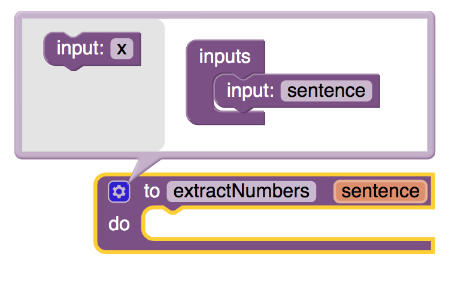
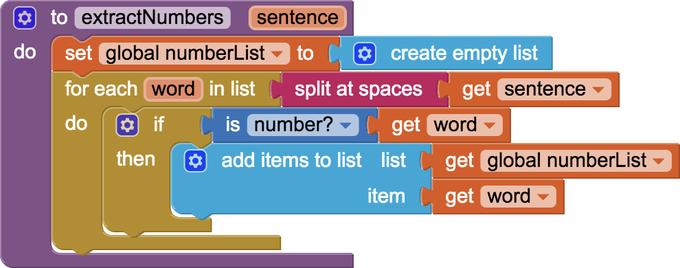
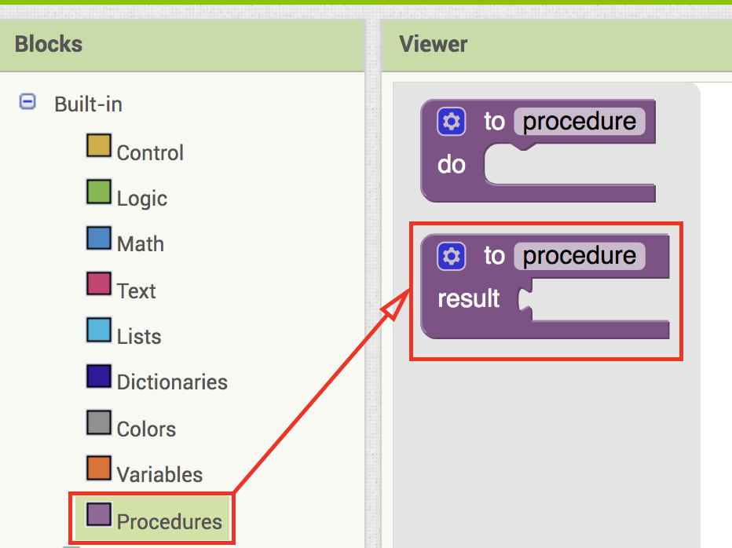
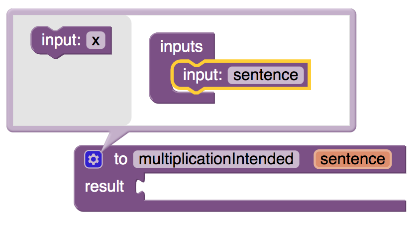
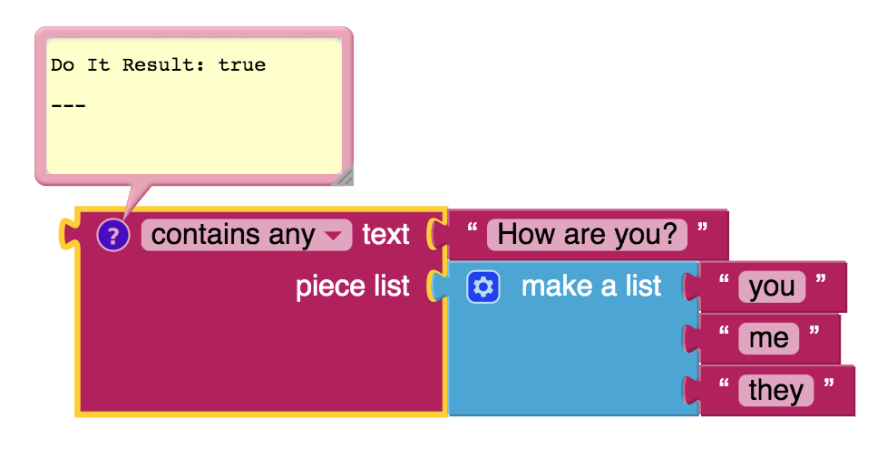
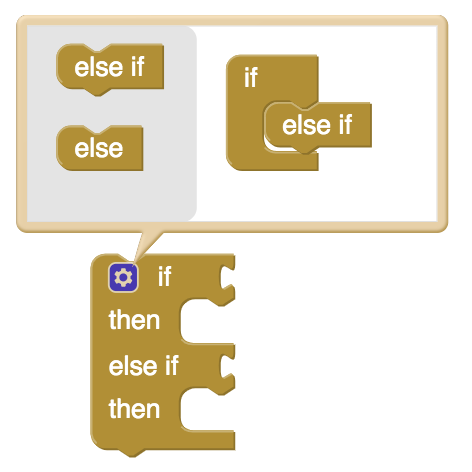

# Challenge

Have you ever wondered how conversational AI agents such as Alexa and Siri work?  How do they interpret what you are saying to them and grasp your intent?  How do they then know how to appropriately and meaningfully respond to you?  In this project you are challenged to create your very first own Voice User Interface (VUI) as you build a voice-driven calculator that can do basic arithmetic operations.

# Setup your computer

# Voice Calculator (Level: Intermediate)

## Introduction

The purpose of this AI project is to give you a sense of the basics of a Voice User Interface (VUI) and to teach you how to design a simple AI system that can understand the intent of the user in a verbally stated calculation question and respond appropriately.  Such a voice-driven AI system can be useful in various contexts such as when designing ***assistive technologies*** for the visually disabled and the elderly.  For example, a visually impaired user can use the Voice Calculator to do mathematical calculations verbally without having to type in all the details of the calculation.

{:.enlargeImage}

 
**Important**: Please note that for this project you cannot use the Emulator to test your app as it does not have Speech Recognition capability.  Similarly your mobile device must have Speech Recognition capability for the Voice Calculator to work.

## Graphical User Interface (GUI)

The GUI has been created for you in the starter file.  Please change the properties of the components as you wish to get the look and feel you want.  However, please do not rename the components, as this tutorial will refer to the given names in the instructions.

{:.enlargeImage}

In the GUI you will notice that there is a Speak  button which the user will press to verbally communicate the calculation they wish to have performed.  The interface will then display in writing what the Calculator heard and respond, both in writing and verbally, with the result of the calculation.  If the Calculator could not hear a meaningful calculation query or could not understand the intent of the user, it will say so.

## Initialize <var>numberList</var>

The first thing you'll tackle is to extract the numbers in the sentence spoken by the user. You'll use them later when you actually perform the mathematical operation.  To do this first you will initialize a global variable named <var>numberList</var> where the numbers in the calculation query will be stored.  As this variable will be a list of numbers,  it will be initialized  to an empty list.

{:.enlargeImage}

## procedure <var>extractNumbers</var> 
(page 1)

Then you  will create  a procedure  called <strong><var>extractNumbers</var></strong> which when given an input sentence will extract the numerical values in that sentence and store these in the global variable <var>numberList</var>.  To do this:
<ol>
<li>choose a procedure and name it <strong><var>extractNumbers</var></strong></li>
<li>use the settings gear to add an input parameter and call it <var>sentence</var></li>
</ol>

{:.enlargeImage}{:.enlargeImage}

(procedure continues next page)

## procedure <var>extractNumbers</var>
(page 2)
<ol start="3">
<li>set the global variable <var>numberList</var> to the empty list.  You need to reinitialize the variable every time you call this procedure as each calculation the user initiates will use a new pair of numbers</li>
<li>use  the <strong>split at spaces</strong> text block to split the input sentence into a list of  its words and use <strong>for each word in list</strong> block to check to see if any of the words is a number</li>
</ol>
{:.enlargeImage}
<ol start="5">
<li>if any word is a number then add it to the global variable <var>numberList</var></li>
</ol>

<hint markdown="block" title="Give me a hint">

{:.enlargeImage}

<hint markdown="block" title="Check my solution">

{:.enlargeImage}

</hint>

</hint>

 Try this on your own but if you get stuck you can click the Hint button.

## Multiplication Intent

As there are many ways for a user to indicate that they would like to perform a multiplication operation, it is essential to identify all these different approaches as a multiplication intent.  For example all of the following statements are different ways of expressing the same multiplication intent: 
* what is 73\*51 ?
* how much is 73x51 ?
* compute  73X51 ?
* what is the product of 73 and 51 ?
* what is the result when you multiply 73 with 51 ?
* what is 73 times 51 ?

Note that the key words/symbols/numbers in green define the multiplication intent while the words/symbols in red can be disregarded.

## variable <var>multiplicationIntents</var>

Now you will create a global variable <var>multiplicationIntents</var> which will be a list of all the common ways of communicating a multiplication intent with symbols and words: 

{ * , x , X , product, multiply, times }

{:.enlargeImage}

<!--## Boolean procedure <var>multiplicationIntended</var>

(page 1)

A Boolean procedure is a procedure that returns the values <strong>true</strong> or <strong>false</strong> based on the truth or falsity of the input statements.  

First, you will create a Boolean procedure called <strong><var>multiplicationIntended</var></strong> with a return value which will determine whether the user intends to perform a multiplication by checking for some key words in the sentence uttered by the user.
<ol>
<li> choose a procedure with a return value and name it <strong><var>multiplicationIntended</var></strong></li>
<li> use the settings gear to add an input parameter and call it <var>sentence</var></li>
</ol>
{:.enlargeImage}
{:.enlargeImage}

(procedure continues next page)

## Boolean procedure <var>multiplicationIntended</var>

(page 2)
<ol start="3">
<li>if any of the following symbols/words are contained in the sentence, have the procedure return <strong>true</strong> or return <strong>false</strong> otherwise:   

   { * , x , X , product, multiply, times }   
   
</li>
</ol>
Note: For consistency both the small letter "x" and the capital "X" have been included here.  It is possible that your device will use either to indicate multiplication.

<hint markdown="block" title="Give me a hint">

Note that Boolean text block <strong>contains</strong> and nested logic operators <strong>or</strong> can be used for this purpose. 

 

{:.enlargeImage}

You can keep nesting as many <strong>or</strong> blocks as you need.  If any one of the nested <strong>or</strong> operators returns <strong>true</strong> then the collection returns <strong>true</strong>. 

{:.enlargeImage}
{:.enlargeImage}

<hint markdown="block" title="Check my solution">

{:.enlargeImage}

</hint>

</hint>

Try this on your own but if you get stuck you can click the Hint button.-->
 

## SpeakButton
Now you will write the code to give functionality to the Speak button.  When the Speak button is clicked:
<ol>
<li>clear the <strong>UserTextLabel</strong> and <strong>CalculatorTextLabel</strong></li>
<li>call the <strong>SpeechRecognizer</strong> to get the text of what the user has spoken</li>
</ol>

<hint markdown="block" title="Give me a hint">

{:.enlargeImage}

<hint markdown="block" title="Check my solution">

{:.enlargeImage}

</hint>

</hint>
Try this on your own but if you get stuck you can click the Hint button.

## when SpeechRecognizer gets text

(page 1)

When the <strong>SpeechRecognizer</strong> performs its task and returns with a text <var>result</var>:
<ol>
<li>set the <strong>UserTextLabel</strong> to this text <var>result</var>.  This indicates what the Calculator heard.</li>
<li>extract the numbers from the  text <var>result</var> to store them in the global variable <var>numberList</var>  using the procedure <strong><var>extractNumbers</var></strong></li>
<li>set the <strong>CalculatorTextLabel</strong> to a default statement indicating that the Calculator could not understand what the user asked and inviting them to ask a clear calculation question.  For ex:  “I could not understand.  Please ask me a multiplication or addition or subtraction or division question like: What is 123 times 85?”</li>
</ol>
(task continues next page)

## when SpeechRecognizer gets text

(page 2)
<ol start="4">
<li>check that there were exactly two numbers extracted from the sentence uttered by the user and if so, determine
	<ul>
		<li>if the intent was multiplication, set <strong>CalculatorTextLabel</strong> to the product of the two numbers</li>
	</ul>
</li>
<li>use the <strong>TextToSpeech</strong> component to have the Calculator verbally read the contents of the <strong>CalculatorTextLabel</strong>.</li>
</ol>

<hint markdown="block" title="Give me a hint">
You may find the the text block <strong>contains any</strong> helpful.
{:.enlargeImage}

In the following example you can see that the <strong>contains any</strong> block returns true when one of the words in the piece list ("you") is contained in the input text ("How are you?").
{:.enlargeImage}

<hint markdown="block" title="Give me another hint">
{:.enlargeImage}

<hint markdown="block" title="Check my solution">

{:.enlargeImage}

</hint>
</hint>
</hint>
Try this on your own but if you get stuck you can click the Hint button.

## Test your App for Multiplication

Now you will use the AI Companion to check that your app works well for a multiplication calculation.  Be sure to use AI2 Companion version 2.60 or later otherwise the app will give errors.  Also please note that an Emulator cannot be used in the testing as it does not support Speech Recognition.  Try to state your multiplication intent in a variety of ways to make sure that the Calculator responds properly with the correct product.  Also make a non-calculation statement like "Hello how are you doing today?" and check that the Calculator responds appropriately by saying something like "I could not understand.  Please ask me a multiplication or addition or subtraction or division question like: What is 123 times 85?"

## Other operations

(page 1)

Now you will create three more global variables for the other operations: <strong><var>additionIntents</var></strong>, <strong><var>subtractionIntents</var></strong> and <strong><var>divisionIntents</var></strong>.

<hint markdown="block" title="Give me a hint">
The following symbols/words are common ways of indicating intent for each operation
* addition: { + , add, sum, plus}
* subtraction: { - , subtract, difference, minus}
* division: { /, ÷ , divide, quotient, ratio}

<hint markdown="block" title="Check my solution">

{:.enlargeImage}

{:.enlargeImage}

{:.enlargeImage}

</hint>

</hint>
Try this on your own but if you get stuck you can click the Hint button.

## Other operations

(page 2)

And now revise <strong>when SpeechRecognizer1.AfterGettingText</strong> to include the extra operations

*	if the intent was division, set <strong>CalculatorTextLabel</strong> to the quotient of the two numbers
* 	if the intent was addition, set <strong>CalculatorTextLabel</strong> to the sum of the two numbers
* 	if the intent was subtraction, set <strong>CalculatorTextLabel</strong> to the difference of the two numbers

<hint markdown="block" title="Give me a hint">

Using the settings gear you can access the following version of the if then block which can be helpful:

{:.enlargeImage}
<hint markdown="block" title="Check my solution">

{:.enlargeImage}

</hint>
</hint>

Try this on your own but if you get stuck you can click the Hint button.

## Test Your App again
Congratulations, you have built your first voice-driven AI system.  Test it thoroughly to make sure that your Voice Calculator can correctly respond to a variety of different utterances for each operation intended.

# Expand Your App
* The calculator at this point functions a lot like how a beginning foreign language learner may try to function in a foreign country when listening to a native speaker: a few known key words are used to identify the intent of the native speaker and the rest of the other words are completely ignored in high hopes that they are irrelevant and thus don’t really matter.  For example in the following sentence, all the words in red are irrelevant and can be ignored while the words in green are highly relevant in defining the intent of the speaker:

	Would you be so kind, oh dear amazing Calculator, to tell me the product of the most glorious number 73 and the supremely wondrous quantity 51 ?

	* Knowing this limitation of the Voice Calculator, come up with a sentence that will trick it to do a calculation when the intent of the sentence was not a calculation at all.  Test it.
	* Knowing the limitations of the Voice Calculator, come up with a completely legitimate calculation sentence that it will fail to understand. Test it.
	* Can you improve your code to avoid any of the tricky sentences you came up with above?
  
* Make the calculator take square roots and other more advanced operations you might know.
  
* Can you try to create a primitive version of Alexa or Siri where the AI will respond to some basic queries like: 
	* What day of the week is it?
	* What is the time?
	* Tell me a joke.
	* What is the weather? (perhaps opens a weather website)
	* What are the top news stories? (perhaps opens a news website)
	* Set a timer for 30 seconds.
  
* As mentioned earlier in the introduction this project can be viewed as an example of ***assistive technology*** that can aid people with disabilities or the elderly.  Do some research about assistive technologies and how they are helping people with disabilities and the elderly population.  What other apps can you think of that can be examples of assistive technologies?  Use MIT App Inventor to build such an app.

# About Youth Mobile Power 
A lot of us spend all day on our phones, hooked on our favorite apps. We keep typing and swiping, even when we know the risks phones can pose to our attention, privacy, and even our safety.  But the computers in our pockets also create untapped opportunities for young people to learn, connect and transform our communities.

That’s why MIT and YR Media teamed up to launch the Youth Mobile Power series. YR teens produce stories highlighting how young people use their phones in surprising and powerful ways. Meanwhile, the team at MIT is continually enhancing MIT App Inventor to make it possible for users like you to create apps like the ones featured in YR’s reporting.

Essentially: get inspired by the story, get busy making your own app!
 
 
 The YR + MIT collaboration is supported in part by the National Science Foundation. This material is based upon work supported by the National Science Foundation under Grant No. (1906895, 1906636).   Any opinions, findings and conclusions or recommendations expressed in this material are those of the author(s) and do not necessarily reflect the views of the National Science Foundation.

 Check out more apps and interactive news content created by YR <a href="https://yr.media/category/interactive/" target="_blank">here</a>.